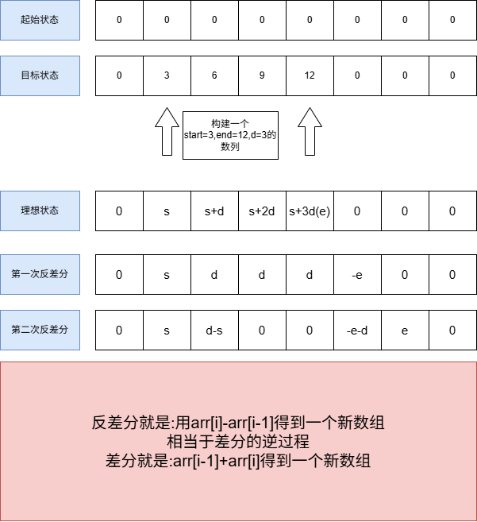
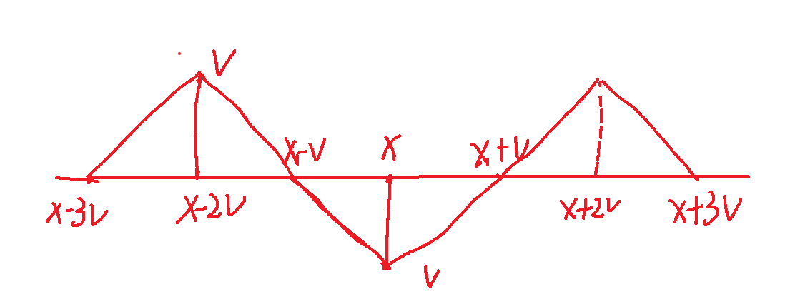

# 一维差分与等差数列差分

## 1.一维差分

【要求】: 题目要求对一维数组中多次 [left,right]+/- value

我们不必每次for循环真的挨个处理，比如要对[left,right]加一个value,我们的做法是: arr[left]+=value,arr[right+1]-=value

最后我们计算整个前缀和，就是我们想要的结果

感觉就像是利用了前缀和的累加效应，前面有的，后面也会有，如果我们想要后面没有，我们就手动减去value

```java
//测试链接:https://leetcode.cn/problems/corporate-flight-bookings/description/
public class Code01_Solution1109 {
    public int[] corpFlightBookings(int[][] bookings, int n) {
        int[] diff = new int[n+2];//下标从1开始，差分数组需要设置n+1
        for (int[] book : bookings) {
            diff[book[0]] += book[2];
            diff[book[1]+1] -= book[2];
        }
        for (int i = 1; i < diff.length; i++) {
            diff[i]+=diff[i-1];
        }
        int[] ans = new int[n];
        for (int i = 0; i < ans.length; i++) {
            ans[i]=diff[i+1];
        }
        return ans;
    }
}
```

## 2.等差数列差分

【问题描述】

一开始1-n范围上的数字都是0。接下来一共有m个操作。

每次操作:l-r范围上依次加上首项s、末项e、公差d的数列

最终1-n范围上的每个数字都要正确得到

等差数列差分的过程:

每个操作都调用set方法

所有操作完成后在arr上生成两遍前缀和，即调用build方法

arr里就是最终1-n范围上的每个数字

```java
void set(int l,int r,int s,int e,int d){
    arr[l] += s;
    arr[l+1] += d-s;
    arr[r+1] -= d+e;
    arr[r+2] += e;
}
void build(){
    for(int i=1;i<=n;i++){
        arr[i]+=arr[i-1];
    }
    for(int i=1;i<=n;i++){
        arr[i]+=arr[i-1];
    }
}
```



## 3.等差数列拆分题目

```java
import java.io.*;
//测试链接:https://www.luogu.com.cn/problem/P4231
public class Code02_Luogu4231 {
    public static long[] arr= new long[10000000+3];
    public static int n;
    public static void main(String[] args) throws IOException{
        BufferedReader br = new BufferedReader(new InputStreamReader(System.in));
        StreamTokenizer in = new StreamTokenizer(br);
        PrintWriter out = new PrintWriter(new OutputStreamWriter(System.out));
        while(in.nextToken()!=StreamTokenizer.TT_EOF){
            n = (int)in.nval;in.nextToken();
            int m = (int)in.nval;in.nextToken();
            int l,r,s,e;
            for(int i=0;i<m;i++){
                l = (int)in.nval;in.nextToken();
                r = (int)in.nval;in.nextToken();
                s = (int)in.nval;in.nextToken();
                e = (int)in.nval;in.nextToken();
                set(l,r,s,e,(e-s)/(r-l));
            }
            build();
            long ans=0,max=0;
            for(int i=1;i<=n;i++){
                max=Math.max(max,arr[i]);
                ans ^= arr[i];
            }
            out.println(ans+" "+max);
        }
        out.flush();
        out.close();
        br.close();

    }
    public static void set(int l,int r,int s,int e,int d){
        arr[l]+=s;
        arr[l+1]+=d-s;
        arr[r+1]-=d+e;
        arr[r+2]+=e;
    }
    public static void build(){
        for(int i=1;i<=n;i++){
            arr[i]+=arr[i-1];
        }
        for(int i=1;i<=n;i++){
            arr[i]+=arr[i-1];
        }
    }
}
```

在idea的输入控制台中，输入**Ctrl+D**就是文件结束符

## 4.等差数列差分不能有重叠

题目大概就是计算这样一段的求和



代码:

```java
package ZuoVideo47;

import java.io.*;

//测试链接:https://www.luogu.com.cn/problem/P5026
public class Code03_Luogu5026 {
    public static int OFFSET = 30000;
    public static int MAX_SIZE = OFFSET+1000000+OFFSET;
    public static int[] arr = new int[MAX_SIZE];
    public static int n,m,v,x;
    public static void main(String[] args) throws IOException {
        BufferedReader br = new BufferedReader(new InputStreamReader(System.in));
        StreamTokenizer in = new StreamTokenizer(br);
        PrintWriter out = new PrintWriter(new OutputStreamWriter(System.out));
        while(in.nextToken() != StreamTokenizer.TT_EOF){
            n=(int) in.nval; in.nextToken();
            m=(int) in.nval; in.nextToken();
            for (int i = 0; i < n; i++) {
                v=(int) in.nval; in.nextToken();
                x=(int) in.nval; in.nextToken();
                solve(v,x);
            }
        }
        build();
        for(int i=OFFSET+1;i<=OFFSET+m;i++){
            out.print(arr[i]+" ");
        }
        out.flush();
        out.close();
        br.close();
    }
    public static void solve(int v,int x){
        set(x-3*v+1,x-2*v,1,v,1);
        set(x-2*v+1,x,v-1,-v,-1);
        set(x+1,x+2*v,-v+1,v,1);
        set(x+2*v+1,x+3*v,v-1,0,-1);
    }
    public static void set(int l,int r,int s,int e,int d){
        arr[l+OFFSET]+=s;
        arr[l+1+OFFSET]+=d-s;
        arr[r+1+OFFSET]-=d+e;
        arr[r+2+OFFSET]+=e;
    }
    public static void build(){
        for(int i=1;i<=OFFSET+m;i++){
            arr[i]+=arr[i-1];
        }
        for(int i=1;i<=OFFSET+m;i++){
            arr[i]+=arr[i-1];
        }
    }

}
```

这道题还运用了一个巧妙办法就是利用**OFFSET偏移量**去扩大数组，避免一些边界的讨论，比如一个人在1的位置落下的时候，会出现边界讨论的情况。
