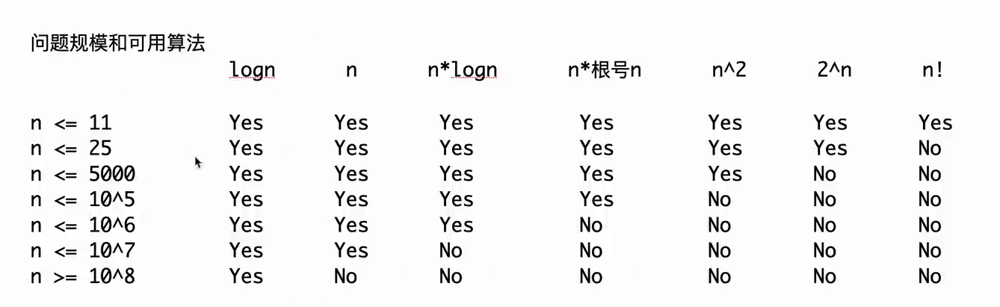

# 根据数据量猜解法技巧:

## 1.基本事实

C/C++运行时间1s,java/python/go等其他语言运行时间1s-2s

对应的常数指令操作量是 **<font color="red">10^7~10^8</font>**，不管什么测试平台，不管什么cpu,都是这个数量级

所以可以根据这个基本事实，来猜测自己设计的算法最终有没有可能在规定时间内通过



## 2.题目

### 2.1消灭怪物

你有n个技能，怪物有m的血量，每个技能可以对怪物造成对应的伤害，如果使用技能时候，怪物血量在满足条件下，会造成2倍攻击。

1<n<=10,此时可以用全排列，也满足题目要求

题目连接:[消灭怪物_牛客题霸_牛客网](https://www.nowcoder.com/practice/d88ef50f8dab4850be8cd4b95514bbbd)

代码:

```java
import java.util.Scanner;

// 注意类名必须为 Main, 不要有任何 package xxx 信息
public class Main {
    public static int n,m;
    public static int[] attack;
    public static int[] doubleCondition;
    public static void main(String[] args) {
        Scanner sc = new Scanner(System.in);
        int tnum = sc.nextInt();
        for(int t=0;t<tnum;t++){
            n=sc.nextInt();m=sc.nextInt();
            attack=new int[n];doubleCondition=new int[n];
            for(int i=0;i<n;i++){
                attack[i]=sc.nextInt();doubleCondition[i]=sc.nextInt();
            }
            int ans = f(0,m);
            System.out.println(ans == Integer.MAX_VALUE?-1:ans);
        }
    }
    public static int f(int cur,int total){
        if(total<=0) return cur;
        if(cur == n){
            return Integer.MAX_VALUE;
        }
        int ans =Integer.MAX_VALUE;
        for(int i=cur;i<n;i++){
            swap(cur,i);
            ans = Math.min(ans,f(cur+1,total-(total<=doubleCondition[cur]?attack[cur]*2:attack[cur])));
            swap(cur,i);
        }
        return ans;
    }
    public static void swap(int i,int j){
        int t =attack[i];
        attack[i]=attack[j];
        attack[j]=t;
        t=doubleCondition[i];
        doubleCondition[i]=doubleCondition[j];
        doubleCondition[j]=t;
    }
}
```

### 2.2超级回文数

如果一个正整数自身是回文数，而且它也是一个回文数的平方，那么我们称这个数为 **超级回文数** 。

现在，给你两个以字符串形式表示的正整数 left 和 right  ，统计并返回区间 `[left, right]` 中的 **超级回文数** 的数目。

`1 <= left.length, right.length <= 18`

这道题即使是设计出O(n)的算法依然超时，所以我们可以枚举根号->时间就降低到了[1,9]->同时我们只枚举前一半去生成回文数->[1,5],这样就非常满足题意

```java
    public static int superpalindromesInRange1(String left, String right) {
        long lnum = Long.valueOf(left),rnum = Long.valueOf(right);
        long limit = (long) Math.sqrt(rnum);
        long seed = 1;
        long num =0;
        int ans = 0;
        do{
            num = createDouble(seed);
            if(check(num*num,lnum,rnum)){
                ans++;
            }
            num = createSingle(seed);
            if(check(num*num,lnum,rnum)){
                ans++;
            }
            seed ++;
        }while (num<=limit);
        return ans;
    }
    private static boolean check(long num,long l,long r){
        return num>=l && num<=r && isPalindRome(num);
    }
    private static long createSingle(long seed) {
        long ans = seed;
        seed /= 10;
        while(seed != 0){
            ans = ans*10 + seed %10;
            seed/=10;
        }
        return ans;
    }
    private static long createDouble(long seed) {
        long ans = seed;
        while(seed != 0){
            ans = ans*10+seed%10;
            seed/=10;
        }
        return ans;
    }
    private static boolean isPalindRome(long num) {
        long offset = 1;
        while (num/offset>=10) offset *= 10;
        while(num !=0){
            if(num/offset != num%10){
                return false;
            }
            num = (num%offset)/10;
            offset /= 100;
        }
        return true;
    }
```

然后我们把1到Long.MAX_VALUE都打表发现只有86个数字，我们直接提前写在数组中

```java
    private static Long[] list = new Long[]{
            1L,
            4L,
            9L,
            121L,
            484L,
            10201L,
            12321L,
            14641L,
            40804L,
            44944L,
            1002001L,
            1234321L,
            4008004L,
            100020001L,
            102030201L,
            104060401L,
            121242121L,
            123454321L,
            125686521L,
            400080004L,
            404090404L,
            10000200001L,
            10221412201L,
            12102420121L,
            12345654321L,
            40000800004L,
            1000002000001L,
            1002003002001L,
            1004006004001L,
            1020304030201L,
            1022325232201L,
            1024348434201L,
            1210024200121L,
            1212225222121L,
            1214428244121L,
            1232346432321L,
            1234567654321L,
            4000008000004L,
            4004009004004L,
            100000020000001L,
            100220141022001L,
            102012040210201L,
            102234363432201L,
            121000242000121L,
            121242363242121L,
            123212464212321L,
            123456787654321L,
            400000080000004L,
            10000000200000001L,
            10002000300020001L,
            10004000600040001L,
            10020210401202001L,
            10022212521222001L,
            10024214841242001L,
            10201020402010201L,
            10203040504030201L,
            10205060806050201L,
            10221432623412201L,
            10223454745432201L,
            12100002420000121L,
            12102202520220121L,
            12104402820440121L,
            12122232623222121L,
            12124434743442121L,
            12321024642012321L,
            12323244744232321L,
            12343456865434321L,
            12345678987654321L,
            40000000800000004L,
            40004000900040004L,
            1000000002000000001L,
            1000220014100220001L,
            1002003004003002001L,
            1002223236323222001L,
            1020100204020010201L,
            1020322416142230201L,
            1022123226223212201L,
            1022345658565432201L,
            1210000024200000121L,
            1210242036302420121L,
            1212203226223022121L,
            1212445458545442121L,
            1232100246420012321L,
            1232344458544432321L,
            1234323468643234321L,
            4000000008000000004L
    };
    public static int superpalindromesInRange2(String left, String right) {
        Long l = Long.valueOf(left), r = Long.valueOf(right);
        int ans = 0;
        for(Long num:list){
            if(num>=l && num<=r) ans++;
        }
        return ans;
    }
```


