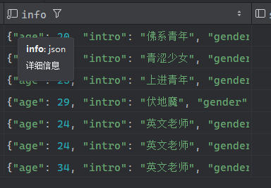

# MyBatisPlus知识点

## 1.MyBatisPlus的使用步骤

1.引入MybatisPlus的起步依赖

MyBatisPlus的官方提供了starter,其中集成了Mybatis和MybatisPlus的所有功能，并且实现了自动装配的效果。

因此我们可以用MybatisPlus的starter代替Mybatis的starter

```xml
<dependency>
    <groupId>com.baomidou</groupId>
    <artifactId>mybatis-plus-boot-starter</artifactId>
    <version>3.5.3.1</version>
</dependency>
```

2.定义Mapper

自定义的mapper继承MybatisPlus提供的BaseMapper接口

```java
public interface UserMapper extends BaseMapp<User>{
    
}
```

体现了Mybatis-plus的一个特性:对mybatis无侵入，mybatis改mp很容易

## 2.常见注解

MybatisPlus通过扫描实体类，并基于反射获取实体类信息作为数据库表信息

```java
public interface UserMapper extends BaseMapp<User>{//继承的时候绑定了实体类
    
}
```

约定：

1. 类名驼峰转下划线作为表名
2. 名为id的字段作为主键
3. 变量名驼峰转下划线作为表的字段名

MybatisPlus比较常用的几个注解:

1. @TableName:用来指定表名
2. @TableId:用来指定表中的主键字段信息
3. @TableField:用来指定表中的普通字段信息

示例:

```java
@TableName("tb_user")
public class User {
    @TableId(value = "id", type = IdType.AUTO)
    private Long id;
    
    @TableField("username")
    private String name;
    
    @TableField("is_marryed")
    private Boolean isMarried;
    
    @TableField("`order`")
    private Integer order;
    
    @TableField(exist = false)
    private String address;
}
```

IdType枚举:

1. AUTO:数据库自增长
2. INPUT:通过set方法自行输入
3. ASSIGN_ID:分配ID,接口identifierGenerator的方法nextId来生成id,默认实现类为DefaultIdentifierGenerator雪花算法

使用@TableFieId的常见场景:

1. 成员变量名和数据库字段名不一致
2. 成员变量以is开头，且是布尔值
3. 成员变量名与数据库关键字冲突
4. 成员变量名不是数据库字段

## 3.MybatisPlus常见配置

```yaml
mybatis-plus:
  type-aliases-package: com.itheima.mp.domain.po  # 别名扫描包
  mapper-locations: classpath*: mapper/**/*Mapper.xml  # Mapper.xml文件地址，默认值
  configuration:
    map-underscore-to-camel-case: true  # 是否开启下划线和驼峰的映射
    cache-enabled: false  # 是否开启二级缓存
  global-config:
    db-config:
      id-type: assign_id  # id为雪花算法生成
      update-strategy: not_null  # 更新策略：只更新非空字段
```

## 4.条件构造器

MybatisPlus支持各种复杂的where条件，可以满足日常开发的所有需求


```java
@Test
public void testQueryWrapper(){
    QueryWrapper<User> wrapper = new QueryWrapper<User>()
        .select("id", "username", "info","balance")
        .like("username", "o")
        .ge("balance",1000);
    List<User> users = userMapper.selectList(wrapper);
    users.forEach(System.out::println);
}

@Test
public void testUpdateWrapper1(){
    //1.更新的数据
    User user = new User();
    user.setBalance(10000);
    //2.更新的条件
    UpdateWrapper<User> wrapper = new UpdateWrapper<User>().eq("username", "祁同伟");
    userMapper.update(user, wrapper);

}
@Test
public void testUpdateWrapper2(){
    //1.更新的数据

    //2.更新的条件
    List<Long> ids = List.of(2L, 4L);
    UpdateWrapper<User> wrapper = new UpdateWrapper<User>()
        .setSql("balance = balance -200")
        .in("id", ids);
    userMapper.update(null, wrapper);
}

@Test
public void testLambdaQueryWrapper(){
    LambdaQueryWrapper<User> wrapper = new LambdaQueryWrapper<User>()
        .select(User::getId,User::getUsername, User::getInfo,User::getBalance)
        .like(User::getUsername, "o")
        .ge(User::getBalance,1000);
    List<User> users = userMapper.selectList(wrapper);
    users.forEach(System.out::println);
}
```

条件构造器的用法:

1. QueryWrapper和LambdaQueryWrapper通常用来构建sql中的where条件部分
2. UpdateWrapper和LambdaUpdateWrapper通常只有在set语句比较特殊才使用
3. 尽量使用LambdaQueryWrapper和LambdaUpdateWrapper，避免硬编码


## 5.自定义SQL

我们可以利用MyBatisPlus的Wrapper来构建复杂的Where条件，然后自己定义SQL语句中剩下的部分。

步骤:

1.基于wrapper构建where条件

```java
List<Long> ids = List.of(1L, 2L, 4L);
int amount = 200;

// 1. 构建条件
LambdaQueryWrapper<User> wrapper = new LambdaQueryWrapper<User>().in(User::getId, ids);

// 2. 自定义SQL方法调用
userMapper.updateBalanceByIds(wrapper, amount);
```

2.在mapper方法参数中用Param注解声明wrapper变量名称，必须是ew

```java
void updateBalanceByIds(@Param("ew") LambdaQueryWrapper<User> wrapper, @Param("amount") int amount);
```

3.自定义SQL,并使用Wrapper条件

```xml
<update id="updateBalanceByIds">
    UPDATE tb_user 
    SET balance = balance - #{amount} 
    ${ew.customSqlSegment}
</update>
```

## 6.Service接口


MP的Service接口使用流程:

1.自定义Service接口继承IService接口

```java
public interface IUserService extends IService<User> {
}
```

2.自定义Service实现类，实现自定义接口并继承ServiceImpl类

```java
@Service
public class UserServiceImpl extends ServiceImpl<UserMapper, User> implements IUserService {
}
```

### 小案例

UserController

```java
@Api(tags = "用户管理接口")
@RestController
@RequestMapping("/users")
@RequiredArgsConstructor
public class UserController {
    private final IUserService userService;

    @PostMapping
    @ApiOperation("保存用户信息")
    public void saveUser(@RequestBody UserFormDTO userFormDTO){
        User user = new User();
        BeanUtils.copyProperties(userFormDTO, user);
        userService.save(user);
    }
    @DeleteMapping("/{id}")
    @ApiOperation("删除用户信息")
    public void deleteUser(@ApiParam("用户id") @PathVariable Long id){
        userService.removeById(id);
    }

    @GetMapping("/{id}")
    @ApiOperation("查询用户信息")
    public UserVO getUserById(@ApiParam("用户id") @PathVariable Long id){
        User user = userService.getById(id);
        UserVO userVO = new UserVO();
        BeanUtils.copyProperties(user, userVO);
        return userVO;
    }

    @GetMapping
    @ApiOperation("批量查询用户信息")
    public List<UserVO> queryUserByIds(@ApiParam("用户id集合") @RequestParam("ids") List<Long> ids){
        List<User> users = userService.listByIds(ids);
        List<UserVO> ansList = users.stream().map(user -> {
            UserVO userVO = new UserVO();
            BeanUtils.copyProperties(user, userVO);
            return userVO;
        }).collect(Collectors.toList());
        return ansList;
    }

    @PutMapping("/{id}/deduction/{money}")
    @ApiOperation("用户余额扣减")
    public void reduceBalance(@PathVariable Long id, @PathVariable Integer money){
       userService.reduceBalanceById(id, money);

    }


}
```

UserServiceImpl

```java
@Service
public class UserServiceImpl extends ServiceImpl<UserMapper, User> implements IUserService {
    @Override
    public void reduceBalanceById(Long id, Integer money) {
        User user = getById(id);
        if(user== null || user.getStatus() ==2){
            throw new RuntimeException("账号存在问题！！！");
        }
        if(user.getBalance() < money){
            throw new RuntimeException("余额不足！！！");
        }
        baseMapper.reduceBalanceById(id,money);
    }
}
```

UserMapper

```java
public interface UserMapper extends BaseMapper<User> {

    void updateBalanceByIds(@Param(Constants.WRAPPER) LambdaQueryWrapper<User> wrapper,@Param("amount") int amount);

    @Update("update tb_user set balance = balance - #{money} where id = #{id}")
    void reduceBalanceById(Long id, Integer money);
}
```

### IService的Lambda查询

```java
@Api(tags = "用户管理接口")
@RestController
@RequestMapping("/users")
@RequiredArgsConstructor
public class UserController {
    private final IUserService userService;

    @GetMapping("/list")
    @ApiOperation("根据条件查询用户列表")
    public List<User> getListByConditions(@RequestBody UserQuery userQuery){
        List<User> list = userService.getListByConditions(userQuery.getName(), userQuery.getStatus(), userQuery.getMinBalance(), userQuery.getMaxBalance());
        return list;
    }


}
```

```java
@Service
public class UserServiceImpl extends ServiceImpl<UserMapper, User> implements IUserService {

    @Override
    public List<User> getListByConditions(String name, Integer status, Integer minBalance, Integer maxBalance) {
        List<User> list = lambdaQuery().like(name != null, User::getUsername, name)
                .eq(status != null, User::getStatus, status)
                .ge(minBalance != null, User::getBalance, minBalance)
                .le(maxBalance != null, User::getBalance, maxBalance)
                .list();
        return list;

    }
}

```

### IService的Lambda修改

```java
@Transactional
@Override
public void reduceBalanceById(Long id, Integer money) {
    User user = getById(id);
    if(user== null || user.getStatus() ==2){
        throw new RuntimeException("账号存在问题！！！");
    }
    if(user.getBalance() < money){
        throw new RuntimeException("余额不足！！！");
    }
    int remainBalance = user.getBalance() - money;
    lambdaUpdate()
        .set(User::getBalance,remainBalance)
        .set(remainBalance==0,User::getStatus,2)
        .eq(User::getId,id)
        .eq(User::getBalance,user.getBalance())//乐观锁，先比较一下
        .update();
}
```

### IService批量新增

mp默认的批量新增，基于预编译的批处理，本质上就网络请求少了，但是sql语句还是一条一条的

当需要一次性插入多条数据时，可以开启`rewriteBatchedStatements=true`参数,可以快速新增数据

在调用mp的批量新增的时候，时间快的飞起

```yaml
spring:
  datasource:
    url: jdbc:mysql://127.0.0.1:3306/mp?rewriteBatchedStatements=true
    driver-class-name: com.mysql.cj.jdbc.Driver
    username: root
    password: 1234
```

## 扩展功能:代码生成器

用mp的步骤：

1. 实体类
2. mapper继承BaseMapper<T>
3. service继承IService
4. serviceImpl继承ServiceImpl<mapper,entity>实现service

因为只有实体类不是固定的，其他的都是差不多固定的，所以可以用代码生成器

需要安装插件:


## 扩展功能:DB静态工具

DB静态工具和Service接口的功能差不多，只是是静态的

为啥需要这个静态工具？解决service之间的循环依赖的问题

```java
@Override
public UserVO getUserAndAdressById(Long id) {
    User user = getById(id);
    if(Objects.isNull(user)){
        throw new RuntimeException("用户状态异常！");
    }
    //和Service的方法差不多,但是要传入字节码
    List<Address> list = Db.lambdaQuery(Address.class).eq(Address::getUserId, id).list();
    List<AddressVO> voList = list.stream().map(address -> {
        AddressVO addressVO = new AddressVO();
        BeanUtils.copyProperties(address, addressVO);
        return addressVO;
    }).collect(Collectors.toList());

    UserVO userVO = new UserVO();
    BeanUtil.copyProperties(user,userVO);
    if(!voList.isEmpty()){
        userVO.setAddressList(voList);
    }
    return userVO;
}
```

## 扩展功能:逻辑删除

逻辑删除:基于代码逻辑模拟删除效果，但并不会真正删除数据，思路如下:

1. 在表中添加一个字段标记数据是否被删除
2. 当删除数据时把标记置为1
3. 查询时只查询标记为0的数据

一旦加了逻辑删除的功能，增删改查的代码都会变

mp提供了逻辑删除的功能，无需改变方法调用的方式，而是在底层帮我们自动修改CRUD的语句。我们要做的就是在application.yaml文件中配置逻辑删除的字段名称和值即可:

```yaml
mybatis-plus:
  global-config:
    db-config:
      logic-delete-field: flag  # 全局逻辑删除的实体字段名，字段类型可以是 boolean、integer
      logic-delete-value: 1     # 逻辑已删除值（默认为 1）
      logic-not-delete-value: 0 # 逻辑未删除值（默认为 0）
```

注意:

逻辑删除本身也有自己的问题:

1. 会导致数据库表垃圾数据越来越多，影响查询效率
2. SQL中全都需要对逻辑删除字段做判断，影响查询效率

因为，还要一种替代方案，如果数据不能删除，可以采用把数据迁移到其他表的方法。

## 扩展功能:枚举处理器

作用:让枚举类型和数据库中的字段类型对应上

实现步骤:

1.枚举类型中用注解声明成员变量对应数据库字段

```java
@Getter
public enum UserStatus {
    NORMAL(1, "正常"),
    FROZEN(2, "冻结"),
    ;
    @EnumValue//声明的成员变量将对应数据库字段
    private final Integer code;
    @JsonValue//jackson将返回的数据转为json,不指定的话默认是实体名
    private final String message;
    UserStatus(Integer code, String message) {
        this.code = code;
        this.message = message;
    }
}
```

2.在application.yml中配置全局枚举处理器

```yaml
mybatis-plus:
  configuration:
    default-enum-type-handler: com.baomidou.mybatisplus.core.handlers.MybatisEnumTypeHandler
```

## 扩展功能:JSON处理器



作用:让数据库中的json类型和java对象之间能够映射

```java
@Data
//第二步
@TableName(value = "user", autoResultMap = true)
public class User {
    private Long id;
    private String username;
	//第一步
    @TableField(typeHandler = JacksonTypeHandler.class)
    private UserInfo info;
}
```

```java
@Data
@NoArgsConstructor
@AllArgsConstructor(staticName = "of")//提供一个静态方法
public class UserInfo {
    private Integer age;
    private String intro;
    private String gender;
}

```

## 7.插件功能

mp提供的内置拦截器有下面这些:

| 序号 | 拦截器                           | 描述                               |
| ---- | -------------------------------- | ---------------------------------- |
| 1    | TenantLineInnerInterceptor       | 多租户插件                         |
| 2    | DynamicTableNameInnerInterceptor | 动态表名插件                       |
| 3    | PaginationInnerInterceptor       | 分页插件                           |
| 4    | OptimisticLockerInnerInterceptor | 乐观锁插件                         |
| 5    | IllegalSQLInnerInterceptor       | SQL性能规范插件，检测并拦截垃圾SQL |
| 6    | BlockAttackInnerInterceptor      | 防止全表更新和删除的插件           |

### 1.分页插件的基本使用

首先，要在配置类中注册MyBatisPlus的核心插件，同时添加分页插件

```java
@Configuration
public class MybatisConfig {

    @Bean
    public MybatisPlusInterceptor mybatisPlusInterceptor() {
        // 1. 初始化核心插件
        MybatisPlusInterceptor interceptor = new MybatisPlusInterceptor();

        // 2. 添加分页插件
        PaginationInnerInterceptor pageInterceptor = new PaginationInnerInterceptor(DbType.MYSQL);
        pageInterceptor.setMaxLimit(1000L); // 设置分页上限（防止一次性查询过多数据）
        interceptor.addInnerInterceptor(pageInterceptor);

        return interceptor;
    }
}
```

然后就可以使用了

```java
@Test
public void pageQueryTest(){
    int pageNo=1,pageSize=5;
    //1.创建分页对象
    Page<User> page = Page.of(pageNo,pageSize);
    //2.添加排序
    page.addOrder(new OrderItem("balance",false));
    page.addOrder(new OrderItem("id",true));
    Page<User> p = userService.page(page); //p和page是同一个对象
    System.out.println("总页数："+p.getPages());
    System.out.println("总记录数："+p.getTotal());
    List<User> records = p.getRecords();
    records.forEach(System.out::println);
}
```

### 2.通用分页实体

```java
@Data
@ApiModel(description = "分页查询条件实体")
public class PageQuery {
    @ApiModelProperty("页码")
    private Integer pageNo;
    @ApiModelProperty("每页数量")
    private Integer pageSize;
    @ApiModelProperty("排序字段")
    private String sortBy;
    @ApiModelProperty("是否升序")
    private Boolean isAsc;
}
```

```java
@Data
@ApiModel(description = "分页结果")
public class PageDTO<T> {
    @ApiModelProperty("总记录数")
    private Integer total;
    @ApiModelProperty("总页数")
    private Integer pages;
    @ApiModelProperty("当前页数据集合")
    private List<T> list;
}
```

```java
@EqualsAndHashCode(callSuper = true)
@Data
@ApiModel(description = "用户查询条件实体")
public class UserQuery extends PageQuery {
    @ApiModelProperty("用户名关键字")
    private String name;
    @ApiModelProperty("用户状态：1-正常，2-冻结")
    private Integer status;
    @ApiModelProperty("余额最小值")
    private Integer minBalance;
    @ApiModelProperty("余额最大值")
    private Integer maxBalance;
}
```

```java
@Service
public class UserServiceImpl extends ServiceImpl<UserMapper, User> implements IUserService {
    /**
     * 分页查询用户列表
     * @param userQuery
     * @return
     */
    @Override
    public PageDTO<UserVO> queryUserPage(UserQuery userQuery) {
        String name = userQuery.getName();
        Integer status = userQuery.getStatus();
        //1.构建分页条件
        Page<User> page = Page.of(userQuery.getPageNo(), userQuery.getPageSize());
        if(StrUtil.isNotBlank(userQuery.getSortBy())){
            page.addOrder(new OrderItem(userQuery.getSortBy(), userQuery.getIsAsc()));
        }else{
            page.addOrder(new OrderItem("update_time",false));
        }
        //2.使用lambda查询
        lambdaQuery().like(name != null, User::getUsername, name)
                .eq(status != null, User::getStatus, status)
                .page(page);
        //3.封装结果
        PageDTO<UserVO> pageDTO = new PageDTO<>();
        pageDTO.setTotal(page.getTotal());
        pageDTO.setPages(page.getPages());
        pageDTO.setList(BeanUtil.copyToList(page.getRecords(), UserVO.class));
        return pageDTO;
    }
}
```

### 3.通用分页实体封装方法

1.PageQuery类封装

```java
@Data
@ApiModel(description = "分页查询条件实体")
public class PageQuery {
    @ApiModelProperty("页码")
    private Integer pageNo=1;
    @ApiModelProperty("每页数量")
    private Integer pageSize=5;
    @ApiModelProperty("排序字段")
    private String sortBy;
    @ApiModelProperty("是否升序")
    private Boolean isAsc=true;

    public <T> Page<T> toMpPage(OrderItem ... items){
        Page<T> page = Page.of(pageNo, pageSize);
        if(StrUtil.isNotBlank(sortBy)){
            page.addOrder(new OrderItem(sortBy, isAsc));
        }else if(items!=null){
            page.addOrder(items);
        }
        return page;
    }
    public <T> Page<T> toMpPage(String sortBy, Boolean isAsc){
        return toMpPage(new OrderItem(sortBy, isAsc));
    }
    public <T> Page<T> toMpPageDefaultByCreateTimeAsc(){
        return toMpPage(new OrderItem("create_time", true));
    }
    public <T> Page<T> toMpPageDefaultByCreateTimeDesc(){
        return toMpPage(new OrderItem("create_time", false));
    }
    public <T> Page<T> toMpPageDefaultByUpdateTimeAsc(){
        return toMpPage(new OrderItem("update_time", true));
    }
    public <T> Page<T> toMpPageDefaultByUpdateTimeDesc(){
        return toMpPage(new OrderItem("update_time", false));
    }
}
```

2.DTO类封装

```java
@Data
@ApiModel(description = "分页结果")
public class PageDTO<T> {
    @ApiModelProperty("总记录数")
    private Long total;
    @ApiModelProperty("总页数")
    private Long pages;
    @ApiModelProperty("当前页数据集合")
    private List<T> list;

    public static <VO,PO> PageDTO<VO> of(Page<PO> page,Class<VO> clazz){
        PageDTO<VO> pageDTO = new PageDTO<>();
        pageDTO.setTotal(page.getTotal());
        pageDTO.setPages(page.getPages());
        if(page.getRecords().isEmpty()){
            pageDTO.setList(Collections.emptyList());
            return pageDTO;
        }
        pageDTO.setList(BeanUtil.copyToList(page.getRecords(), clazz));
        return pageDTO;
    }
    public static <VO,PO> PageDTO<VO> of(Page<PO> page, Function<PO,VO> convertor){
        PageDTO<VO> pageDTO = new PageDTO<>();
        pageDTO.setTotal(page.getTotal());
        pageDTO.setPages(page.getPages());
        if(page.getRecords().isEmpty()){
            pageDTO.setList(Collections.emptyList());
            return pageDTO;
        }
        pageDTO.setList(page.getRecords().stream().map(convertor).collect(Collectors.toList()));
        return pageDTO;
    }

}

```

3.封装了之后的业务层代码

```java
/**
     * 分页查询用户列表
     * @param userQuery
     * @return
*/
@Override
public PageDTO<UserVO> queryUserPage(UserQuery userQuery) {
    String name = userQuery.getName();
    Integer status = userQuery.getStatus();
    //1.构建分页条件
    Page<User> page = userQuery.toMpPageDefaultByUpdateTimeAsc();
    //2.使用lambda查询
    lambdaQuery().like(name != null, User::getUsername, name)
        .eq(status != null, User::getStatus, status)
        .page(page);
    //3.封装结果
    return PageDTO.of(page,user->{
        //1.拷贝基础属性
        UserVO userVO = BeanUtil.copyProperties(user, UserVO.class);
        //2.处理特俗逻辑
        userVO.setUsername(userVO.getUsername().substring(0,userVO.getUsername().length()-2)+"**");
        return userVO;
    });
}
```


