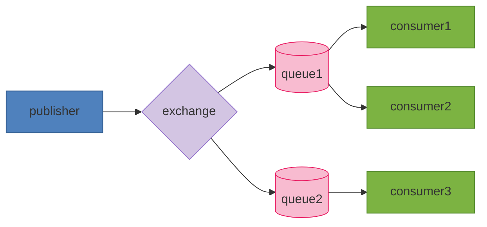
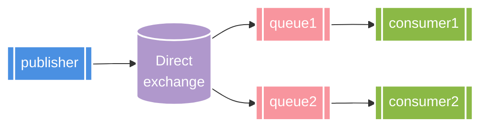
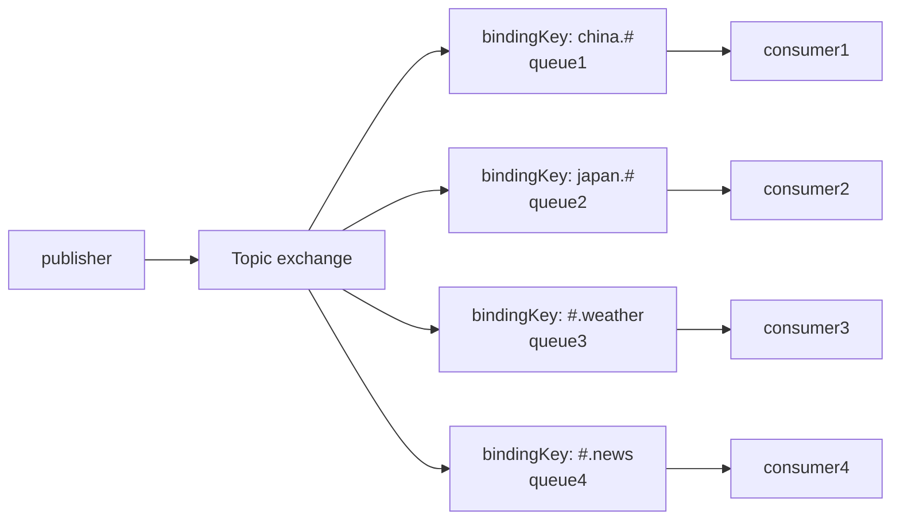

# RabbitMQ

## 1.RabbitMQ介绍

RabbitMQ是一款典型的异步通信组件。

同步通信就像视频电话，实时对话；

同步调用的优势: 

- 时效性强：等待到结果后才返回。

同步调用的劣势:

 - 扩展性差
- 性能下降
- 级联失败问题(微服务中，一个远程调用失败，下面的流程可能接着失败)


异步通信就像发微信，不用实时回复，根据自己的时间来回复。

异步调用方式其实就是基于消息通知的方式，一般包含三个角色：

- **消息发送者**：投递消息的人，就是原来的调用方。
- **消息代理**：管理、暂存、转发消息，你可以把它理解成微信服务器。
- **消息接收者**：接收和处理消息的人，就是原来的服务提供方。

异步调用的优势:

- **耦合度低，拓展性强**
- **异步调用，无需等待，性能好**
- **故障隔离**：下游服务故障不影响上游业务。
- **缓存消息，流量削峰填谷**

异步调用的缺点:

- **不能立即得到调用结果，时效性差**
- **不确定下游业务执行是否成功**
- **业务安全依赖于 Broker 的可靠性**


基础篇

- 同步和异步
- MQ技术选型
- 数据隔离
- SpringAMQP
- Work模式
- MQ消息转换器
- 发布订阅模式
- 消息堆积问题处理

高级篇

- 发送者重连
- 发送者确认
- MQ持久化
- LazyQueue
- 消费者确认
- 失败重试
- 业务幂等
- 延迟消息


## 2.MQ的技术选型

MQ（MessageQueue），中文是消息队列，字面来看就是存放消息的队列。也就是异步调用中的 Broker。

| 对比维度       | RabbitMQ                | ActiveMQ                          | RocketMQ   | Kafka      |
| :------------- | :---------------------- | :-------------------------------- | :--------- | :--------- |
| **公司/社区**  | Rabbit                  | Apache                            | 阿里       | Apache     |
| **开发语言**   | Erlang                  | Java                              | Java       | Scala&Java |
| **协议支持**   | AMQP, XMPP, SMTP, STOMP | OpenWire, STOMP, REST, XMPP, AMQP | 自定义协议 | 自定义协议 |
| **可用性**     | 高                      | 一般                              | 高         | 高         |
| **单机吞吐量** | 一般                    | 差                                | 高         | 非常高     |
| **消息延迟**   | 微秒级                  | 毫秒级                            | 毫秒级     | 毫秒以内   |
| **消息可靠性** | 高                      | 一般                              | 高         | 一般       |


RabbitMQ的基本介绍:


## 3.数据隔离


通过virtual host可以实现数据隔离，不同的virtual host之间互不影响

## 4.Java客户端快速入门


Spring AMQP:[Spring AMQP](https://spring.io/projects/spring-amqp)


SpringAMQP如何收发消息？
1.引入spring-boot-starter-amqp依赖
2.配置rabbitmq服务端信息
3.利用RabbitTemplate发送消息
4.利用@RabbitListener注解声明要监听的队列，监听消息

```java
//发消息
record User(String name,Integer age){}
@Test
public void sendMessage(){
    User user = new User("张峻豪", 21);
    String queueName = "queue1";
    rabbitTemplate.convertAndSend(queueName,user);
}
```

```java
//收消息
@Slf4j
@Component
public class MqListener {

    record User(String name,Integer age){}

    @RabbitListener(queues = "queue1")
    public void listenSimpleQueue(User user){
        log.info("消费者收到了消息:【{}】",user);
    }
}

```

提示，配置一下mq的消息转换器(使用Jackson来序列化对象)

```java
@Configuration
public class RabbitMQConfig {
    @Bean
    public MessageConverter jsonMessageConverter(){
        return new JacksonJsonMessageConverter();
    }
}

```

## 5.Java客户端work模型

默认情况下，RabbitMQ会将消息依次轮询投递给绑定在队列上的每一个消费者。但这并没有考虑到消费者是否已经处理完消息，可能出现消息堆积。

```java
@Slf4j
@Component
public class MqListener {
    @RabbitListener(queues = "work.queue")
    public void listenWorkQueue1(String msg) throws InterruptedException {
        log.info("消费者1收到了消息:【{}】",msg);
        Thread.sleep(20);
    }
    @RabbitListener(queues = "work.queue")
    public void listenWorkQueue2(String msg) throws InterruptedException {
        log.info("消费者2222收到了消息:【{}】",msg);
        Thread.sleep(200);
    }
}
```


因此我们需要修改`application.yml`设置preFetch值为1，确保同一时刻最多投递给消费者1条消息

```
spring:
  application:
    name: consumer

  rabbitmq:
    host: 127.0.0.1
    port: 5672
    username: yiyi
    password: 1234
    virtual-host: test_virtual
    listener:
      simple:
        prefetch: 1
```


Work模型的使用：

- 多个消费者绑定到一个队列，可以加快消息处理速度
- 同一条消息只会被一个消费者处理
- 通过设置prefetch来控制消费者预取的消息数量，处理完一条再处理下一条，实现能者多劳

## 6.Java客户端-Fanout交换机

真正的生产环境都会经过exchange来发送消息，而不是直接发送到队列，交换机的类型有以下三种:

> Fanout：广播
>
> Direct：定向
>
> Topic：话题




Fanout Exchange会将接收到的消息广播到每一个跟其绑定的queue，所以也叫广播模型

```java
@Test
public void sendMessage2Exchange() throws InterruptedException {
    String exchangeName = "test.fanout";
    String message = "我是广播的消息";
    rabbitTemplate.convertAndSend(exchangeName,null,message);
}
```

```java
@RabbitListener(queues = "fanout.queue1")
public void listenFanoutQueue1(String msg){
    log.info("消费者1收到了消息:【{}】",msg);
}
@RabbitListener(queues = "fanout.queue2")
public void listenFanoutQueue2(String msg)  {
    log.info("消费者2222收到了消息:【{}】",msg);
}
```

交换机的作用:

1.接收publisher发送的消息

2.将消息按照规则路由到与之绑定的队列

3.FanoutExchange的会将消息路由到每个绑定的队列

## 7.Java客户端-Direct交换机

Direct Exchange会将接收到的消息根据规则路由到指定的Queue，因此称为**定向**路由。

> 每一个Queue都与Exchange设置一个BindingKey
>
> 发布者发送消息时，指定消息的RoutingKey
>
> Exchange将消息路由到BindingKey与消息RoutingKey一致的队列




```java
@Test
public void sendMessage2DirectExchange() throws InterruptedException {
    String exchangeName = "test.direct";
    String message = "红色预警:日本排放核污水，惊现异常生物！！！";
    rabbitTemplate.convertAndSend(exchangeName,"red",message);
}
```

```java
@RabbitListener(queues = "direct.queue1")
public void listenDirectQueue1(String msg){
    log.info("消费者1收到了消息:【{}】",msg);
}
@RabbitListener(queues = "direct.queue2")
public void listenDirectQueue2(String msg)  {
    log.info("消费者2222收到了消息:【{}】",msg);
}
```

## 8.Java客户端-Topic交换机

TopicExchange与DirectExchange类似，区别在于routingKey可以是多个单词的列表，并且以`.`分割。

Queue与Exchange指定BingdingKey时可以使用通配符

> `#`：代指0个或多个单词
>
> `*`：代指一个单词




```java
@Test
public void sendMessage2TopicExchange() throws InterruptedException {
    String exchangeName = "test.topic";
    String message = "樊振东 vs 张本智和";
    rabbitTemplate.convertAndSend(exchangeName,"china.news",message);
}
```

```java
@RabbitListener(queues = "topic.queue1")
public void listenTopicQueue1(String msg){
    log.info("消费者1收到了消息:【{}】",msg);
}
@RabbitListener(queues = "topic.queue2")
public void listenTopicQueue2(String msg)  {
    log.info("消费者2222收到了消息:【{}】",msg);
}
```

描述下Direct交换机与Topic交换机的差异？

> Topic交换机接收的消息RoutingKey可以是多个单词，以`.`分割
>
> Topic交换机与队列绑定时的bindingKey可以指定通配符
>
> #：代表0个或多个词
>
> *：代表1个词

## 9.声明队列和交换机的方式

SpringAMQP提供了几个类，用来声明队列、交换机及其绑定关系:

> Queue：用于声明队列，可以用工厂类QueueBuilder构建
>
> Exchange：用于声明交换机，可以用工厂类ExchangeBuilder构建
>
> Binding：用于声明队列和交换机的绑定关系，可以用工厂类BindingBuilder构建

```java
import org.springframework.amqp.core.*;
import org.springframework.context.annotation.Bean;
import org.springframework.context.annotation.Configuration;


@Configuration
public class CreateConfig {

    @Bean
    public Queue createQueue1(){
        return new Queue("test.create.queue1");
    }
    @Bean
    public FanoutExchange createFanoutExchange(){
        return new FanoutExchange("test.create.fanoutExchange");
    }
    @Bean
    public Binding testBing(){
        return BindingBuilder.bind(createQueue1()).to(createFanoutExchange());
    }

}
```

SpringAMQP还提供了基于@RabbitListener注解来声明队列和交换机的方式:

```java
@RabbitListener(bindings = @QueueBinding(
    value = @Queue(name = "test.creat.annotation"),
    exchange = @Exchange(name = "test.create.annotation.exchange",type = ExchangeTypes.DIRECT),
    key = {"red","blue"}
))
public void listenAnnotationCreate(String msg){
    log.info("listenAnnotationCreate accept message:{}",msg);

}
```

## 10.Java客户端-消息转换器

Spring的对消息对象的处理是由`org.springframework.amqp.support.converter.MessageConverter`来处理的。而默认实现是`SimpleMessageConverter`，基于JDK的`ObjectOutputStream`完成序列化。
存在下列问题：

> JDK的序列化有安全风险
> JDK序列化的消息太大
> JDK序列化的消息可读性差 

建议采用JSON序列化代替默认的JDK序列化，要做两件事情：

在publisher和consumer中都要引入jackson依赖：

```xml
<dependency>
    <groupId>com.fasterxml.jackson.core</groupId>
    <artifactId>jackson-databind</artifactId>
</dependency>
```

在publisher和consumer中都要配置MessageConverter：

```java
@Configuration
public class RabbitMQConfig {
    @Bean
    public MessageConverter jsonMessageConverter(){
        return new JacksonJsonMessageConverter();
    }
}

```

