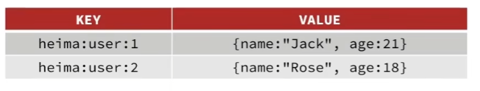

# 基础篇

## 1.初识NoSQL

|          | SQL                                                        | NoSQL                                                        |
| -------- | ---------------------------------------------------------- | ------------------------------------------------------------ |
| 数据结构 | 结构化(Structured)                                         | 非结构化                                                     |
| 数据关联 | 关联的(Relational)                                         | 无关联的                                                     |
| 查询方式 | SQL查询                                                    | 非SQL                                                        |
| 事物特性 | ACID                                                       | BASE                                                         |
| 存储方式 | 磁盘                                                       | 内存                                                         |
| 扩展性   | 垂直                                                       | 水平                                                         |
| 使用场景 | 1.数据结构固定 2.相关业务对数据安全性，一致性要求较高 | 1.数据结构不固定 2.对一致性、安全性要求不高 3.对性能要求 |

## 2.认识Redis

Redis诞生于2009年全称是Remote Dictionary Server,远程词典服务器，是一个基于内存的键值型NoSQL数据库。

特征:

1. 键值(key-value)型，value支持多种不同数据结构，功能丰富
2. 单线程，每个命令具备原子性
3. 低延迟，速度快(基于内存、IO多路复用、良好的编码)
4. 支持数据持久化
5. 支持主从集群，分片集群
6. 支持多语言客户端

## 3.Redis数据结构介绍

Redis是一个key-value的数据库，key一般是String类型，value的类型多种多样

| value类型 | 示例                 |
| --------- | -------------------- |
| String    | hello word           |
| Hash      | {name:"Jack",age:21} |
| List      | [A -> B -> C -> C]   |
| Set       | [A,B,C]              |
| SortedSet | [A:1,B:2,C:3]        |
| GEO       | {A:{120.0,30.5}}     |
| BitMap    | 0110110101110101011  |
| HyperLog  | 0110110101110101011  |

其中前5种为基本类型，后3种为特殊类型

## 3.通用命令

可以通过help [command]查看一个命令的具体用法

1.Keys:查看符合模板的所有的key，不建议在生产环境设备上使用

其中*是通配符

2.DEL：删除指定的key,可以删多个 

3.EXISTS：判断key是否存在

4.EXPIRE：给一个key设置有效期，有效期到期时该key会被自动删除

5.TTL:查看一个KEY的剩余有效期

## 4.String类型

String类型，也就是字符串类型，是Redis中最简单的存储类型

其value是字符串，不过根据字符串格式不同，又可以分为3类

1. string:普通字符串
2. int:整数类型，可以做自增，自减操作
3. float:浮点类型，可以做自增，自减操作

不管哪种格式，底层都是字节数组形式存储，只不过是编码方式不同。字符串类型的最大空间不能超过512m。

| KEY   | VALUE       |
| ----- | ----------- |
| msg   | hello world |
| num   | 10          |
| score | 92.5        |

String的常见命令有:

1.Set：添加或者修改已经存在的一个String类型的键值对

2.Get：根据key获取String类型的value

3.MSET: 批量添加多个String类型的键值对

4.MGET：根据多个key获取多个String类型的value

5.INCR：让一个整形的key自增1

6.INCRBY：让一个整形的key自增并指定步长，例如:incrby num 2 让num值自增2

7.INCRBYFLOAT：让一个浮点类型的数字自增并指定步长

8.SETNX：添加一个String类型的键值对，前提是这个key不存在，否则不执行

这是一个组合命令，set key value nx也可以达到同样的效果

9.SETEX：添加一个String类型的键值对，并且指定有效期

这也是一个组合命令, set key value ex time 可以达到同样的效果

## 5.Key的层级格式

Redis的key允许有多个单词形成的层级结构，多个单词之间用":"隔开，格式如下:

`项目名:业务名:类型:id`

这个格式并非固定，可以根据自己的需求来删除或添加词条

例如我们的项目名称叫heima,有user和product两种不同类型的数据，我们可以这样定义key

user相关的key:`heima:user:1`

product相关的key:`heima:product:1`

如果value是一个Java对象，可以将对象序列化为json字符串后存储。

## 6.Hash类型

Hash类型，也叫散列，其value是一个无序字典，类似于Java中的HashMap结构

String结构是将对象序列化为JSON字符串后存储，当需要修改对象的某个字段时很不方便

Hash结构可以将对象中的每个字段独立存储，可以针对单个字段做CRUD

Hash类型的常见命令:

1.Hset key field value : 添加或者修改hash类型key的field的值

2.Hget key field : 获取一个hash类型key的field的值

3.HMset : 批量添加多个hash类型key的field的值

4.HMget : 批量获取多个hash类型key的field的值

5.HGetall : 获取一个hash类型的key中所有的field和value

6.Hkeys : 获取一个hash类型的key中所有的field

7.Hvals : 获取一个hash类型的key中的所有的value

8.HIncrby : 让一个hash类型key的字段值自增并指定步长

9.HSetnx : 添加一个hash类型的key的field值，前提是这个field不存在，否则不执行

## 7.List类型

Redis中的List类型与Java中的LinkedList类似，可以看做是一个双向链表结构。既可以支持正向检索，也可以支持反向检索

特征也与LinkedList类似:

1. 有序
2. 元素可以重复
3. 插入和删除快
4. 查询速度一般

常用来存储一个有序数据，例如:朋友圈点赞列表，评论列表等。

List的常见命令:

1.LPush key element : 向列表左侧插入一个或多个元素

2.Lpop key : 移除并返回列表左侧的第一个元素，没有则返回nil

3.Rpush key element : 向列表右侧插入一个或多个元素

4.Rpop key : 移除并返回列表右侧的第一个元素

5.Lrange key star end:返回一段角标范围内的所有元素

6.BLpop和BRpop:与Lpop和Rpop类似，只不过在没有元素时等待指定时间，而不是直接返回nil

## 8.Set类型

Redis的Set结构与Java中的HashSet相似，可以看做是一个value为null的HashMap。因为也是一个hash表，因此具备与HashSet类似的特征:

1. 无序
2. 元素不可重复
3. 查找快
4. 支持交集、并集、差集等功能

Set类型的常见命令:

1.Sadd key member : 向set中添加一个或多个元素

2.Srem key member : 移除set中的指定元素

3.Scard key : 返回set中元素的个数

4.SIsmember key member : 判断一个元素是否存在于set中

5.Smembers : 获取set中的所有元素

6.SInter key1 key2 : 求key1与key2的交集

7.SDiff key1 key2 : 求key1与key2的差集

8.Sunion key1 key2:求key1和key2的并集

## 9.SortedSet类型

Redis的SortedSet是一个可排序的set集合,与Java中的TreeSet有些类似，但底层数据结构差别很大。SortedSet中的每一个元素都带有一个score属性，可以基于score属性对元素排序，底层的实现是一个跳表(SkipList)加hash表

SortedSet具备下列特性:

1. 可排序
2. 元素不重复
3. 查询速度快

因为其可排序性，经常被用来实现排行榜这样的功能。

SortedSet的常见命令:

1.Zadd key score member : 添加一个或多个元素到sorted set,如果已经存在则更新其score值

2.Zrem key member : 删除sorted set中的一个指定元素

3.Zscore key memer : 获取sorted set中的指定元素的score值

4.Zrank key member : 获取sorted set中的指定元素的排名

5.Zcard key : 获取sorted set中的元素个数

6.Zcount key min max : 统计score值在给定范围内的所有元素的个数

7.Zincrby key increment member : 让sorted set中的指定元素自增，步长为指定的increment值

8.Zrange key min max : 按照score排序后，获取指定排名范围内的元素

9.Zrangebyscore key min max : 按照score排序后，获取指定score范围内的元素

10.Zdiff、ZInter、Zunion:求差集、交集、并集

注意:所有排名默认都是升序，如果想要降序则在命令的Z后面添加REV即可。

