# Redis实战篇

## 1.实战大纲

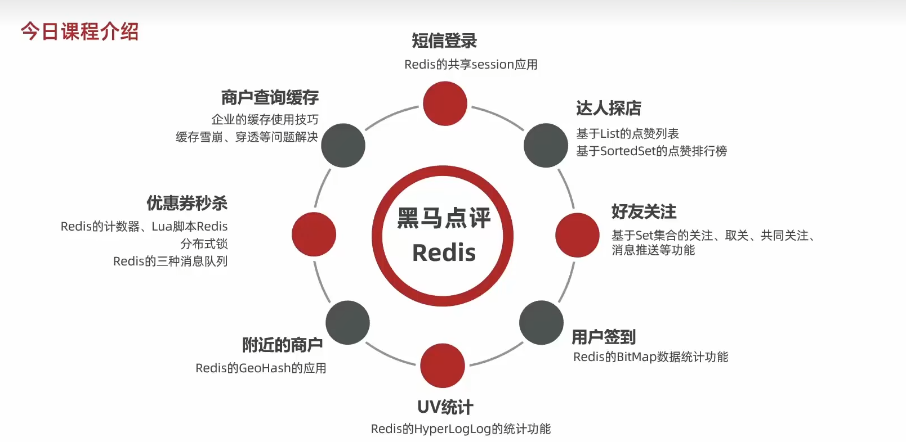

## 2.短信登录

### 1.基于Session的短信登录

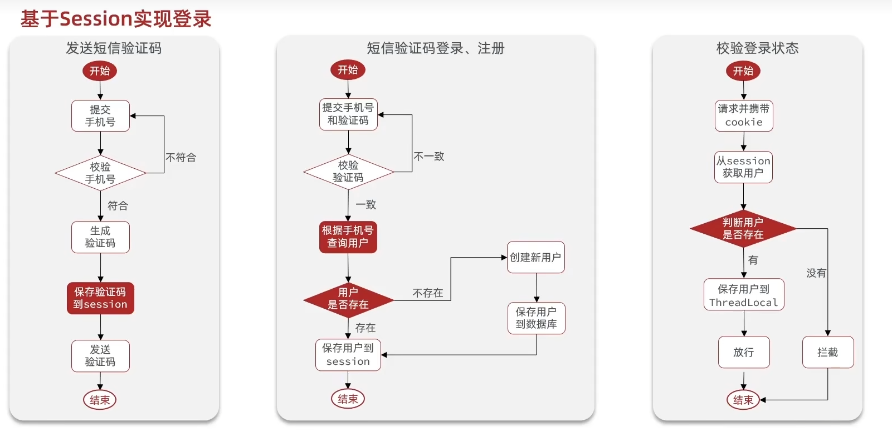

Service层代码实现:

```java
@Slf4j
@Service
public class UserServiceImpl extends ServiceImpl<UserMapper, User> implements IUserService {

    /**
     * 发送短信验证码
     * @param phone
     * @param session
     * @return
     */
    @Override
    public Result sendCode(String phone, HttpSession session) {
        //1.校验手机号
        if(RegexUtils.isPhoneInvalid(phone)){
            return Result.fail("请输入正确的手机号");
        }
        //2.生成验证码
        String code = RandomUtil.randomNumbers(6);
        //3.存入session,返回
        session.setAttribute("code",code);
        //4.发送验证码
        log.info("发送短信验证码成功,验证码:{}",code);
        return Result.ok();
    }

    /**
     * 登录功能实现
     * @param loginForm
     * @param session
     * @return
     */
    @Override
    public Result login(LoginFormDTO loginForm, HttpSession session) {
        //1.校验手机号
        String phone = loginForm.getPhone();
        if(RegexUtils.isPhoneInvalid(phone)){
            return Result.fail("请输入正确的手机号");
        }
        //2.校验验证码，验证码错误报错
        Object cachCode = session.getAttribute("code");
        String code = loginForm.getCode();
        if(cachCode == null || !cachCode.toString().equals(code)){
            return Result.fail("验证码错误");
        }
        //3.判断用户是否存在
        User user = lambdaQuery().eq(User::getPhone,phone).one();
        //4.用户不存在要注册一个用户
        if(user == null){
            user = createUser(phone);
        }
        //5.存在的话登录成功
        UserDTO userDTO = BeanUtil.copyProperties(user, UserDTO.class);
        session.setAttribute("user",userDTO);

        //6.不存在的话注册用户
        return Result.ok();
    }

    private User createUser(String phone) {
        //1.创建用户
        User user=new User();
        user.setPhone(phone);
        user.setNickName(USER_NICK_NAME_PREFIX + RandomUtil.randomString(10));
        //2.保存用户
        save(user);
        return user;
    }
}
```

### 集群的session共享问题

session共享问题:多台Tomcat并不共享session存储空间，当请求切换到不同的tomcat服务时会导致数据丢失的问题

session的替代方案应该满足

1. 数据共享

2. 内存存储

3. key,value结构

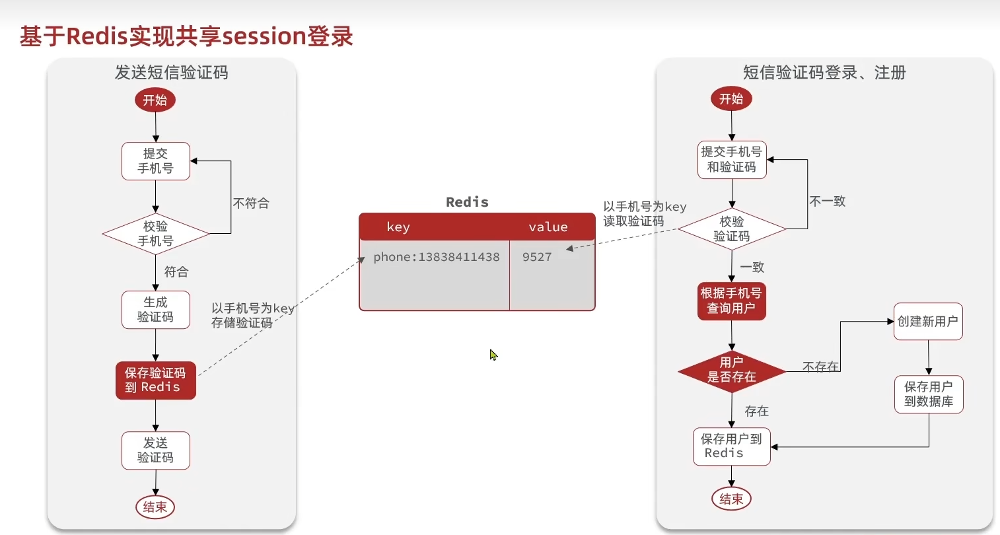

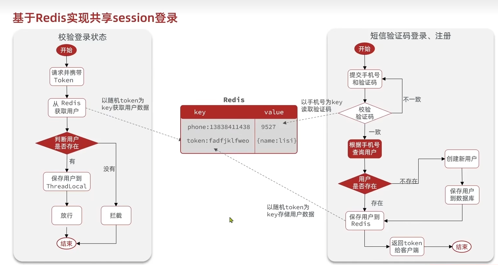

**key的选择必须满足两点:1.唯一性 2.方便取 3.尽量取的时候不暴露敏感信息**

Service层代码实现:

```java
@Slf4j
@Service
public class UserServiceImpl extends ServiceImpl<UserMapper, User> implements IUserService {

    @Resource
    private StringRedisTemplate stringRedisTemplate;

    /**
     * 发送短信验证码
     * @param phone
     * @param session
     * @return
     */
    @Override
    public Result sendCode(String phone, HttpSession session) {
        //1.校验手机号
        if(RegexUtils.isPhoneInvalid(phone)){
            return Result.fail("请输入正确的手机号");
        }
        //2.生成验证码
        String code = RandomUtil.randomNumbers(6);
        //3.存入Redis,返回
        stringRedisTemplate.opsForValue().set(LOGIN_CODE_KEY +phone,code,LOGIN_CODE_TTL, TimeUnit.MINUTES);
        //4.发送验证码
        log.info("发送短信验证码成功,验证码:{}",code);
        return Result.ok();
    }

    /**
     * 登录功能实现
     * @param loginForm
     * @param session
     * @return
     */
    @Override
    public Result login(LoginFormDTO loginForm, HttpSession session) {
        //1.校验手机号
        String phone = loginForm.getPhone();
        if(RegexUtils.isPhoneInvalid(phone)){
            return Result.fail("请输入正确的手机号");
        }
        //2.校验验证码，验证码错误报错
        //从Redis中读取验证码code
        String cachCode = stringRedisTemplate.opsForValue().get(LOGIN_CODE_KEY +phone);
        String code = loginForm.getCode();
        if(cachCode == null || !cachCode.equals(code)){
            return Result.fail("验证码错误");
        }
        //3.判断用户是否存在
        User user = lambdaQuery().eq(User::getPhone,phone).one();
        //4.用户不存在要注册一个用户
        if(user == null){
            user = createUser(phone);
        }
        //5.存在的话登录成功
        UserDTO userDTO = BeanUtil.copyProperties(user, UserDTO.class);
        //生成一个不重复的Token
        String token = UUID.randomUUID().toString(true);
        //将userDTO以Hash结构的方式存储,设置有效期
        Map<String, Object> map = BeanUtil.beanToMap(userDTO,new HashMap<>(),
                CopyOptions.create().ignoreNullValue().setFieldValueEditor((fieldName,fieldValue)->{
                    return fieldValue.toString(); //这里要转为String,因为用的StringRedisTemplate
                }));
        stringRedisTemplate.opsForHash().putAll(LOGIN_USER_KEY+token,map);
        stringRedisTemplate.expire(LOGIN_USER_KEY+token,LOGIN_USER_TTL,TimeUnit.MINUTES);
        //返回Token给前端
        return Result.ok(token);
    }

    private User createUser(String phone) {
        //1.创建用户
        User user=new User();
        user.setPhone(phone);
        user.setNickName(USER_NICK_NAME_PREFIX + RandomUtil.randomString(10));
        //2.保存用户
        save(user);
        return user;
    }
}
```

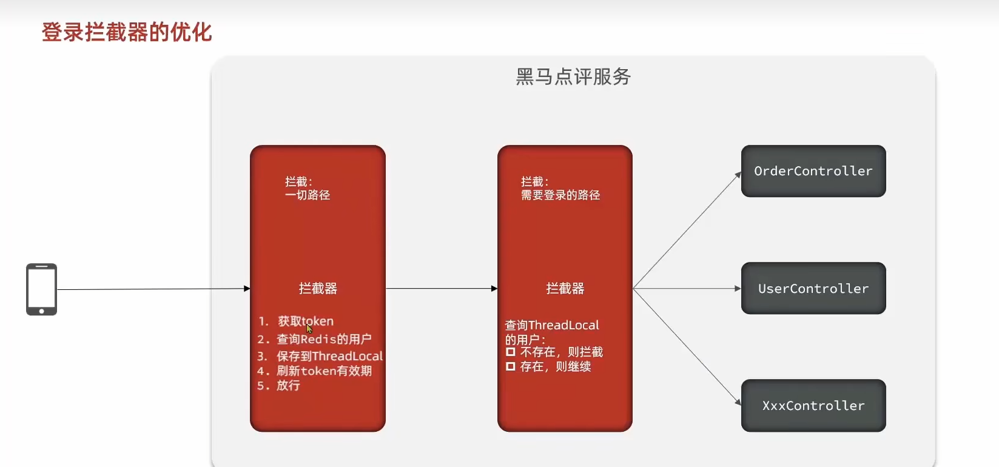

为啥要优化:因为如果用户在不需要拦截的路径操作的时间超过我们设置的有效期时间，Redis中也会过期

```java
@Configuration
public class MvcConfig implements WebMvcConfigurer {
    @Autowired
    private LoginInterceptor loginInterceptor;
    @Autowired
    private RefreshTokenInterceptor refreshTokenInterceptor;
    @Override
    public void addInterceptors(InterceptorRegistry registry) {
        registry.addInterceptor(loginInterceptor)
                .excludePathPatterns(
                        "/shop/**",
                        "/voucher/**",
                        "/shop-type/**",
                        "/upload/**",
                        "/blog/hot",
                        "/user/code",
                        "/user/login"
                ).order(1);
        //order值越小，越先执行
        registry.addInterceptor(refreshTokenInterceptor).addPathPatterns("/**").order(0);
    }
}
```

## 3. 商户查询缓存

### 3.1缓存

缓存：数据交换的缓冲区(称作Cache),是存储数据的临时地方，一般读写性能较高

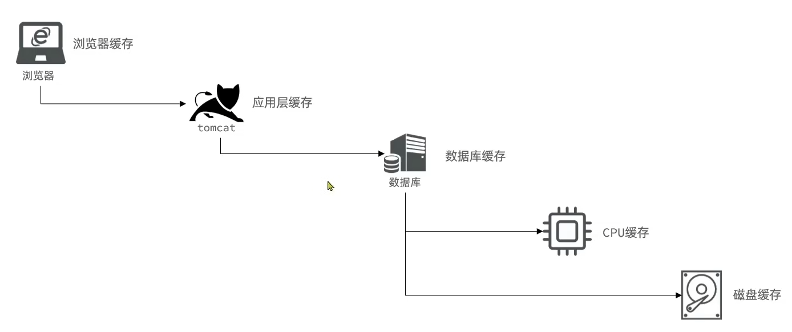

缓存的作用:

1. 降低后端负载

2. 提高读写效率，降低响应时间

缓存的成本:

1. 数据一致性成本

2. 代码维护成本

3. 运维成本

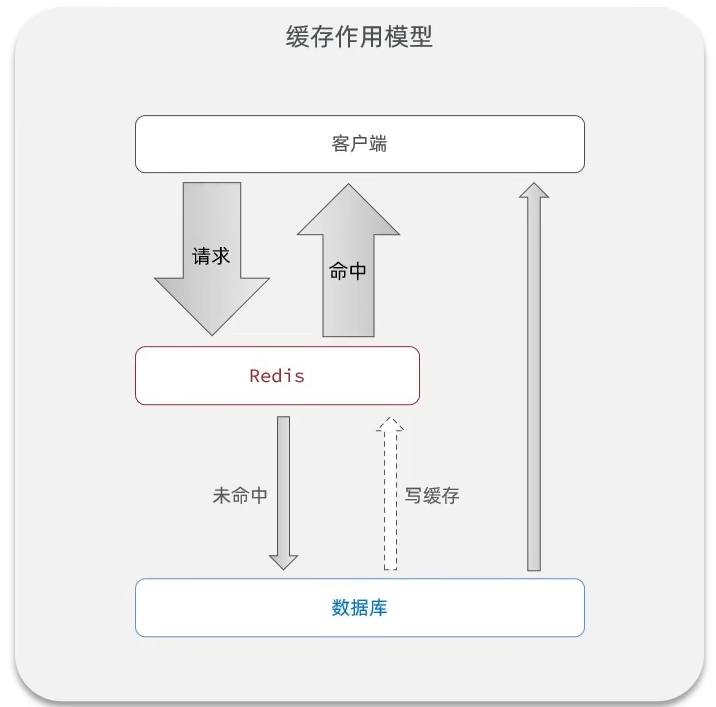

Service层代码实现:

```java
    @Override
    public Result queryById(Long id) {
        String key = CACHE_SHOP_KEY + id.toString();
        //1.先查Redis
        Map<Object, Object> map = stringRedisTemplate.opsForHash().entries(key);
        //2.查到了直接返回
        if(!map.isEmpty()){
            Shop shop = BeanUtil.fillBeanWithMap(map, new Shop(), false);
            log.info("根据id查询shop,Redis命中直接返回");
            return Result.ok(shop);
        }
        //3.没有查到再去查数据库
        Shop shop = lambdaQuery().eq(Shop::getId, id).one();
        //4.没有店铺，返回错误信息
        if(Objects.isNull(shop)){
            return Result.fail("对不起，没有店铺数据");
        }
        //5.有店铺，存入Redis,返回
        Map<String, Object> redisMap = BeanUtil.beanToMap(shop, new HashMap<>(),
                //因为用的stringRedisTemplate，所以要对值进行处理
                CopyOptions.create().setIgnoreNullValue(true).setFieldValueEditor((fieldName, fieldValue) -> {
                    if(fieldValue!=null){
                        return fieldValue.toString();
                    }
                    return null;
                }));
        stringRedisTemplate.opsForHash().putAll(key,redisMap);
        stringRedisTemplate.expire(key,CACHE_SHOP_TTL, TimeUnit.HOURS);
        return Result.ok(shop);
    }
```

### 3.2缓存更新策略

|      | 内存淘汰                                               | 超时剔除                                 | 主动更新                  |
| ---- | -------------------------------------------------- | ------------------------------------ | --------------------- |
| 说明   | 不用自己维护，利用Redis的内存淘汰机制，<br>当内存不足时自动淘汰部分数据。下次查询时更新缓存 | 给缓存数据添加TTL时间，到期后自动删除缓存。<br>下次查询时更新缓存 | 编写业务逻辑，在修改数据库的同时，更新缓存 |
| 一致性  | 差                                                  | 一般                                   | 好                     |
| 维护成本 | 无                                                  | 低                                    | 高                     |

业务场景:

1. 低一致性需求:使用内存淘汰机制、例如店铺类型的查询缓存。

2. 高一致性需求:主动更新，并以超时剔除作为兜底方案。例如店铺详情查询的缓存。

**主动更新策略:**

<font color=red>1. Cache Aside Pattern</font>

由缓存的调用者，在更新数据库的同时更新缓存。

2.Read/Write Through Pattern

缓存和数据库整合为一个服务，由服务来维护一致性。调用者调用该服务，无需关心缓存一致性问题。

3.Write Behind Caching Pattern

调用者只操作缓存，由其他线程异步的将缓存数据持久化到数据库，保证最终一致。

**用Cache Aside Pattern，操作缓存和数据库时有三个问题需要考虑:**

1. 删除缓存还是更新缓存?

    更新缓存:每次更新数据库都更新缓存，无效写操作较多

    删除缓存:更新数据库时让缓存失效，查询时再更新缓存

2. 如何保证缓存与数据库的操作的同时成功或失败?

    单体系统:将缓存与数据库操作放在一个事物

    分布式系统：利用TCC等分布式事物方案

3. 先操作缓存还是先操作数据库:

    老师给的说明是先操作数据库，再删除缓存

### 3.3缓存穿透问题

**缓存穿透**是指客户端请求的数据在缓存中和数据库中都不存在，这样缓存永远不会生效，这些请求都会打到数据库。

常见的解决方法:

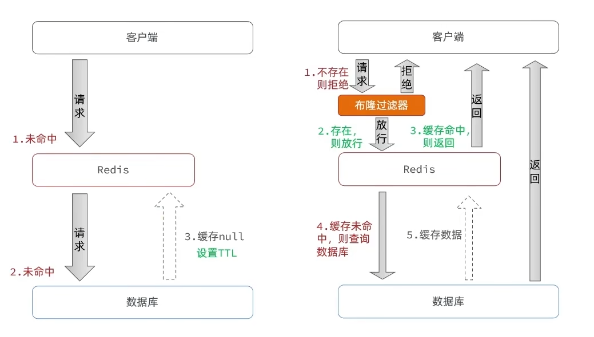

方法一:<font color="red">缓存空对象</font>

优点:实现简单，维护方便

缺点:1.额外的内存消耗 2.可能造成短期的不一致(当这次请求穿透了缓存为null,下一次新增了一个真实数据，数据不一致)

方法二:<font color="red">布隆过滤</font>

优点:内存占用较少，没有多余的key

缺点:1.实现复杂 2.存在误判可能(当布隆过滤器放行的时候，也不一定真的存在，又出现缓存穿透问题)


方法一的流程大致图:

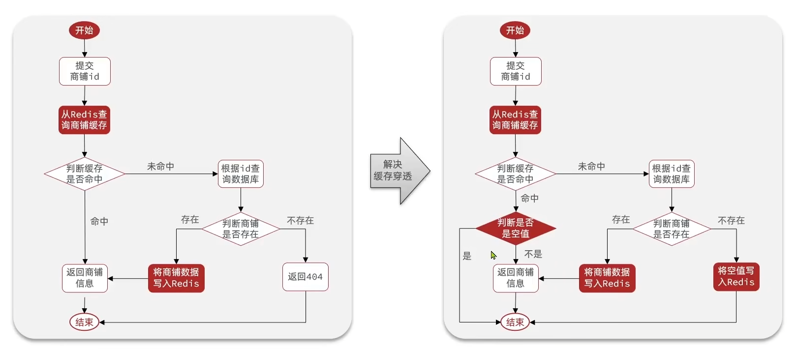

以上说的两种方案是被动的解决，还有一些主动解决缓存穿透的方法:

1. 增加id复杂度，避免被猜测id规律

2. 做好数据的基础格式校验

3. 加强用户权限校验

4. 做好热点参数的限流

### 3.4缓存雪崩

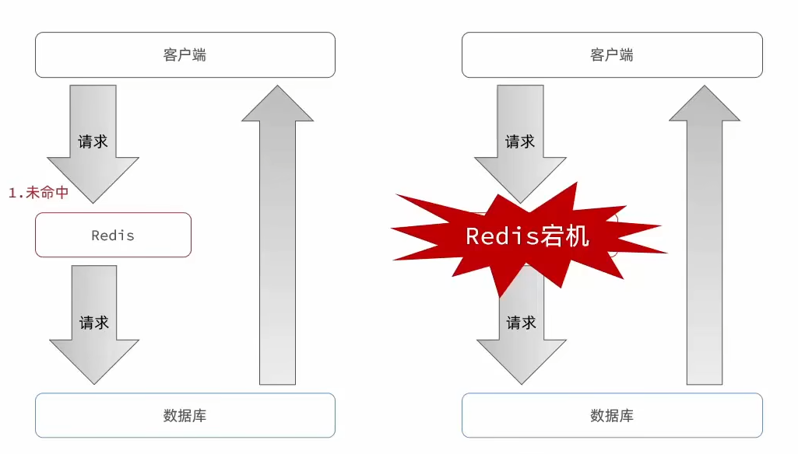

**缓存雪崩是指在同一时段大量的缓存key同时失效或者Redis的服务宕机，导致大量的请求到达数据库，带来巨大压力**

**解决方案:**

1. 给不同的key的TTL添加随机值

2. 利用Redis集群提高服务的可用性

3. 给缓存业务添加降级限流策略

4. 给业务添加多级缓存

### 3.5缓存击穿

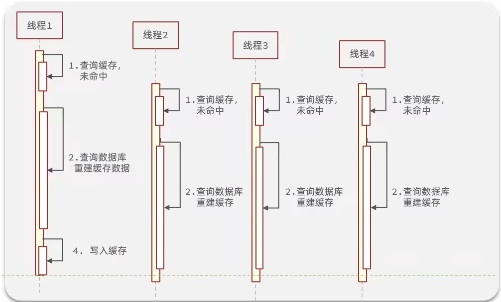

缓存击穿问题也叫热点Key问题，就是一个被高并发访问并且缓存重建业务较复杂的key突然失效了，无数的请求访问会在瞬间给数据库带来巨大的冲击

解决方式有两种:

1. 互斥锁

2. 逻辑过期

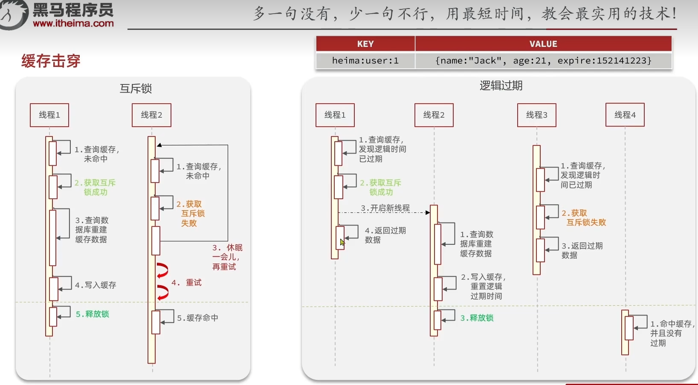

<table>
    <tr>
        <th>解决方案</th>
        <th>优点</th>
        <th>缺点</th>
    </tr>
    <tr>
        <td>互斥锁</td>
        <td>
            1.没有额外的内存消耗
            2.保证一致性
            3.实现简单
        </td>
        <td>
            1.线程需要等待，性能受影响
            2.可能有死锁风险
        </td>
    </tr>
    <tr>
        <td>逻辑过期</td>
        <td>
            线程无需等待，性能较好
        </td>
        <td>
            1.不保证一致性
            2.有额外内存消耗
            3.实现复杂
        </td>
    </tr>
</table>


