# Redis实战篇

## 1.实战大纲


## 2.短信登录

### 1.基于Session的短信登录


Service层代码实现:

```java
@Slf4j
@Service
public class UserServiceImpl extends ServiceImpl<UserMapper, User> implements IUserService {

    /**
     * 发送短信验证码
     * @param phone
     * @param session
     * @return
     */
    @Override
    public Result sendCode(String phone, HttpSession session) {
        //1.校验手机号
        if(RegexUtils.isPhoneInvalid(phone)){
            return Result.fail("请输入正确的手机号");
        }
        //2.生成验证码
        String code = RandomUtil.randomNumbers(6);
        //3.存入session,返回
        session.setAttribute("code",code);
        //4.发送验证码
        log.info("发送短信验证码成功,验证码:{}",code);
        return Result.ok();
    }

    /**
     * 登录功能实现
     * @param loginForm
     * @param session
     * @return
     */
    @Override
    public Result login(LoginFormDTO loginForm, HttpSession session) {
        //1.校验手机号
        String phone = loginForm.getPhone();
        if(RegexUtils.isPhoneInvalid(phone)){
            return Result.fail("请输入正确的手机号");
        }
        //2.校验验证码，验证码错误报错
        Object cachCode = session.getAttribute("code");
        String code = loginForm.getCode();
        if(cachCode == null || !cachCode.toString().equals(code)){
            return Result.fail("验证码错误");
        }
        //3.判断用户是否存在
        User user = lambdaQuery().eq(User::getPhone,phone).one();
        //4.用户不存在要注册一个用户
        if(user == null){
            user = createUser(phone);
        }
        //5.存在的话登录成功
        UserDTO userDTO = BeanUtil.copyProperties(user, UserDTO.class);
        session.setAttribute("user",userDTO);

        //6.不存在的话注册用户
        return Result.ok();
    }

    private User createUser(String phone) {
        //1.创建用户
        User user=new User();
        user.setPhone(phone);
        user.setNickName(USER_NICK_NAME_PREFIX + RandomUtil.randomString(10));
        //2.保存用户
        save(user);
        return user;
    }
}
```

### 集群的session共享问题

session共享问题:多台Tomcat并不共享session存储空间，当请求切换到不同的tomcat服务时会导致数据丢失的问题

session的替代方案应该满足

1. 数据共享

2. 内存存储

3. key,value结构


**key的选择必须满足两点:1.唯一性 2.方便取 3.尽量取的时候不暴露敏感信息**

Service层代码实现:

```java
@Slf4j
@Service
public class UserServiceImpl extends ServiceImpl<UserMapper, User> implements IUserService {

    @Resource
    private StringRedisTemplate stringRedisTemplate;

    /**
     * 发送短信验证码
     * @param phone
     * @param session
     * @return
     */
    @Override
    public Result sendCode(String phone, HttpSession session) {
        //1.校验手机号
        if(RegexUtils.isPhoneInvalid(phone)){
            return Result.fail("请输入正确的手机号");
        }
        //2.生成验证码
        String code = RandomUtil.randomNumbers(6);
        //3.存入Redis,返回
        stringRedisTemplate.opsForValue().set(LOGIN_CODE_KEY +phone,code,LOGIN_CODE_TTL, TimeUnit.MINUTES);
        //4.发送验证码
        log.info("发送短信验证码成功,验证码:{}",code);
        return Result.ok();
    }

    /**
     * 登录功能实现
     * @param loginForm
     * @param session
     * @return
     */
    @Override
    public Result login(LoginFormDTO loginForm, HttpSession session) {
        //1.校验手机号
        String phone = loginForm.getPhone();
        if(RegexUtils.isPhoneInvalid(phone)){
            return Result.fail("请输入正确的手机号");
        }
        //2.校验验证码，验证码错误报错
        //从Redis中读取验证码code
        String cachCode = stringRedisTemplate.opsForValue().get(LOGIN_CODE_KEY +phone);
        String code = loginForm.getCode();
        if(cachCode == null || !cachCode.equals(code)){
            return Result.fail("验证码错误");
        }
        //3.判断用户是否存在
        User user = lambdaQuery().eq(User::getPhone,phone).one();
        //4.用户不存在要注册一个用户
        if(user == null){
            user = createUser(phone);
        }
        //5.存在的话登录成功
        UserDTO userDTO = BeanUtil.copyProperties(user, UserDTO.class);
        //生成一个不重复的Token
        String token = UUID.randomUUID().toString(true);
        //将userDTO以Hash结构的方式存储,设置有效期
        Map<String, Object> map = BeanUtil.beanToMap(userDTO,new HashMap<>(),
                CopyOptions.create().ignoreNullValue().setFieldValueEditor((fieldName,fieldValue)->{
                    return fieldValue.toString(); //这里要转为String,因为用的StringRedisTemplate
                }));
        stringRedisTemplate.opsForHash().putAll(LOGIN_USER_KEY+token,map);
        stringRedisTemplate.expire(LOGIN_USER_KEY+token,LOGIN_USER_TTL,TimeUnit.MINUTES);
        //返回Token给前端
        return Result.ok(token);
    }

    private User createUser(String phone) {
        //1.创建用户
        User user=new User();
        user.setPhone(phone);
        user.setNickName(USER_NICK_NAME_PREFIX + RandomUtil.randomString(10));
        //2.保存用户
        save(user);
        return user;
    }
}
```


为啥要优化:因为如果用户在不需要拦截的路径操作的时间超过我们设置的有效期时间，Redis中也会过期

```java
@Configuration
public class MvcConfig implements WebMvcConfigurer {
    @Autowired
    private LoginInterceptor loginInterceptor;
    @Autowired
    private RefreshTokenInterceptor refreshTokenInterceptor;
    @Override
    public void addInterceptors(InterceptorRegistry registry) {
        registry.addInterceptor(loginInterceptor)
                .excludePathPatterns(
                        "/shop/**",
                        "/voucher/**",
                        "/shop-type/**",
                        "/upload/**",
                        "/blog/hot",
                        "/user/code",
                        "/user/login"
                ).order(1);
        //order值越小，越先执行
        registry.addInterceptor(refreshTokenInterceptor).addPathPatterns("/**").order(0);
    }
}
```

## 3. 商户查询缓存

### 3.1缓存

缓存：数据交换的缓冲区(称作Cache),是存储数据的临时地方，一般读写性能较高


缓存的作用:

1. 降低后端负载

2. 提高读写效率，降低响应时间

缓存的成本:

1. 数据一致性成本

2. 代码维护成本

3. 运维成本


Service层代码实现:

```java
    @Override
    public Result queryById(Long id) {
        String key = CACHE_SHOP_KEY + id.toString();
        //1.先查Redis
        Map<Object, Object> map = stringRedisTemplate.opsForHash().entries(key);
        //2.查到了直接返回
        if(!map.isEmpty()){
            Shop shop = BeanUtil.fillBeanWithMap(map, new Shop(), false);
            log.info("根据id查询shop,Redis命中直接返回");
            return Result.ok(shop);
        }
        //3.没有查到再去查数据库
        Shop shop = lambdaQuery().eq(Shop::getId, id).one();
        //4.没有店铺，返回错误信息
        if(Objects.isNull(shop)){
            return Result.fail("对不起，没有店铺数据");
        }
        //5.有店铺，存入Redis,返回
        Map<String, Object> redisMap = BeanUtil.beanToMap(shop, new HashMap<>(),
                //因为用的stringRedisTemplate，所以要对值进行处理
                CopyOptions.create().setIgnoreNullValue(true).setFieldValueEditor((fieldName, fieldValue) -> {
                    if(fieldValue!=null){
                        return fieldValue.toString();
                    }
                    return null;
                }));
        stringRedisTemplate.opsForHash().putAll(key,redisMap);
        stringRedisTemplate.expire(key,CACHE_SHOP_TTL, TimeUnit.HOURS);
        return Result.ok(shop);
    }
```

### 3.2缓存更新策略

|      | 内存淘汰                                               | 超时剔除                                 | 主动更新                  |
| ---- | -------------------------------------------------- | ------------------------------------ | --------------------- |
| 说明   | 不用自己维护，利用Redis的内存淘汰机制，<br>当内存不足时自动淘汰部分数据。下次查询时更新缓存 | 给缓存数据添加TTL时间，到期后自动删除缓存。<br>下次查询时更新缓存 | 编写业务逻辑，在修改数据库的同时，更新缓存 |
| 一致性  | 差                                                  | 一般                                   | 好                     |
| 维护成本 | 无                                                  | 低                                    | 高                     |

业务场景:

1. 低一致性需求:使用内存淘汰机制、例如店铺类型的查询缓存。

2. 高一致性需求:主动更新，并以超时剔除作为兜底方案。例如店铺详情查询的缓存。

**主动更新策略:**

<font color=red>1. Cache Aside Pattern</font>

由缓存的调用者，在更新数据库的同时更新缓存。

2.Read/Write Through Pattern

缓存和数据库整合为一个服务，由服务来维护一致性。调用者调用该服务，无需关心缓存一致性问题。

3.Write Behind Caching Pattern

调用者只操作缓存，由其他线程异步的将缓存数据持久化到数据库，保证最终一致。

**用Cache Aside Pattern，操作缓存和数据库时有三个问题需要考虑:**

1. 删除缓存还是更新缓存?

    更新缓存:每次更新数据库都更新缓存，无效写操作较多

    删除缓存:更新数据库时让缓存失效，查询时再更新缓存

2. 如何保证缓存与数据库的操作的同时成功或失败?

    单体系统:将缓存与数据库操作放在一个事物

    分布式系统：利用TCC等分布式事物方案

3. 先操作缓存还是先操作数据库:

    老师给的说明是先操作数据库，再删除缓存

### 3.3缓存穿透问题

**缓存穿透**是指客户端请求的数据在缓存中和数据库中都不存在，这样缓存永远不会生效，这些请求都会打到数据库。

常见的解决方法:


方法一:<font color="red">缓存空对象</font>

优点:实现简单，维护方便

缺点:1.额外的内存消耗 2.可能造成短期的不一致(当这次请求穿透了缓存为null,下一次新增了一个真实数据，数据不一致)

方法二:<font color="red">布隆过滤</font>

优点:内存占用较少，没有多余的key

缺点:1.实现复杂 2.存在误判可能(当布隆过滤器放行的时候，也不一定真的存在，又出现缓存穿透问题)

方法一的流程大致图:


以上说的两种方案是被动的解决，还有一些主动解决缓存穿透的方法:

1. 增加id复杂度，避免被猜测id规律

2. 做好数据的基础格式校验

3. 加强用户权限校验

4. 做好热点参数的限流

### 3.4缓存雪崩


**缓存雪崩是指在同一时段大量的缓存key同时失效或者Redis的服务宕机，导致大量的请求到达数据库，带来巨大压力**

**解决方案:**

1. 给不同的key的TTL添加随机值

2. 利用Redis集群提高服务的可用性

3. 给缓存业务添加降级限流策略

4. 给业务添加多级缓存

### 3.5缓存击穿


缓存击穿问题也叫热点Key问题，就是一个被高并发访问并且缓存重建业务较复杂的key突然失效了，无数的请求访问会在瞬间给数据库带来巨大的冲击

解决方式有两种:

1. 互斥锁

2. 逻辑过期


<table>
    <tr>
        <th>解决方案</th>
        <th>优点</th>
        <th>缺点</th>
    </tr>
    <tr>
        <td>互斥锁</td>
        <td>
            1.没有额外的内存消耗
            2.保证一致性
            3.实现简单
        </td>
        <td>
            1.线程需要等待，性能受影响
            2.可能有死锁风险
        </td>
    </tr>
    <tr>
        <td>逻辑过期</td>
        <td>
            线程无需等待，性能较好
        </td>
        <td>
            1.不保证一致性
            2.有额外内存消耗
            3.实现复杂
        </td>
    </tr>
</table>

基于互斥锁解决缓存击穿问题流程:

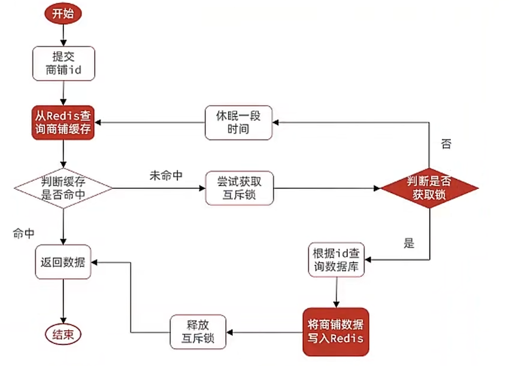

```java
    /**
     * 用互斥锁解决缓存击穿
     * @param id
     * @return
     */
    private Shop queryWithMutex(Long id) {
        String key = CACHE_SHOP_KEY + id.toString();
        //1.先查Redis
        Map<Object, Object> map = stringRedisTemplate.opsForHash().entries(key);
        //2.查到了
        if(!map.isEmpty()){
            //判断是不是空值
            if(map.containsKey("nullKey")) return null;
            Shop shop = BeanUtil.fillBeanWithMap(map, new Shop(), false);
            log.info("根据id查询shop,Redis命中直接返回");
            return shop;
        }
        String lockKey = "lock:shop:"+id;
        try{
            //要先获取锁
            //如果获取锁失败
            if(!tryLock(lockKey)){
                //休眠后重试
                Thread.sleep(50);
                return queryWithMutex(id);
            }
            //3.没有查到再去查数据库
            Shop shop = lambdaQuery().eq(Shop::getId, id).one();
            //4.没有店铺，返回错误信息
            if(Objects.isNull(shop)){
                stringRedisTemplate.opsForHash().put(key,"nullKey","null");
                stringRedisTemplate.expire(key,CACHE_NULL_TTL,TimeUnit.MINUTES);
                return null;
            }
            //5.有店铺，存入Redis,返回
            Map<String, Object> redisMap = BeanUtil.beanToMap(shop, new HashMap<>(),
                    //因为用的stringRedisTemplate，所以要对值进行处理
                    CopyOptions.create().setIgnoreNullValue(true).setFieldValueEditor((fieldName, fieldValue) -> {
                        if(fieldValue!=null){
                            return fieldValue.toString();
                        }
                        return null;
                    }));
            stringRedisTemplate.opsForHash().putAll(key,redisMap);
            stringRedisTemplate.expire(key,CACHE_SHOP_TTL, TimeUnit.HOURS);
            return shop;
        } catch(Exception e) {
            throw new RuntimeException(e);
        }
        finally {
            unLock(lockKey);
        }
        //释放锁
    }
```

用逻辑过期解决缓存击穿

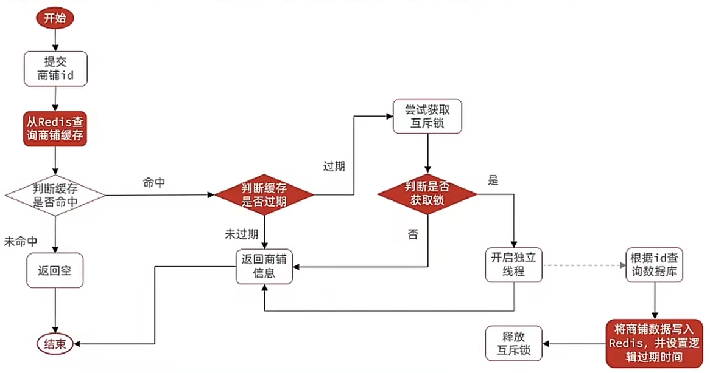

 代码:

```java
    private static final ExecutorService CACHE_REBUILD_EXECUTOR = Executors.newFixedThreadPool(10);

    private Shop queryWithLogicalExpire(Long id){
        String key = CACHE_SHOP_KEY + id.toString();
        //1.从Redis里面查询数据
        String jsonStr = stringRedisTemplate.opsForValue().get(key);
        //如果Redis没有名字直接返回
        if(StrUtil.isBlank(jsonStr)){
            return null;
        }
        //2.反序列化
        RedisData redisData = JSONUtil.toBean(jsonStr, RedisData.class);
        Shop shop = JSONUtil.toBean((JSONObject) redisData.getData(), Shop.class);
        //如果没有过期，直接返回shop
        if(redisData.getExpireTime().isAfter(LocalDateTime.now())){
            return shop;
        }
        String lockKey = LOCK_SHOP_KEY+id;
        boolean isLock = tryLock(lockKey);
        if(isLock){
            //创建新线程去重建
            CACHE_REBUILD_EXECUTOR.submit(()->{
                try{
                    saveShopToRedis(id,20L);
                }catch (Exception e){
                    throw new RuntimeException(e);
                }finally {
                    //释放锁
                    unLock(lockKey);
                }
            });
        }
        return shop;
    }
```

### 封装Redis工具类

```java
@Component
@RequiredArgsConstructor
public class CacheClient {
    private StringRedisTemplate stringRedisTemplate;

    /**
     * 设置缓存
     * @param key
     * @param value
     * @param time
     * @param unit
     */
    public void set(String key, Object value, Long time, TimeUnit unit){
        stringRedisTemplate.opsForValue().set(key, JSONUtil.toJsonStr(value),time,unit);
    }

    /**
     * 设置缓存-逻辑过期
     * @param key
     * @param value
     * @param time
     * @param unit
     */
    public void setLogicalExpire(String key,Object value,Long time,TimeUnit unit){
        //1.先转为RedisData对象
        RedisData redisData = new RedisData();
        redisData.setData(value);
        redisData.setExpireTime(LocalDateTime.now().plusSeconds(unit.toSeconds(time)));
        //2.再写入Redis
        stringRedisTemplate.opsForValue().set(key, JSONUtil.toJsonStr(redisData));
    }

    /**
     * 缓存穿透
     * @param keyPrefix
     * @param id
     * @param type
     * @param dbFallback
     * @param time
     * @param unit
     * @param <R>
     * @param <ID>
     * @return
     */
    public <R,ID> R queryWithPassThrough(String keyPrefix, ID id, Class<R> type, Function<ID,R> dbFallback, Long time, TimeUnit unit){
        String key = keyPrefix + id;
        String json = stringRedisTemplate.opsForValue().get(key);
        if(StrUtil.isNotBlank(json)){
            //有缓存，直接返回
            return JSONUtil.toBean(json,type);
        }
        if(json != null){
            //缓存穿透，返回错误
            return null;
        }
        R r = dbFallback.apply(id);
        if(r == null){
            //数据库没有数据，缓存空值
            stringRedisTemplate.opsForValue().set(key,"",CACHE_NULL_TTL,TimeUnit.MINUTES);
            return null;
        }
        set(key,r,time,unit);
        return r;
    }

    /**
     * 实现逻辑过期缓存
     */
    private static final ExecutorService CACHE_REBUILD_EXECUTOR = Executors.newFixedThreadPool(10);
    public <R,ID> R queryWithLogicalExpire(String keyPrefix, ID id, Class<R> type, Function<ID,R> dbFallback, Long time, TimeUnit unit){
        String key = keyPrefix + id;
        String json = stringRedisTemplate.opsForValue().get(key);
        if(StrUtil.isBlank(json)){
            return null;
        }
        RedisData redisData = JSONUtil.toBean(json,RedisData.class);
        R r = JSONUtil.toBean((JSONObject)redisData.getData(),type);
        if(redisData.getExpireTime().isAfter(LocalDateTime.now())){
            return r;
        }
        String lockKey = RedisConstants.LOCK_SHOP_KEY + key;
        boolean isLock = tryLock(lockKey);
        if(isLock){
            CACHE_REBUILD_EXECUTOR.submit(() -> {
                try {
                    R r1 = dbFallback.apply(id);
                    RedisData data = new RedisData();
                    data.setData(r1);
                    data.setExpireTime(LocalDateTime.now().plusSeconds(unit.toSeconds(time)));
                    set(key,data,time,unit);
                } catch (Exception e) {
                    throw new RuntimeException(e);
                } finally {
                    unLock(lockKey);
                }
            });
        }
        return r;
    }
    //获取一个互斥锁
    private boolean tryLock(String key){
        Boolean ans = stringRedisTemplate.opsForValue().setIfAbsent(key, "1", 10, TimeUnit.MINUTES);
        return BooleanUtil.isTrue(ans);
    }
    //释放一个互斥锁
    private void unLock(String key){
        stringRedisTemplate.delete(key);
    }

}
```

## 4.优惠卷秒杀

### 1.全局id生成器

自增的id有啥缺陷:

1. id的规律性太明显

2. 受单表数据量的限制

全局id生成器，是一种在分布式系统下用来生成全局唯一ID的工具，一般要满足下列特性:

1. 唯一性

2. 递增性

3. 安全性

4. 高可用

5. 高性能

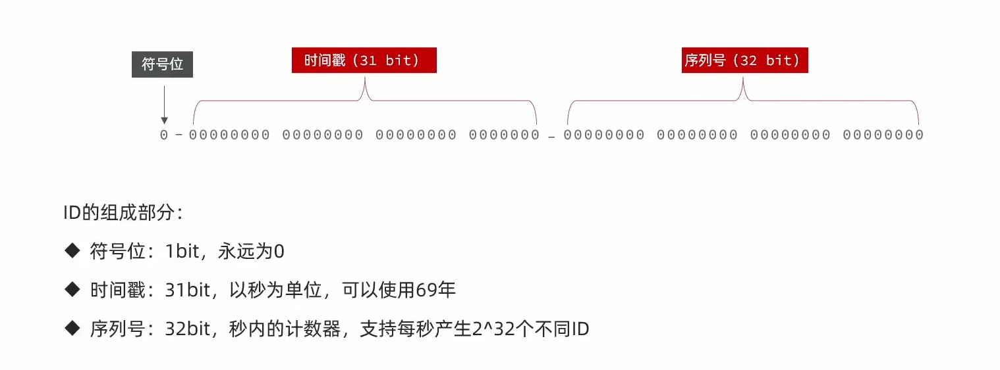

代码:

```java
@Component
public class RedisIdWorker {
    private static final long startTimeMils = 1767225600;
    private StringRedisTemplate stringRedisTemplate;
    //利用构造函数注入
    public RedisIdWorker(StringRedisTemplate stringRedisTemplate) {
        this.stringRedisTemplate = stringRedisTemplate;
    }
    public long nextId(String keyPrefix){
        long curTimeMils = LocalDateTime.now().toEpochSecond(ZoneOffset.UTC);
        long timeMils = curTimeMils - startTimeMils;
        String date = LocalDateTime.now().format(DateTimeFormatter.ofPattern("yyyy:MM:dd"));
        long increment = stringRedisTemplate.opsForValue().increment("icr:" + keyPrefix + ":" + date);
        return timeMils <<32 | increment;
    }
}
```

全局唯一ID生成策略:

1. UUID

2. Redis自增

3. snowflake算法

4. 数据库自增

Redis自增ID策略:

1. 每天一个key,方便统计订单量

2. ID构造是时间戳+计数器

### 2.优惠卷秒杀业务流程

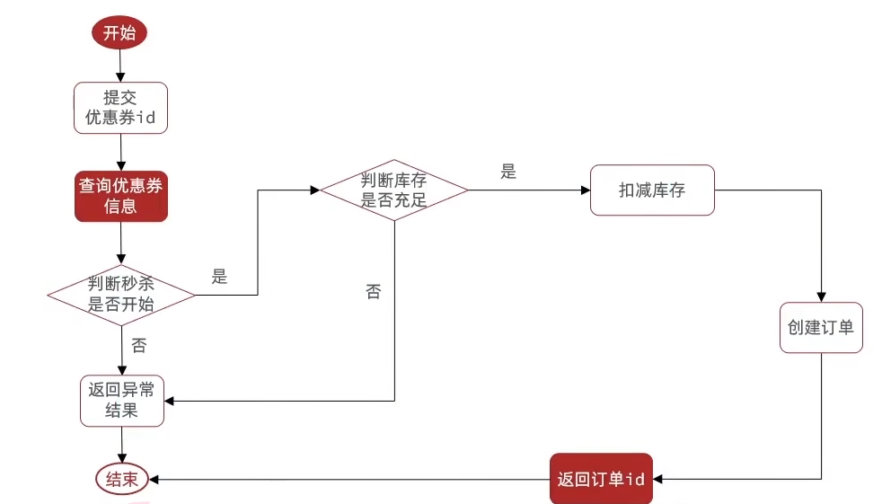

代码:

```java
@Service
public class VoucherOrderServiceImpl extends ServiceImpl<VoucherOrderMapper, VoucherOrder> implements IVoucherOrderService {

    @Resource
    private ISeckillVoucherService seckillVoucherService;
    @Resource
    private RedisIdWorker redisIdWorker;
    /**
     * 秒杀优惠券
     * @param voucherId
     * @return
     */
    @Override
    @Transactional
    public Result seckillVoucher(Long voucherId) {
        //1.查询对应优惠卷
        SeckillVoucher voucher = seckillVoucherService.lambdaQuery().eq(SeckillVoucher::getVoucherId, voucherId).one();
        if (voucher == null) {
            return Result.fail("优惠券不存在");
        }
        //2.判断时间是否在优惠券的开始时间和结束时间内
        if (voucher.getBeginTime().isAfter(LocalDateTime.now()) || voucher.getEndTime().isBefore(LocalDateTime.now())) {
            return Result.fail("优惠券不在使用范围");
        }
        //3.判断库存是否充足
        if (voucher.getStock() < 1){
            return Result.fail("库存不足");
        }
        //4.扣减库存
        boolean success = seckillVoucherService.update().setSql("stock = stock - 1").eq("voucher_id", voucherId).update();
        if (!success) {
            return Result.fail("库存不足");
        }
        //5.创建订单
        Long userId = UserHolder.getUser().getId();
        VoucherOrder voucherOrder = new VoucherOrder();
        voucherOrder.setUserId(userId);
        voucherOrder.setVoucherId(voucherId);
        long orderId = redisIdWorker.nextId("order");
        voucherOrder.setId(orderId);
        save(voucherOrder);
        //6.返回订单号
        return Result.ok(orderId);
    }
}
```

### 3.超卖问题

刚刚写的那个代码会出现超卖问题，如果设置200个线程同时去抢购，就会出现库存量为-9的问题，这是典型的多线程安全问题，针对这一问题的常见解决方案就是加锁:

<font color="skyblue">悲观锁:</font>

认为线程安全问题一定会发生，因此在操作数据之前先获取锁，确保线程串行执行

例如:Synchronized、Lock都属于悲观锁

<font color="red">乐观锁:</font>

认为线程安全问题不一定会发生，因此不加锁，只是在更新数据时去判断有没有其他线程对数据做了修改。

如果没有修改则认为是安全的，自己才更新数据

如果已经被其他线程修改说明发生了安全问题，此时可以重试或异常。

**乐观锁的关键是判断之前查询得到的数据是否有被修改过，常见的方式有两种:**

**<font color="red">1.版本号法</font>**

<table>
<tr>
    <th>id</th>
    <th>stock</th>
    <th>version</th>
</tr>
<tr>
    <td>10</td>
    <td>0</td>
    <td>2</td>
</tr>
</table>

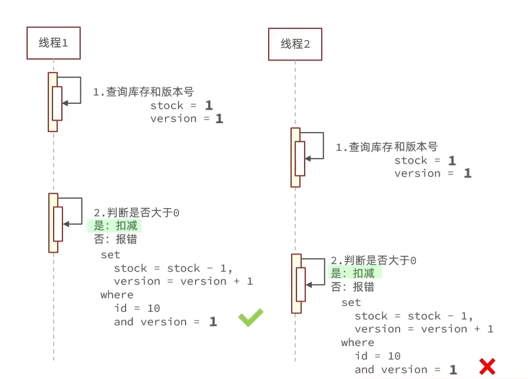

**<font color="red">2.CAS法</font>**

cas法想法和版本号的想法一样，只不过我们在做的时候，利用共享的数据是否被修改直接判断

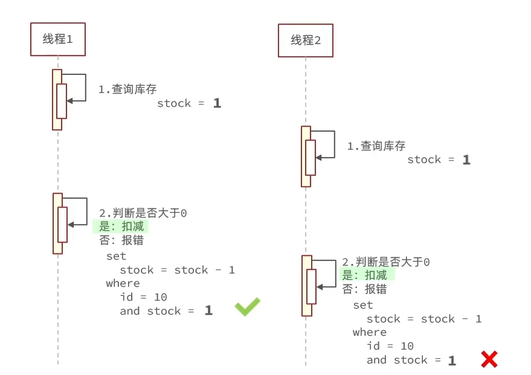

基于CAS解决秒杀优惠卷:

```java
    @Override
    @Transactional
    public Result seckillVoucher(Long voucherId) {
        //1.查询对应优惠卷
        SeckillVoucher voucher = seckillVoucherService.lambdaQuery().eq(SeckillVoucher::getVoucherId, voucherId).one();
        if (voucher == null) {
            return Result.fail("优惠券不存在");
        }
        //2.判断时间是否在优惠券的开始时间和结束时间内
        if (voucher.getBeginTime().isAfter(LocalDateTime.now()) || voucher.getEndTime().isBefore(LocalDateTime.now())) {
            return Result.fail("优惠券不在使用范围");
        }
        //3.判断库存是否充足
        if (voucher.getStock() < 1){
            return Result.fail("库存不足");
        }
        //4.扣减库存
        boolean success = seckillVoucherService.update().setSql("stock = stock - 1")
                .eq("voucher_id", voucherId).eq("stock",voucher.getStock())//乐观锁
                .update();
        if (!success) {
            return Result.fail("库存不足");
        }
        //5.创建订单
        Long userId = UserHolder.getUser().getId();
        VoucherOrder voucherOrder = new VoucherOrder();
        voucherOrder.setUserId(userId);
        voucherOrder.setVoucherId(voucherId);
        long orderId = redisIdWorker.nextId("order");
        voucherOrder.setId(orderId);
        save(voucherOrder);
        //6.返回订单号
        return Result.ok(orderId);
    }
```

但是这个失败率太高了，所以我们一般只要订单剩余>0就可以扣减

```java
    @Override
    @Transactional
    public Result seckillVoucher(Long voucherId) {
        //1.查询对应优惠卷
        SeckillVoucher voucher = seckillVoucherService.lambdaQuery().eq(SeckillVoucher::getVoucherId, voucherId).one();
        if (voucher == null) {
            return Result.fail("优惠券不存在");
        }
        //2.判断时间是否在优惠券的开始时间和结束时间内
        if (voucher.getBeginTime().isAfter(LocalDateTime.now()) || voucher.getEndTime().isBefore(LocalDateTime.now())) {
            return Result.fail("优惠券不在使用范围");
        }
        //3.判断库存是否充足
        if (voucher.getStock() < 1){
            return Result.fail("库存不足");
        }
        //4.扣减库存
        boolean success = seckillVoucherService.update().setSql("stock = stock - 1")
                .eq("voucher_id", voucherId)
                .gt("stock",0)//乐观锁 stocl>0 就可以扣减
                .update();
        if (!success) {
            return Result.fail("库存不足");
        }
        //5.创建订单
        Long userId = UserHolder.getUser().getId();
        VoucherOrder voucherOrder = new VoucherOrder();
        voucherOrder.setUserId(userId);
        voucherOrder.setVoucherId(voucherId);
        long orderId = redisIdWorker.nextId("order");
        voucherOrder.setId(orderId);
        save(voucherOrder);
        //6.返回订单号
        return Result.ok(orderId);
    }
```

### 4.一人一单

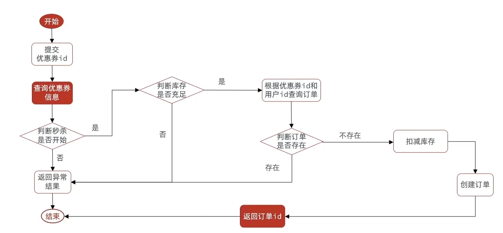

代码如下:

```java
@Service
public class VoucherOrderServiceImpl extends ServiceImpl<VoucherOrderMapper, VoucherOrder> implements IVoucherOrderService {

    @Resource
    private ISeckillVoucherService seckillVoucherService;
    @Resource
    private RedisIdWorker redisIdWorker;
    /**
     * 秒杀优惠券
     * @param voucherId
     * @return
     */
    @Override
    public Result seckillVoucher(Long voucherId) {
        //1.查询对应优惠卷
        SeckillVoucher voucher = seckillVoucherService.lambdaQuery().eq(SeckillVoucher::getVoucherId, voucherId).one();
        if (voucher == null) {
            return Result.fail("优惠券不存在");
        }
        //2.判断时间是否在优惠券的开始时间和结束时间内
        if (voucher.getBeginTime().isAfter(LocalDateTime.now()) || voucher.getEndTime().isBefore(LocalDateTime.now())) {
            return Result.fail("优惠券不在使用范围");
        }
        //3.判断库存是否充足
        if (voucher.getStock() < 1){
            return Result.fail("库存不足");
        }
        Long userId = UserHolder.getUser().getId();
        //针对每个用户加锁 intern方法是确保string值一样的在一把锁
        synchronized (userId.toString().intern()) {
            //获取代理对象
            IVoucherOrderService proxy = (IVoucherOrderService) AopContext.currentProxy();
            return proxy.createVoucherOrder(voucherId);
        }
    }

    @Transactional
    public Result createVoucherOrder(Long voucherId) {
        //3.5 增加一人一单功能
        Long userId = UserHolder.getUser().getId();
        Long count = lambdaQuery().eq(VoucherOrder::getUserId, userId).eq(VoucherOrder::getVoucherId, voucherId).count();
        if(count > 0){
            return Result.fail("该优惠卷只允许购物一次！");
        }
        //4.扣减库存
        boolean success = seckillVoucherService.update().setSql("stock = stock - 1")
                .eq("voucher_id", voucherId)
                .gt("stock",0)//乐观锁 stocl>0 就可以扣减
                .update();
        if (!success) {
            return Result.fail("库存不足");
        }
        //5.创建订单
        VoucherOrder voucherOrder = new VoucherOrder();
        voucherOrder.setUserId(userId);
        voucherOrder.setVoucherId(voucherId);
        long orderId = redisIdWorker.nextId("order");
        voucherOrder.setId(orderId);
        save(voucherOrder);
        //6.返回订单号
        return Result.ok(orderId);
    }
}
```

要获取到代理对象，需要如下配置:

1. 引入依赖

```xml
        <dependency>
            <groupId>org.aspectj</groupId>
            <artifactId>aspectjweaver</artifactId>
        </dependency>
```

2. 启动类上加注解

```java
@EnableAspectJAutoProxy(exposeProxy = true)
@MapperScan("com.hmdp.mapper")
@SpringBootApplication
public class HmDianPingApplication {

    public static void main(String[] args) {
        SpringApplication.run(HmDianPingApplication.class, args);
    }

}
```

### 5.集群模式下的并发安全问题

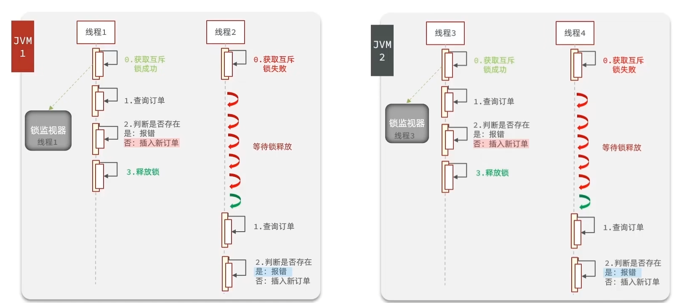

由于后端有多台tomcat服务器，每台服务器都有自己独立的锁，所以会出现并发安全问题，之前规定的一人一单可能也会因为这个出现问题。

### 6.分布式锁

分布式锁:满足分布式系统或集群模式下多进程可见并且互斥的锁。

要求:

1. 多进程可见

2. 互斥

3. 高性能

4. 高可用

5. 安全性

<table>
    <tr>
        <th>比较方式</th>
        <th>Mysql</th>
        <th>Redis</th>
        <th>Zookeeper</th>
    </tr>
    <tr>
        <td>互斥</td>
        <td>利用mysql本身的互斥锁机制</td>
        <td>利用setnx这样的互斥命令</td>
        <td>利用结点的唯一性和有序性实现互斥</td>
    </tr>
    <tr>
        <td>高可用</td>
        <td>好</td>
        <td>好</td>
        <td>好</td>
    </tr>
    <tr>
        <td>高性能</td>
        <td>一般</td>
        <td>好</td>
        <td>一般</td>
    </tr>
    <tr>
        <td>安全性</td>
        <td>断开连接，自动释放锁</td>
        <td>利用锁超时时间，到期释放</td>
        <td>临时结点，断开连接自动释放</td>
    </tr>
</table>

**基于Redis的分布式锁**

实现分布式锁时需要实现的两个基本方法:

<font color="red">获取锁:</font>

互斥：确保只能有一个线程获取锁

非阻塞式: 尝试一次，成功返回true,失败返回false

`set lock thread1 ex 10 nx `添加锁,nx是互斥，ex是设置超时时间

<font color="red">释放锁:</font>

手动释放:`del key`

超时释放:获取锁时添加一个超时时间

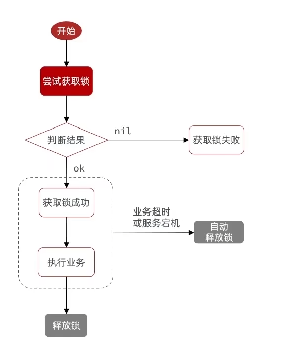

代码:

```java
public interface ILock {
    /**
     * 尝试获取锁
     * @param timeoutSec 锁持有的时间，过期后自动释放
     * @return true代表取锁成功;false代表取锁失败
     */
    boolean tryLock(long timeoutSec);

    /**
     * 释放锁
     */
    void unlock();
}
```

简易实现版本:

```java
public class SimpleRedisLock implements ILock{
    private String name;
    private StringRedisTemplate stringRedisTemplate;
    public SimpleRedisLock(String name, StringRedisTemplate stringRedisTemplate) {
        this.name = name;
        this.stringRedisTemplate = stringRedisTemplate;
    }
    private static final String KEY_PREFIX = "lock:";
    @Override
    public boolean tryLock(long timeoutSec) {
        String key = KEY_PREFIX + name;
        String value = Thread.currentThread().getName();
        return Boolean.TRUE.equals(stringRedisTemplate.opsForValue().setIfAbsent(key, value, timeoutSec, TimeUnit.SECONDS));
    }

    @Override
    public void unlock() {
        String key = KEY_PREFIX + name;
        stringRedisTemplate.delete(key);
    }
}
```

业务代码的修改:

```java
@Service
public class VoucherOrderServiceImpl extends ServiceImpl<VoucherOrderMapper, VoucherOrder> implements IVoucherOrderService {

    @Resource
    private ISeckillVoucherService seckillVoucherService;
    @Resource
    private RedisIdWorker redisIdWorker;
    @Resource
    private StringRedisTemplate stringRedisTemplate;
    /**
     * 秒杀优惠券
     * @param voucherId
     * @return
     */
    @Override
    public Result seckillVoucher(Long voucherId) {
        //1.查询对应优惠卷
        SeckillVoucher voucher = seckillVoucherService.lambdaQuery().eq(SeckillVoucher::getVoucherId, voucherId).one();
        if (voucher == null) {
            return Result.fail("优惠券不存在");
        }
        //2.判断时间是否在优惠券的开始时间和结束时间内
        if (voucher.getBeginTime().isAfter(LocalDateTime.now()) || voucher.getEndTime().isBefore(LocalDateTime.now())) {
            return Result.fail("优惠券不在使用范围");
        }
        //3.判断库存是否充足
        if (voucher.getStock() < 1){
            return Result.fail("库存不足");
        }
        Long userId = UserHolder.getUser().getId();
        //创建分布式锁对象
        SimpleRedisLock isLock = new SimpleRedisLock("order:" + userId, stringRedisTemplate);
        boolean lock = isLock.tryLock(120);
        if(!lock){
            return Result.fail("一人只能下一单");
        }
        try {
            //获取代理对象
            IVoucherOrderService proxy = (IVoucherOrderService) AopContext.currentProxy();
            return proxy.createVoucherOrder(voucherId);
        } finally {s
            //释放锁
            isLock.unlock();
        }
    }

    @Transactional
    public Result createVoucherOrder(Long voucherId) {
        //3.5 增加一人一单功能
        Long userId = UserHolder.getUser().getId();
        Long count = lambdaQuery().eq(VoucherOrder::getUserId, userId).eq(VoucherOrder::getVoucherId, voucherId).count();
        if(count > 0){
            return Result.fail("该优惠卷只允许购物一次！");
        }
        //4.扣减库存
        boolean success = seckillVoucherService.update().setSql("stock = stock - 1")
                .eq("voucher_id", voucherId)
                .gt("stock",0)//乐观锁 stock>0 就可以扣减
                .update();
        if (!success) {
            return Result.fail("库存不足");
        }
        //5.创建订单
        VoucherOrder voucherOrder = new VoucherOrder();
        voucherOrder.setUserId(userId);
        voucherOrder.setVoucherId(voucherId);
        long orderId = redisIdWorker.nextId("order");
        voucherOrder.setId(orderId);
        save(voucherOrder);
        //6.返回订单号
        return Result.ok(orderId);
    }
}
```

**刚刚的简易Redis分布式锁有问题:**

线程1首先获取到锁，但是线程1的程序发生阻塞，此时Redis自动把锁删除了，然后线程2获得锁，开始执行程序过程中，线程1把锁释放了，此时线程3又进入了，发生了问题。

解决办法:在释放锁的时候要判断是不是当前线程的锁->在锁的时候要加入当前线程的标识

<font color="red">由于可能有多个后端，我们线程的标识=UUID+线程id</font>

代码如下:

```java
public class SimpleRedisLock implements ILock{
    private String name;
    private StringRedisTemplate stringRedisTemplate;
    public SimpleRedisLock(String name, StringRedisTemplate stringRedisTemplate) {
        this.name = name;
        this.stringRedisTemplate = stringRedisTemplate;
    }
    private static final String KEY_PREFIX = "lock:";
    private static final String THREAD_ID_PREFIX = UUID.randomUUID().toString(true)+"-";
    @Override
    public boolean tryLock(long timeoutSec) {
        String key = KEY_PREFIX + name;
        String value = THREAD_ID_PREFIX + Thread.currentThread().getId();
        return Boolean.TRUE.equals(stringRedisTemplate.opsForValue().setIfAbsent(key, value, timeoutSec, TimeUnit.SECONDS));
    }

    @Override
    public void unlock() {
        String key = KEY_PREFIX + name;
        String curThreadName = THREAD_ID_PREFIX + Thread.currentThread().getId();
        String ThreadName = stringRedisTemplate.opsForValue().get(key);
        if(curThreadName.equals(ThreadName)){
            stringRedisTemplate.delete(key);
        }
    }
}
```

**此时还是有问题，因为在释放锁的时候有两步:1.判断2.删除**

**如果在判断之后，发生了阻塞，还是有可能删除别人的锁，所以我们要保证判断和删除是原子性操作**

### 7.Redis的Lua脚本

Redis提供了Lua脚本功能，在一个脚本中编写多条Redis命令,确保多条命令执行时的原子性。Lua是一种编程语言，它的基本语言可以参网站:[Lua 教程 | 菜鸟教程](https://www.runoob.com/lua/lua-tutorial.html)

这里重点介绍Redis提供的调用函数，语法如下:

`redis.call('命令名称','key','其他参数')`

例如，我们要执行set name jack,脚本是这样的:

`redis.call('set','name','jack')`

例如，我们要执行set name Rose,再执行get name,则脚本如下:

`redis.call('set','name','jack') `

`local name = redis.call('get','name')`

`return name`

写好脚本后，需要用Redis命令来调用脚本，调用脚本的常见命令如下:

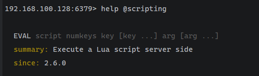

例如，我们要执行redis.call('set','name','jack')这个脚本，语法如下:

`eval "return redis.call('set','name','jack')" 0`  这个0是脚本需要key类型的参数个数

如果脚本中的key,value不想写死，可以作为参数传递。key类型参数会放入keys数组，其他参数会放入argv数组，在脚本中可以从keys和argv数组获取这些参数:

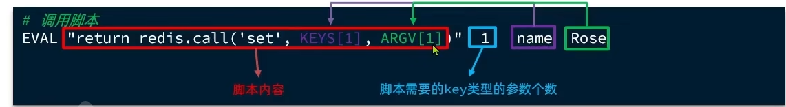

<font color="red">lua脚本的数组下标是从1开始的 </font>

**释放锁的lua脚本:**

```lua
-- 锁的key
local key = KEYS[1]
-- 当前线程标示
local threadId = ARGV[1]
-- 获取锁中的线程标识
local id = redis.call('get',key)
-- 比较线程标识与锁中的标识是否一致
if(id == threadId) then
  -- 释放锁
  return redis.call('del',key)
end
return 0
```

代码实现；

```java
public class SimpleRedisLock implements ILock{
    private String name;
    private StringRedisTemplate stringRedisTemplate;
    public SimpleRedisLock(String name, StringRedisTemplate stringRedisTemplate) {
        this.name = name;
        this.stringRedisTemplate = stringRedisTemplate;
    }
    private static final String KEY_PREFIX = "lock:";
    private static final String THREAD_ID_PREFIX = UUID.randomUUID().toString(true)+"-";
    private static final DefaultRedisScript<Long> UNLOCK_SCRIPT;
    static {
        UNLOCK_SCRIPT = new DefaultRedisScript<>();
        UNLOCK_SCRIPT.setLocation(new ClassPathResource("unlock.lua"));
        UNLOCK_SCRIPT.setResultType(Long.class);
    }
    @Override
    public boolean tryLock(long timeoutSec) {
        String key = KEY_PREFIX + name;
        String value = THREAD_ID_PREFIX + Thread.currentThread().getId();
        return Boolean.TRUE.equals(stringRedisTemplate.opsForValue().setIfAbsent(key, value, timeoutSec, TimeUnit.SECONDS));
    }

//    @Override
//    public void unlock() {
//        String key = KEY_PREFIX + name;
//        String curThreadName = THREAD_ID_PREFIX + Thread.currentThread().getId();
//        String ThreadName = stringRedisTemplate.opsForValue().get(key);
//        if(curThreadName.equals(ThreadName)){
//            stringRedisTemplate.delete(key);
//        }
//    }
    @Override
    public void unlock() {
        String key = KEY_PREFIX + name;
        String curThreadId = THREAD_ID_PREFIX + Thread.currentThread().getId();
        stringRedisTemplate.execute(UNLOCK_SCRIPT,
                Collections.singletonList(key),
                curThreadId);

    }
}
```

**基于Redis的分布式锁实现思路:**

1. 利用set nx ex获取锁，并设置过期时间，保存线程标识

2. 释放锁时先判断线程标示是否与自己一致，一致则删除锁

**特性:**

1. 利用set nx满足互斥性

2. 利用set ex保证故障时锁依然能释放，避免死锁，提高安全性

3. 利用Redis集群保证高可用和高并发特性

### 8.基于Redis的分布式锁优化

基于setnx实现分布式锁存在下面的问题:

1. 不可重入:同一个线程无法多次获取同一把锁

2. 不可重试:获取锁只尝试一次就返回false,没有重试机制

3. 超时释放:锁超时虽然可以避免死锁，但是如果业务执行耗时较长，业务还没有执行完，锁就释放了，存在安全隐患

4. 主从一致性:如果Redis提供了主从集群，主从同步存在延迟，当主宕机时，如果从节点还没有同步主节点的锁时，会出现问题。

**<font color="red">Redisson</font>**

Redisson是一个在Redis的基础上实现的Java驻内存数据网格(In-Memory Data Grid)。它不仅提供了一系列的分布式的Java常用对象，还提供了许多分布式服务，其中就包含了各种分布式锁的实现。


### 9.Redisson入门

1. 引入依赖

```xml
<dependency>
    <groupId>org.redisson</groupId>
    <artifactId>redisson</artifactId>
    <version>3.13.6</version>
</dependency>
```

2. 配置Redisson客户端

```java
@Configuration
public class RedisConfig {

    @Bean
    public RedissonClient redissonClient() {
        // 配置类
        Config config = new Config();
        // 添加 Redis 地址，这里添加了单点的地址，也可以使用 config.useClusterServers() 添加集群地址
        config.useSingleServer()
              .setAddress("redis://192.168.150.101:6379")
              .setPassword("123321");
        // 创建客户端
        return Redisson.create(config);
    }
}
```

3. 使用Redisson的分布式锁

```java
@Resource
private RedissonClient redissonClient;

@Test
void testRedisson() throws InterruptedException {
    // 获取锁（可重入），指定锁的名称
    RLock lock = redissonClient.getLock("anyLock");

    // 尝试获取锁，参数分别是：
    // - 获取锁的最大等待时间（期间会重试）
    // - 锁自动释放时间
    // - 时间单位
    boolean isLock = lock.tryLock(1, 10, TimeUnit.SECONDS);

    // 判断是否获取成功
    if (isLock) {
        try {
            System.out.println("执行业务");
        } finally {
            // 释放锁
            lock.unlock();
        }
    }
}
```

基于Redisson的业务代码:

```java
@Service
public class VoucherOrderServiceImpl extends ServiceImpl<VoucherOrderMapper, VoucherOrder> implements IVoucherOrderService {

    @Resource
    private ISeckillVoucherService seckillVoucherService;
    @Resource
    private RedisIdWorker redisIdWorker;
    @Resource
    private StringRedisTemplate stringRedisTemplate;
    @Resource
    private RedissonClient redissonClient;
    /**
     * 秒杀优惠券
     * @param voucherId
     * @return
     */
    @Override
    public Result seckillVoucher(Long voucherId) {
        //1.查询对应优惠卷
        SeckillVoucher voucher = seckillVoucherService.lambdaQuery().eq(SeckillVoucher::getVoucherId, voucherId).one();
        if (voucher == null) {
            return Result.fail("优惠券不存在");
        }
        //2.判断时间是否在优惠券的开始时间和结束时间内
        if (voucher.getBeginTime().isAfter(LocalDateTime.now()) || voucher.getEndTime().isBefore(LocalDateTime.now())) {
            return Result.fail("优惠券不在使用范围");
        }
        //3.判断库存是否充足
        if (voucher.getStock() < 1){
            return Result.fail("库存不足");
        }
        Long userId = UserHolder.getUser().getId();
        //创建锁对象
        //SimpleRedisLock isLock = new SimpleRedisLock("order:" + userId, stringRedisTemplate);
        RLock lock = redissonClient.getLock("lock:order:" + userId);
        boolean isLock = lock.tryLock();
        if(!isLock){
            return Result.fail("一人只能下一单");
        }
        try {
            //获取代理对象
            IVoucherOrderService proxy = (IVoucherOrderService) AopContext.currentProxy();
            return proxy.createVoucherOrder(voucherId);
        } finally {
            //释放锁
            lock.unlock();
        }
    }

    @Transactional
    public Result createVoucherOrder(Long voucherId) {
        //3.5 增加一人一单功能
        Long userId = UserHolder.getUser().getId();
        Long count = lambdaQuery().eq(VoucherOrder::getUserId, userId).eq(VoucherOrder::getVoucherId, voucherId).count();
        if(count > 0){
            return Result.fail("该优惠卷只允许购物一次！");
        }
        //4.扣减库存
        boolean success = seckillVoucherService.update().setSql("stock = stock - 1")
                .eq("voucher_id", voucherId)
                .gt("stock",0)//乐观锁 stock>0 就可以扣减
                .update();
        if (!success) {
            return Result.fail("库存不足");
        }
        //5.创建订单
        VoucherOrder voucherOrder = new VoucherOrder();
        voucherOrder.setUserId(userId);
        voucherOrder.setVoucherId(voucherId);
        long orderId = redisIdWorker.nextId("order");
        voucherOrder.setId(orderId);
        save(voucherOrder);
        //6.返回订单号
        return Result.ok(orderId);
    }
}
```

### 10.Redisson可重入锁原理

```java
// 创建锁对象
RLock lock = redissonClient.getLock("lock");

@Test
void method1() {
    boolean isLock = lock.tryLock();
    if (!isLock) {
        log.error("获取锁失败，1");
        return;
    }
    try {
        log.info("获取锁成功，1");
        method2();
    } finally {
        log.info("释放锁，1");
        lock.unlock();
    }
}

void method2() {
    boolean isLock = lock.tryLock();
    if (!isLock) {
        log.error("获取锁失败，2");
        return;
    }
    try {
        log.info("获取锁成功，2");
    } finally {
        log.info("释放锁，2");
        lock.unlock();
    }
}
```

可重入锁，需要用到Redis里面的Hash结构，去记录这个锁目前进入了多少次，删除的时候次数减一，次数为0的时候才释放锁

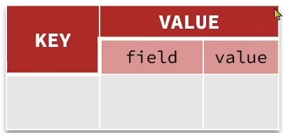

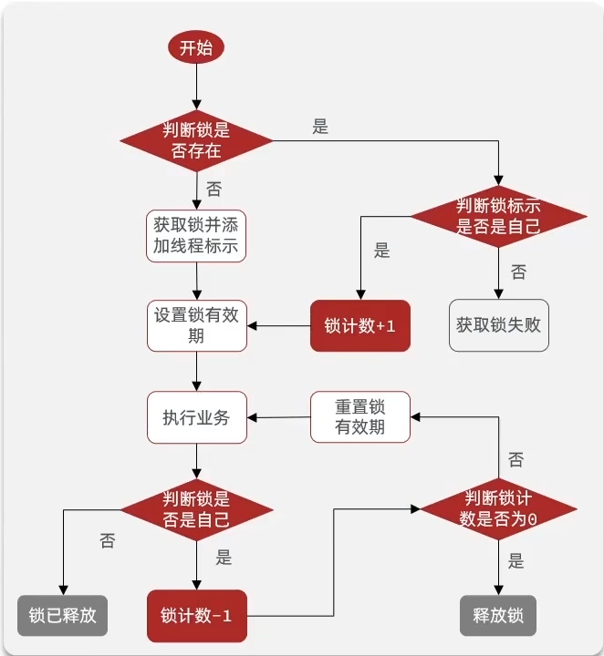

获取锁的Lua脚本:

```lua
local key = KEYS[1]; -- 锁的key
local threadId = ARGV[1]; -- 线程唯一标识
local releaseTime = ARGV[2]; -- 锁的自动释放时间

-- 判断是否存在
if (redis.call('exists', key) == 0) then
    -- 不存在，获取锁
    redis.call('hset', key, threadId, '1');
    -- 设置有效期
    redis.call('expire', key, releaseTime);
    return 1; -- 返回结果
end;

-- 锁已经存在，判断threadId是否是自己
if (redis.call('hexists', key, threadId) == 1) then
    -- 不存在，获取锁，重入次数+1
    redis.call('hincrby', key, threadId, '1');
    -- 设置有效期
    redis.call('expire', key, releaseTime);
    return 1; -- 返回结果
end;

return 0; -- 代码走到这里，说明获取锁的不是自己，获取锁失败
```

释放锁的Lua脚本:

```lua
local key = KEYS[1]; -- 锁的key
local threadId = ARGV[1]; -- 线程唯一标识
local releaseTime = ARGV[2]; -- 锁的自动释放时间

-- 判断当前锁是否还是被自己持有
if (redis.call('HEXISTS', key, threadId) == 0) then
    return nil; -- 如果已经不是自己，则直接返回
end;

-- 是自己的锁，则重入次数-1
local count = redis.call('HINCRBY', key, threadId, -1);

-- 判断是否重入次数是否已经为0
if (count > 0) then
    -- 大于0说明不能释放锁，重置有效期然后返回
    redis.call('EXPIRE', key, releaseTime);
    return nil;
else
    -- 等于0说明可以释放锁，直接删除
    redis.call('DEL', key);
    return nil;
end;
```

Redisson源码流程图:

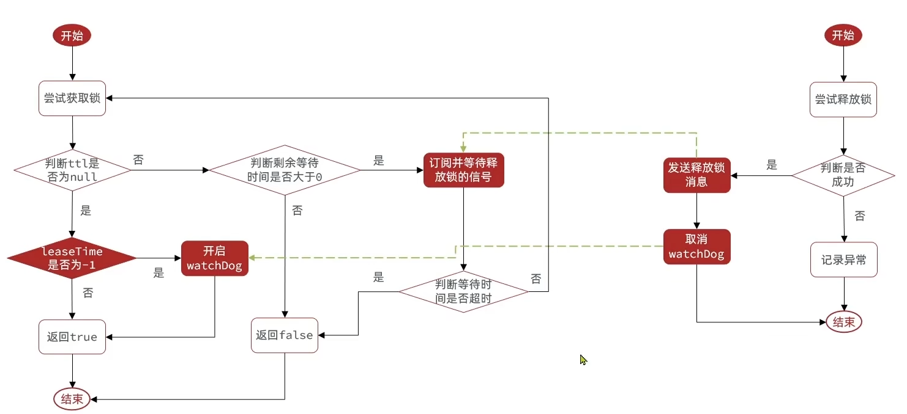

**<font color="red">Redisson分布式锁原理:</font>**

1. 可重入:利用hash结构记录线程id和重入次数

2. 可重试:利用信号量和PubSub功能实现等待、唤醒，获取锁失败的重试机制

3. 超时续约:利用watchDog,每隔一段时间(releaseTime/3),重置超时时间

### 11.Redisson的multiLock

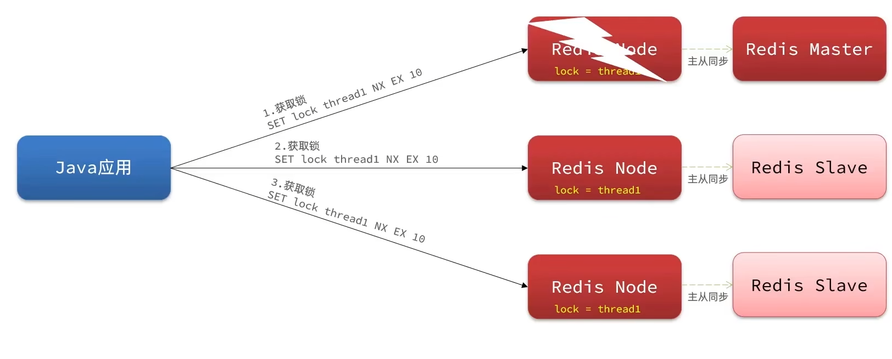

**几种锁的对比:**

**1.不可重入Redis分布式锁**

原理:利用setnx的互斥性;利用ex避免死锁；释放锁时判断线程标示

缺陷:不可重入、无法重试、锁超时失效

**2.可重入的Redis分布式锁**

原理:利用hash结构，记录线程标示和重入次数;利用watchDog延续锁时间;利用信号量控制锁重试等待

缺陷:Redis宕机引起锁失效问题

**3.Redisson的multiLock**

原理:多个独立的Redis节点，必须在所有节点都获取重入锁，才算获取锁成功

缺陷:运维成本高，实现复杂

### 12.异步秒杀

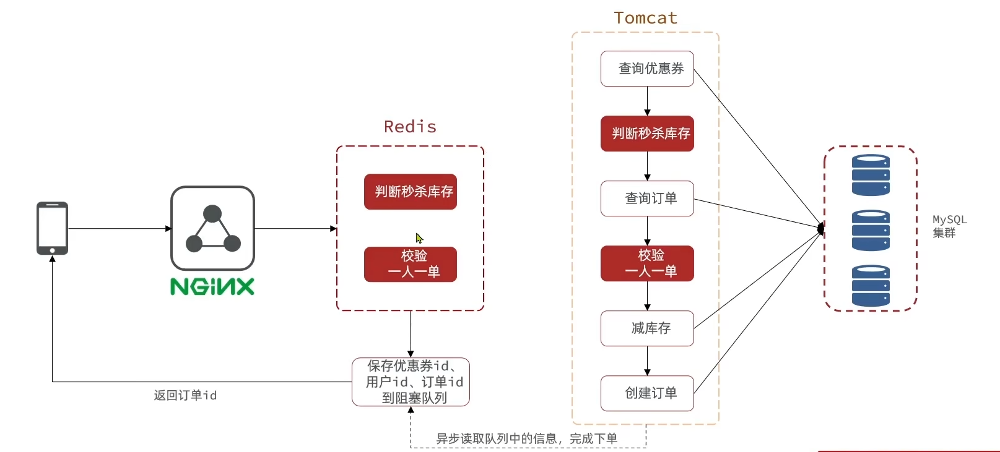

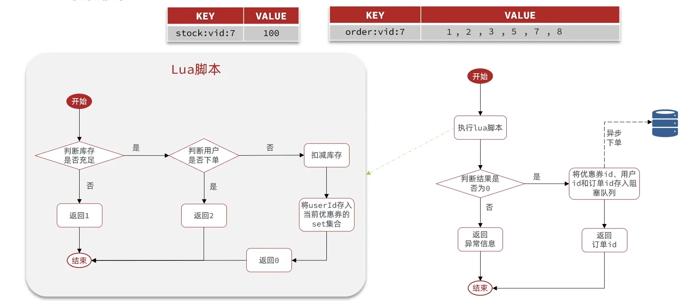

需求:

1. 新增秒杀优惠卷的同时，将优惠卷信息保存到Redis中

2. 基于Lua脚本，判断秒杀库存、一人一单、决定用户是否抢购成功

3. 如果抢购成功，将优惠卷id和用户id封装后存入阻塞队列

4. 开启线程任务，不断从阻塞队列中获取信息，实现异步下单功能

代码实现:

```lua
-- 1.获取参数
-- 1.1获取秒杀卷id
local seckillId = ARGV[1]
-- 1.2获取用户id
local userId = ARGV[2]
-- 1.3秒杀卷key
local stockKey = "seckill:stock:" .. seckillId
-- 1.4订单key
local orderKey = "seckill:order:" .. seckillId

-- 2.校验
-- 2.1校验库存是否充足
if(tonumber(redis.call("get",stockKey)) <=0) then
    return 1
end
-- 2.2校验用户之前是否购买过
if(redis.call("sismember", orderKey,userId) == 1) then
    return 2
end
-- 3.扣减库存
redis.call("incrby", stockKey, -1)
-- 4.记录用户
redis.call("sadd", orderKey, userId)
return 0
```

```java
@Slf4j
@Service
public class VoucherOrderServiceImpl extends ServiceImpl<VoucherOrderMapper, VoucherOrder> implements IVoucherOrderService {

    @Resource
    private ISeckillVoucherService seckillVoucherService;
    @Resource
    private RedisIdWorker redisIdWorker;
    @Resource
    private StringRedisTemplate stringRedisTemplate;
    @Resource
    private RedissonClient redissonClient;

    private BlockingQueue<VoucherOrder> orderTasks = new ArrayBlockingQueue<>(1024*1024);
    private static final ExecutorService SECKILL_ORDER_EXECUTOR = Executors.newSingleThreadExecutor();

    //@PostConstruct 在类初始化时执行
    @PostConstruct
    public void init(){
        SECKILL_ORDER_EXECUTOR.submit(()->{
            try {
                VoucherOrder voucherOrder = orderTasks.take();
                handleVoucherOrder(voucherOrder);
            } catch (Exception e) {
                log.error("处理订单异常:{}",e);
            }
        });
    }

    private void handleVoucherOrder(VoucherOrder voucherOrder) {
        //1.获取用户(注意不要用ThreaLocal,因为我们开启了一个子线程)
        Long userId = voucherOrder.getUserId();
        //2.创建锁对象
        RLock lock = redissonClient.getLock("lock:order:" + userId);
        //3.获取锁
        boolean isLock = lock.tryLock();
        if(!isLock){
            //获取锁失败,返回失败
            log.error("不允许重复下单");
            return;
        }
        try {
            //4.创建订单
            proxy.createVoucherOrder(voucherOrder);
        }finally {
            //释放锁
            lock.unlock();
        }
    }


    private static final DefaultRedisScript<Long> SECKILL_SCRIPT;
    static {
        SECKILL_SCRIPT = new DefaultRedisScript<>();
        SECKILL_SCRIPT.setLocation(new ClassPathResource("Seckill.lua"));
        SECKILL_SCRIPT.setResultType(Long.class);
    }

    //创建代理对象
    private IVoucherOrderService proxy;
    /**
     * 秒杀优惠券
     * @param voucherId
     * @return
     */
    @Override
    public Result seckillVoucher(Long voucherId) {
        //1.执行Lua脚本
        Long userId = UserHolder.getUser().getId();
        Long result = stringRedisTemplate.execute(SECKILL_SCRIPT, Collections.emptyList(), voucherId.toString(), userId.toString());
        int r = result.intValue();
        if(r!=0){
            return Result.fail(r == 1 ? "库存不足" : "不能重复下单");
        }
        //2.返回订单id,保存信息到异步消息队列
        long orderId = redisIdWorker.nextId("order");
        //2.1 生成订单信息
        VoucherOrder voucherOrder = new VoucherOrder();
        voucherOrder.setUserId(userId);
        voucherOrder.setVoucherId(voucherId);
        voucherOrder.setId(orderId);
        //2.2 放入到阻塞队列中
        orderTasks.add(voucherOrder);
        //3.获取到代理对象
        proxy = (IVoucherOrderService) AopContext.currentProxy();
        //4.返回订单id
        return Result.ok(orderId);

    }

//    /**
//     * 秒杀优惠券
//     * @param voucherId
//     * @return
//     */
//    @Override
//    public Result seckillVoucher(Long voucherId) {
//        //1.查询对应优惠卷
//        SeckillVoucher voucher = seckillVoucherService.lambdaQuery().eq(SeckillVoucher::getVoucherId, voucherId).one();
//        if (voucher == null) {
//            return Result.fail("优惠券不存在");
//        }
//        //2.判断时间是否在优惠券的开始时间和结束时间内
//        if (voucher.getBeginTime().isAfter(LocalDateTime.now()) || voucher.getEndTime().isBefore(LocalDateTime.now())) {
//            return Result.fail("优惠券不在使用范围");
//        }
//        //3.判断库存是否充足
//        if (voucher.getStock() < 1){
//            return Result.fail("库存不足");
//        }
//        Long userId = UserHolder.getUser().getId();
//        //创建锁对象
//        //SimpleRedisLock isLock = new SimpleRedisLock("order:" + userId, stringRedisTemplate);
//        RLock lock = redissonClient.getLock("lock:order:" + userId);
//        boolean isLock = lock.tryLock();
//        if(!isLock){
//            return Result.fail("一人只能下一单");
//        }
//        try {
//            //获取代理对象
//            IVoucherOrderService proxy = (IVoucherOrderService) AopContext.currentProxy();
//            return proxy.createVoucherOrder(voucherId);
//        } finally {
//            //释放锁
//            lock.unlock();
//        }
//    }

    @Transactional
    public void createVoucherOrder(VoucherOrder voucherOrder) {
        //3.5 增加一人一单功能
        Long userId = voucherOrder.getUserId();
        Long voucherId = voucherOrder.getVoucherId();
        Long count = lambdaQuery().eq(VoucherOrder::getUserId, userId).eq(VoucherOrder::getVoucherId, voucherId).count();
        if(count > 0){
            log.info("该优惠卷只允许购物一次！");
        }
        //4.扣减库存
        boolean success = seckillVoucherService.update().setSql("stock = stock - 1")
                .eq("voucher_id", voucherId)
                .gt("stock",0)//乐观锁 stock>0 就可以扣减
                .update();
        if (!success) {
            log.info("库存不足");
        }
        //5.创建订单
        save(voucherOrder);
    }
}
```

**基于阻塞队列的异步秒杀存在哪些问题?**

1. 内存限制问题

2. 数据安全问题

### 13.Redis消息队列实现异步秒杀

**消息队列(Message Queue),字面意思就是存放消息的队列。最简单的消息队列模型包括三个角色:**

- 消息队列:存储和管理消息，也被称为消息代理(Message Broker)

- 生产者:发送消息到消息队列

- 消费者:从消息队列获取消息并处理消息

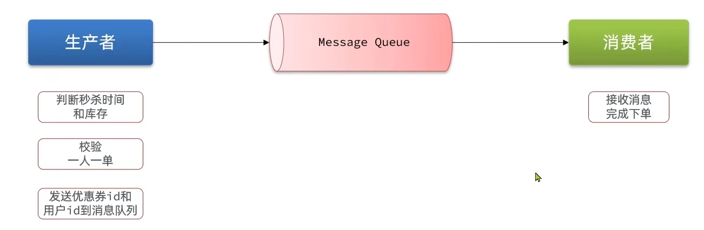

Redis提供了三种不同方式来实现消息队列:

- list结构:基于List结构模拟消息队列

- PubSub:基本的点对点消息模型

- Stream:比较完善的消息队列模型

### 14.基于List结构模拟消息队列

Redis的list数据结构是一个双向链表，很容易模拟出队列效果。

队列是入口和出口不在一边，因此我们可以利用:LPUSH结合RPOP,或者RPUSH结合LPOP来实现。

不过要注意的是，当队列中没有消息时RPOP或LPOP操作会返回null,并不像JVM的阻塞队列那样会阻塞并等待消息。

因此这里应该使用BRPOP或者BLPOP来实现阻塞效果


**基于List的消息队列有哪些优缺点:**

**优点:**

1. 利用Redis存储，不受限于JVM内存上限

2. 基于Redis的持久化存储，数据安全性有保证

3. 可以满足消息有序性

**缺点:**

1. 无法避免消息丢失

2. 只支持单消费者

### 15.基于PubSub的消息队列

**PubSub(发布订阅)** 是Redis2.0版本引入的消息传递模型。顾名思义，消费者可以订阅一个或多个channel，生产者向channel发送消息后，所有订阅者都能收到相关消息。

1. Subscribe channel [channel]:订阅一个或多个频道

2. Publish channel msg :向一个频道发送消息

3. Psubscribe pattern [pattern]:订阅与pattern格式匹配的所有频道

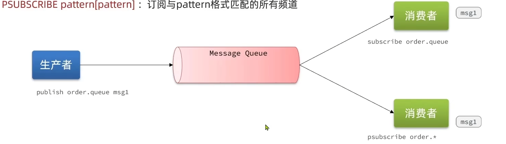

**基于PubSub的消息队列有哪些优缺点:**

**优点:**

采用发布订阅模型，支持多生产、多消费

**缺点:**

1. 不支持数据持久化

2. 无法避免消息丢失

3. 消息堆积有上限，超出时数据丢失

### 16.基于Stream的消息队列

Stream是Redis5.0引入的一种新的数据结构，可以实现一个功能非常完善的消息队列。

发送消息的命令:

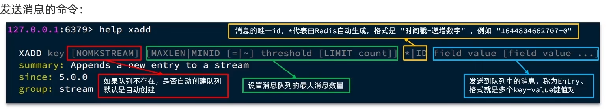

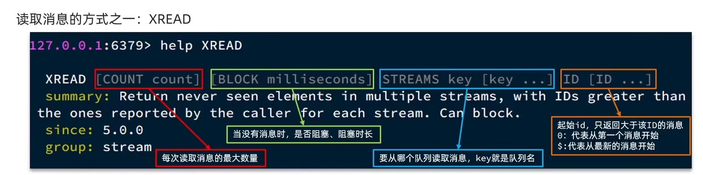

**stream类型消息队列的XREAD命令特点:**

1. 消息可回溯

2. 一个消息可以被多个消费者读取

3. 可以阻塞读取

4. 有消息漏读的风险

### 17.基于Stream的消息队列-消费者组

**消费者组(Consumer Group):** 将多个消费者划分到一个组中,监听同一个队列。具备下列特点:

1. **消息分流:** 队列中的消息会分流给组内不同的消费者，而不是重复消费，从而加快消息 处理的速度。

2. **消息提示:** 消费者会维护一个标示，记录最后一个被处理的消息，哪怕消费者宕机重启，还会从标示之后读取消息。确保每一个消息都会被消费。

3. **消息确认** :消费者获取消息后，消息处于一个pending状态，并存入一个pending-list。当处理完成后需要通过XACK来确认消息，标记消息为已处理，才会从pending-list移除。

**创建消费者组:**

`Xgroup create key groupName ID [Mkstream]`

key:队列名称

groupName:消费者组名称

ID:起始ID标示,$代表队列中最后一个消息，0则代表队列中第一个消息

Mkstream:队列不存在时自动创建队列

其他常见命令:

```textile
# 删除指定的消费者组
Xgroup destory key groupName
# 给指定的消费者组添加消费者
Xgroup createconsumer key groupname consumername
# 删除消费者组中指定消费者
Xgroup delconsumer key groupname consumername
```

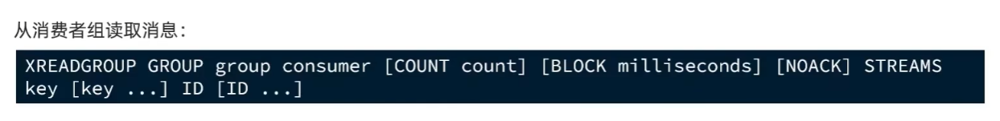

- group:消费组名称

- consumer:消费者名称，如果消费者不存在，会自动创建一个消费者

- count:本次查询的最大数量

- Block milliseconds:当没有消息时最长等待时间

- noack:无需手动ack,获取到消息后自动确认

- streams key:指定队列名称

- id:获取消息的id:1.">":从下一个未消费的消息开始 2.其他:根据指定id从pending-list中获取已消费但未确认的消息，例如0，是从pending-list中第一个消息开始

**消费者监听消息的基本思路:**

```java
while(true){
    // 尝试监听队列，使用阻塞模式，最长等待 2000 毫秒
    Object msg = redis.call("XREADGROUP GROUP g1 c1 COUNT 1 BLOCK 2000 STREAMS s1 >");

    if(msg == null){ // null说明没有消息，继续下一次
        continue;
    }
    try {
        // 处理消息，完成后一定要ACK
        handleMessage(msg);
    } catch(Exception e){
        while(true){
            Object msg = redis.call("XREADGROUP GROUP g1 c1 COUNT 1 STREAMS s1 0");

            if(msg == null){ // null说明没有异常消息，所有消息都已确认，结束循环
                break;
            }

            try {
                // 说明有异常消息，再次处理
                handleMessage(msg);
            } catch(Exception e){
                // 再次出现异常，记录日志，继续循环
                continue;
            }
        }
    }
}
```

**Stream类型消息队列的XREADGROUP命令特点:**

- 消息可回溯

- 可以多消费者争抢消息，加快消费速度

- 可以阻塞读取

- 没有消息漏读的风险

- 有消息确认机制，保证消息至少被消费一次

**Redid消息队列对比:**

| 特性     | List                 | PubSub    | Stream                      |
| ------ | -------------------- | --------- | --------------------------- |
| 消息持久化  | 支持                   | 不支持       | 支持                          |
| 阻塞读取   | 支持                   | 支持        | 支持                          |
| 消息堆积处理 | 受限于内存空间，可以利用多消费者加快处理 | 受限于消费者缓冲区 | 受限于队列长度，可以利用消费者组提高消费速度，减少堆积 |
| 消息确认机制 | 不支持                  | 不支持       | 支持                          |
| 消息回溯   | 不支持                  | 不支持       | 支持                          |

**基于Redis的Stream结构作为消息队列，实现异步秒杀下单**

需求:

1. 创建一个Stream类型的消息队列，名为stream.orders

2. 修改之前的秒杀下单Lua脚本，在认定有抢购资格后，直接向stream.orders中添加消息，内容包含voucherId,userId,orderId

3. 项目启动时，开启一个线程任务，尝试获取stream.orders中的消息，完成下单

```lua
-- 1.获取参数
-- 1.1获取秒杀卷id
local voucherId = ARGV[1]
-- 1.2获取用户id
local userId = ARGV[2]
-- 1.3获取订单id
local orderId = ARGV[3]
-- 1.4秒杀卷key
local stockKey = "seckill:stock:" .. voucherId
-- 1.5订单key
local orderKey = "seckill:order:" .. voucherId

-- 2.校验
-- 2.1校验库存是否充足
if(tonumber(redis.call("get",stockKey)) <=0) then
    return 1
end
-- 2.2校验用户之前是否购买过
if(redis.call("sismember", orderKey,userId) == 1) then
    return 2
end
-- 3.扣减库存
redis.call("incrby", stockKey, -1)
-- 4.记录用户
redis.call("sadd", orderKey, userId)
-- 5.发送消息
redis.call("xadd","stream.orders","*","userId",userId,"voucherId", voucherId,"id",orderId)
return 0
```

```java
@Slf4j
@Service
public class VoucherOrderServiceImpl extends ServiceImpl<VoucherOrderMapper, VoucherOrder> implements IVoucherOrderService {

    @Resource
    private ISeckillVoucherService seckillVoucherService;
    @Resource
    private RedisIdWorker redisIdWorker;
    @Resource
    private StringRedisTemplate stringRedisTemplate;
    @Resource
    private RedissonClient redissonClient;

    private static final ExecutorService SECKILL_ORDER_EXECUTOR = Executors.newSingleThreadExecutor();

    //@PostConstruct 在类初始化时执行
    @PostConstruct
    public void init(){
        SECKILL_ORDER_EXECUTOR.submit(()->{
            while(true){
                try {
                    //1.获取队列中的订单信息
                    List<MapRecord<String, Object, Object>> list = stringRedisTemplate.opsForStream().read(
                            Consumer.from("g1", "c1"),
                            StreamReadOptions.empty().count(1).block(Duration.ofSeconds(2)),
                            StreamOffset.create("stream.orders", ReadOffset.lastConsumed())
                    );
                    //2.判断消息是否为空
                    if(list == null || list.isEmpty()){
                        continue;
                    }
                    //3.解析消息中的订单信息
                    MapRecord<String, Object, Object> record = list.get(0);
                    Map<Object, Object> values = record.getValue();
                    VoucherOrder voucherOrder = BeanUtil.fillBeanWithMap(values, new VoucherOrder(), true);
                    //4.如果获取成功可以下单
                    handleVoucherOrder(voucherOrder);
                    //5.ACK确认 SACK stream.orders g1 id
                    stringRedisTemplate.opsForStream().acknowledge("stream.orders","g1", record.getId());
                }catch (Exception e){
                    log.error("处理订单异常",e);
                    handlePendingList();
                }
            }


        });
    }

    //获取pending-list中的消息
    private void handlePendingList() {
        while(true){
            try {
                //1.获取pending-list中的订单信息
                List<MapRecord<String, Object, Object>> list = stringRedisTemplate.opsForStream().read(
                        Consumer.from("g1", "c1"),
                        StreamReadOptions.empty().count(1),
                        StreamOffset.create("stream.orders", ReadOffset.from("0"))
                );
                //2.判断消息是否为空
                if(list == null || list.isEmpty()){
                    break;
                }
                //3.解析消息中的订单信息
                MapRecord<String, Object, Object> record = list.get(0);
                Map<Object, Object> values = record.getValue();
                VoucherOrder voucherOrder = BeanUtil.fillBeanWithMap(values, new VoucherOrder(), true);
                //4.如果获取成功可以下单
                handleVoucherOrder(voucherOrder);
                //5.ACK确认 SACK stream.orders g1 id
                stringRedisTemplate.opsForStream().acknowledge("stream.orders","g1", record.getId());
            }catch (Exception e){
                log.error("处理订单异常",e);
                try {
                    Thread.sleep(20);
                } catch (InterruptedException ex) {
                    throw new RuntimeException(ex);
                }
            }
        }
    }

    private void handleVoucherOrder(VoucherOrder voucherOrder) {
        //1.获取用户(注意不要用ThreaLocal,因为我们开启了一个子线程)
        Long userId = voucherOrder.getUserId();
        //2.创建锁对象
        RLock lock = redissonClient.getLock("lock:order:" + userId);
        //3.获取锁
        boolean isLock = lock.tryLock();
        if(!isLock){
            //获取锁失败,返回失败
            log.error("不允许重复下单");
            return;
        }
        try {
            //4.创建订单
            proxy.createVoucherOrder(voucherOrder);
        }finally {
            //释放锁
            lock.unlock();
        }
    }


    private static final DefaultRedisScript<Long> SECKILL_SCRIPT;
    static {
        SECKILL_SCRIPT = new DefaultRedisScript<>();
        SECKILL_SCRIPT.setLocation(new ClassPathResource("Seckill.lua"));
        SECKILL_SCRIPT.setResultType(Long.class);
    }

    //创建代理对象
    private IVoucherOrderService proxy;
    /**
     * 秒杀优惠券
     * @param voucherId
     * @return
     */
    @Override
    public Result seckillVoucher(Long voucherId) {
        //1.执行Lua脚本
        Long userId = UserHolder.getUser().getId();
        //2.生成订单id
        long orderId = redisIdWorker.nextId("order");
        Long result = stringRedisTemplate.execute(
                SECKILL_SCRIPT, Collections.emptyList(), voucherId.toString(), userId.toString(),String.valueOf(orderId)
        );
        int r = result.intValue();
        if(r!=0){
            return Result.fail(r == 1 ? "库存不足" : "不能重复下单");
        }
        //3.获取到代理对象
        proxy = (IVoucherOrderService) AopContext.currentProxy();
        //4.返回订单id
        return Result.ok(orderId);
    }


    @Transactional
    public void createVoucherOrder(VoucherOrder voucherOrder) {
        //3.5 增加一人一单功能
        Long userId = voucherOrder.getUserId();
        Long voucherId = voucherOrder.getVoucherId();
        Long count = lambdaQuery().eq(VoucherOrder::getUserId, userId).eq(VoucherOrder::getVoucherId, voucherId).count();
        if(count > 0){
            log.info("该优惠卷只允许购物一次！");
        }
        //4.扣减库存
        boolean success = seckillVoucherService.update().setSql("stock = stock - 1")
                .eq("voucher_id", voucherId)
                .gt("stock",0)//乐观锁 stock>0 就可以扣减
                .update();
        if (!success) {
            log.info("库存不足");
        }
        //5.创建订单
        save(voucherOrder);
    }
}
```

## 5.达人探店

### 1.完善点赞功能

需求:

- 同一个用户只能点赞一次，再次点击则取消点赞

- 如果当前用户已经点赞，则点赞按钮高亮显示(前端实现，判断字段Blog类的isLike属性)

实现步骤:

- 给Blog类中添加一个isLike字段，标示是否被当前用户点赞

- 修改点赞功能，利用Redis的set集合判断是否点赞过，未点赞过则点赞数 加1，已点赞过则点赞数-1

- 修改根据id查询Blog的业务，判断当前登录用户是否点赞过，赋值给isLike字段

- 修改分页查询Blog业务，判断当前登录用户是否点赞过，赋值给isLike字段

代码实现:

```java
@Service
public class BlogServiceImpl extends ServiceImpl<BlogMapper, Blog> implements IBlogService {
    @Resource
    private IUserService userService;
    @Resource
    private StringRedisTemplate stringRedisTemplate;

    /**
     * 查询博文详情
     * @param id
     * @return
     */
    @Override
    public Result queryBlogById(Long id) {
        //1.根据id查询博文
        Blog blog = getById(id);
        if (blog==null) {
            return Result.fail("博客不存在");
        }
        //2.获取用户
        fillUserOfBlog(blog);
        //3.判断用户是否已经点过赞
        fillIsLikedOfBlog(blog);
        //3.返回
        return Result.ok(blog);
    }

    private void fillUserOfBlog(Blog blog) {
        Long userId = blog.getUserId();
        User user = userService.getById(userId);
        blog.setName(user.getNickName());
        blog.setIcon(user.getIcon());
    }
    private void fillIsLikedOfBlog(Blog blog){
        //1.获取登录用户
        Long userId = UserHolder.getUser().getId();
        //2.判断用户是否已经点过赞
        String key = "blog:liked:" + blog.getId();
        Boolean isLiked = stringRedisTemplate.opsForSet().isMember(key, userId.toString());
        blog.setIsLike(BooleanUtil.isTrue(isLiked));
    }

    /**
     * 查询热门博文
     * @param current
     * @return
     */
    @Override
    public Result queryHotBlog(Integer current) {
        // 根据用户查询
        Page<Blog> page = this.query()
                .orderByDesc("liked")
                .page(new Page<>(current, SystemConstants.MAX_PAGE_SIZE));
        // 获取当前页数据
        List<Blog> records = page.getRecords();
        // 查询用户
        records.forEach(blog->{
            fillUserOfBlog(blog);
            fillIsLikedOfBlog(blog);
        });
        return Result.ok(records);
    }


    /**
     * 点赞
     * @param id
     * @return
     */
    @Override
    public Result likeBlog(Long id) {
        //1.获取登录用户
        Long userId = UserHolder.getUser().getId();
        //2.判断用户是否已经点过赞
        String key = "blog:liked:" + id;
        Boolean isLiked = stringRedisTemplate.opsForSet().isMember(key, userId.toString());
        //3.没点赞->数据库点赞数+1->redis里面set集合中添加当前用户id
        if(BooleanUtil.isFalse(isLiked)){
            boolean isSuccess = update().setSql("liked = liked + 1").eq("id", id).update();
            if(BooleanUtil.isTrue(isSuccess)){
                stringRedisTemplate.opsForSet().add(key, userId.toString());
            }
        }else{
            //4.点赞->数据库点赞数-1->redis里面set集合中删除当前用户id
            boolean isSuccess = update().setSql("liked = liked -1").eq("id", id).update();
            if(BooleanUtil.isTrue(isSuccess)){
                stringRedisTemplate.opsForSet().remove(key, userId.toString());
            }
        }

        return null;
    }
}
```

### 2.点赞排行榜功能

|          | List       | Set    | SortedSet  |
| -------- | ---------- | ------ | ---------- |
| **排序方式** | 按添加顺序排序    | 无法排序   | 根据score值排序 |
| **唯一性**  | 不唯一        | 唯一     | 唯一         |
| **查找方式** | 按索引查找或首尾查找 | 根据元素查找 | 根据元素查找     |

**实现思路:** 利用SortedSet,利用时间戳作为score

**<font color="red">mysql中根据特定的字段顺序返回:</font>**

```sql
SELECT id,phone,password,nick_name,icon,create_time,update_time
FROM tb_user
WHERE id IN (1015,1)
ORDER BY FIELD(id,1015,1)
```

代码实现:

```java
@Service
public class BlogServiceImpl extends ServiceImpl<BlogMapper, Blog> implements IBlogService {
    @Resource
    private IUserService userService;
    @Resource
    private StringRedisTemplate stringRedisTemplate;

    /**
     * 查询博文详情
     * @param id
     * @return
     */
    @Override
    public Result queryBlogById(Long id) {
        //1.根据id查询博文
        Blog blog = getById(id);
        if (blog==null) {
            return Result.fail("博客不存在");
        }
        //2.获取用户
        fillUserOfBlog(blog);
        //3.判断用户是否已经点过赞
        fillIsLikedOfBlog(blog);
        //3.返回
        return Result.ok(blog);
    }

    private void fillUserOfBlog(Blog blog) {
        Long userId = blog.getUserId();
        User user = userService.getById(userId);
        blog.setName(user.getNickName());
        blog.setIcon(user.getIcon());
    }
    private void fillIsLikedOfBlog(Blog blog){
        //1.获取登录用户
        if (UserHolder.getUser()==null) {
            return;
        }
        Long userId = UserHolder.getUser().getId();
        //2.判断用户是否已经点过赞
        String key = BLOG_LIKED_KEY+ blog.getId();
        Double score = stringRedisTemplate.opsForZSet().score(key, userId.toString());
        blog.setIsLike(Objects.nonNull(score));
    }

    /**
     * 查询热门博文
     * @param current
     * @return
     */
    @Override
    public Result queryHotBlog(Integer current) {
        // 根据用户查询
        Page<Blog> page = this.query()
                .orderByDesc("liked")
                .page(new Page<>(current, SystemConstants.MAX_PAGE_SIZE));
        // 获取当前页数据
        List<Blog> records = page.getRecords();
        // 查询用户
        records.forEach(blog->{
            fillUserOfBlog(blog);
            fillIsLikedOfBlog(blog);
        });
        return Result.ok(records);
    }


    /**
     * 点赞
     * @param id
     * @return
     */
    @Override
    public Result likeBlog(Long id) {
        //1.获取登录用户
        Long userId = UserHolder.getUser().getId();
        //2.判断用户是否已经点过赞
        String key = BLOG_LIKED_KEY + id;
        Double score = stringRedisTemplate.opsForZSet().score(key, userId.toString());
        //Boolean isLiked = stringRedisTemplate.opsForSet().isMember(key, userId.toString());
        //3.没点赞->数据库点赞数+1->redis里面set集合中添加当前用户id
        if(Objects.isNull(score)){
            boolean isSuccess = update().setSql("liked = liked + 1").eq("id", id).update();
            if(BooleanUtil.isTrue(isSuccess)){
                stringRedisTemplate.opsForZSet().add(key, userId.toString(), System.currentTimeMillis());
            }
        }else{
            //4.点赞->数据库点赞数-1->redis里面set集合中删除当前用户id
            boolean isSuccess = update().setSql("liked = liked -1").eq("id", id).update();
            if(BooleanUtil.isTrue(isSuccess)){
                stringRedisTemplate.opsForZSet().remove(key, userId.toString());
            }
        }

        return null;
    }

    /**
     * 查询点赞
     * @param id
     * @return
     */
    @Override
    public Result queryBlogLikes(Long id) {
        //1.获取key
        String key = BLOG_LIKED_KEY + id;
        //2.得到点赞的前5名
        Set<String> idSets = stringRedisTemplate.opsForZSet().range(key, 0, 4);
        //3.如果为空返回一个空列表
        if(idSets==null||idSets.isEmpty()){
            return Result.ok(Collections.emptyList());
        }
        String fieldIds = StrUtil.join(",", idSets);
        //4.不为空查询->封装结果
        List<UserDTO> list = userService.lambdaQuery().in(User::getId, idSets).last("order by field(id,"+fieldIds+")").list()
                .stream()
                .map(user -> BeanUtil.copyProperties(user, UserDTO.class))
                .toList();
        return Result.ok(list);
    }
}
```

### 3.好友关注

**共同关注:** 利用Redis里面set求交集的命令sinter,可以快速知道共同关注的好友

代码:

```java
@Service
public class FollowServiceImpl extends ServiceImpl<FollowMapper, Follow> implements IFollowService {
    @Resource
    private StringRedisTemplate stringRedisTemplate;
    @Resource
    private IUserService userService;

    /**
     * 关注和取关
     * @param followUserId
     * @param isFollow
     * @return
     */
    @Override
    public Result follow(Long followUserId, Boolean isFollow) {
        //1.获取用户id
        Long userId = UserHolder.getUser().getId();
        String key = "follows:"+userId;
        //2.关注操作
        if(BooleanUtil.isTrue(isFollow)){
            Follow follow = new Follow();
            follow.setUserId(userId);
            follow.setFollowUserId(followUserId);
            boolean isSuccess = save(follow);
            //存入Redis
            if(isSuccess){
                stringRedisTemplate.opsForSet().add(key,followUserId.toString());
            }
        }else{
            //取消关注
            boolean isSuccess = remove(new QueryWrapper<Follow>().lambda().eq(Follow::getUserId, userId).eq(Follow::getFollowUserId, followUserId));
            //从Redis中移除
            if(isSuccess){
                stringRedisTemplate.opsForSet().remove(key,followUserId.toString());
            }
        }
        return Result.ok();
    }

    /**
     * 看当前用户是否关注
     * @param followUserId
     * @return
     */
    @Override
    public Result isFollow(Long followUserId) {
        //1.获取用户id
        Long userId = UserHolder.getUser().getId();
        if (userId==null) {
            return Result.fail("用户未登录");
        }
        Long count = lambdaQuery().eq(Follow::getUserId, userId).eq(Follow::getFollowUserId, followUserId).count();
        return Result.ok(count>0);
    }

    /**
     * 共同关注
     * @param id
     * @return
     */
    @Override
    public Result followCommons(Long id) {
        //1.获取当前用户
        Long userId = UserHolder.getUser().getId();
        String key1 = "follows:"+userId;
        String key2 = "follows:"+id;
        //2.取出交集
        Set<String> intersect = stringRedisTemplate.opsForSet().intersect(key1, key2);
        if(Objects.isNull(intersect)){
            return Result.ok(Collections.emptyList());
        }
        //3.查询
        List<UserDTO> list = userService.lambdaQuery().in(User::getId, intersect).list()
                .stream().map(user -> BeanUtil.copyProperties(user, UserDTO.class)).toList();
        //4.返回
        return Result.ok(list);
    }
}
```

### 4.关注推送

关注推送也叫做Feed流，直译为<font color="red">投喂</font>。为用户持续的提供"沉浸式"的体验，通过无限下拉刷新获取新的信息。

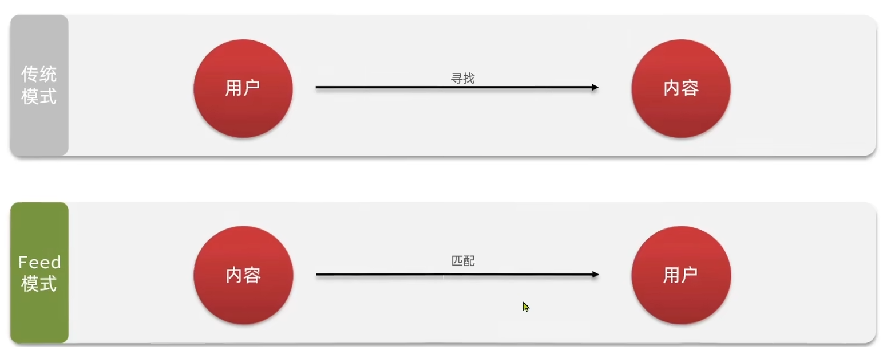

**Feed流产品有两种常见模式:**

1. **Timeline:** 不做内容筛选，简单的按照内容发布时间排序，常用于好友或关注。例如朋友圈

    <font color="red">优点:</font> 信息全面，不会有缺失。并且实现也相对简单

    <font color="red">缺点:</font>信息噪音较多，用户不一定感兴趣，内容获取效率低

2. **智能排序:** 利用智能算法屏蔽掉违规的，用户不感兴趣的内容。推送用户感兴趣的信息来吸引用户

    <font color="red">优点:</font> 投喂用户感兴趣信息，用户黏度很高，容易沉迷

    <font color="red">缺点:</font> 如果算法不精准，可能起到反作用 

**Timeline模式的实现方式有三种:**

**1.拉模式**

    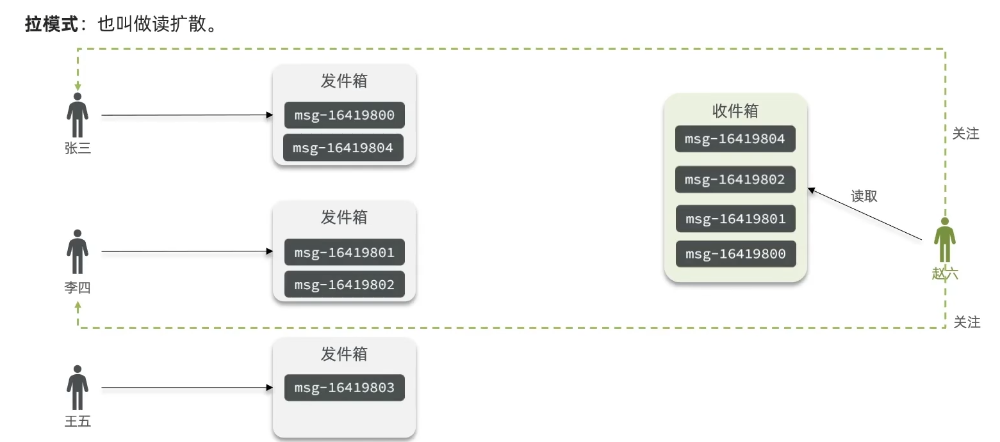

**2.推模式**

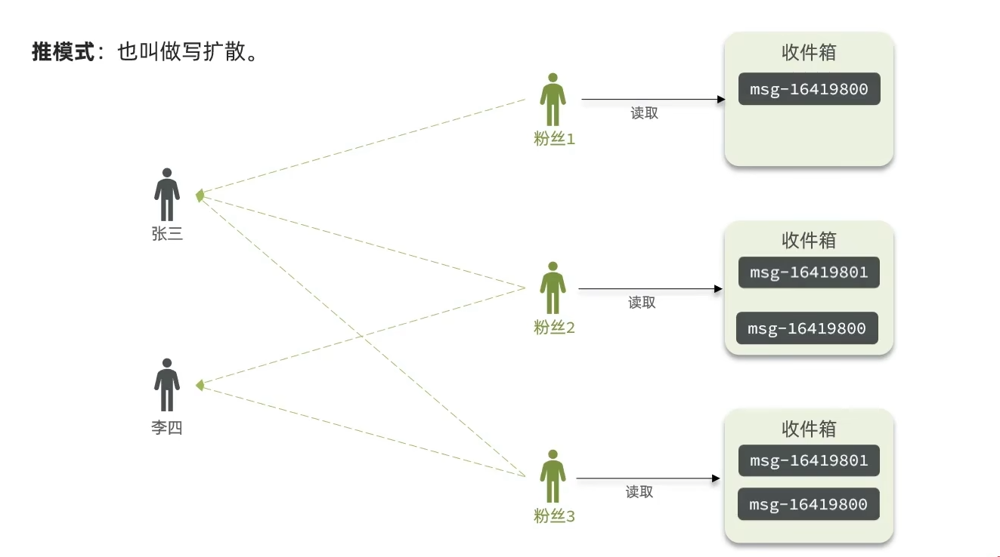

**3.推拉模式**

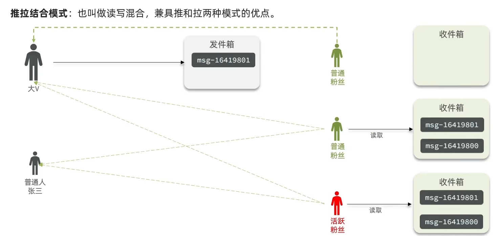

|            | 拉模式  | 推模式       | 推拉结合        |
| ---------- | ---- | --------- | ----------- |
| **写比例**    | 低    | 高         | 中           |
| **读比例**    | 高    | 低         | 中           |
| **用户读取延迟** | 高    | 低         | 低           |
| **实现难度**   | 复杂   | 简单        | 很复杂         |
| **使用场景**   | 很少使用 | 用户量少，没有大V | 过千万的用户量，有大V |

### 5.关注推送推模式实现

Feed流中的数据会不断更新，所以数据的角标也在变化。因此不能采用传统的分页模式

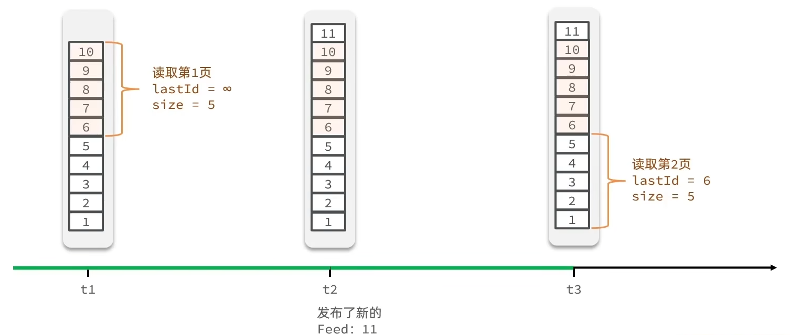

在Redis中list和sorted set都可以实现基础分页，但是滚动分页一般都用**sorted set**

新增时的代码修改:

```java
    /**
     * 保存博文
     * @param blog
     * @return
     */
    @Override
    public Result saveBlog(Blog blog) {
        // 1.获取登录用户
        UserDTO user = UserHolder.getUser();
        blog.setUserId(user.getId());
        // 2.保存探店博文
        boolean isSuccess = save(blog);
        if(!isSuccess){
            return Result.fail("保存博文失败");
        }
        // 3.查询出该用户的所有粉丝
        List<Follow> list = followService.lambdaQuery().eq(Follow::getFollowUserId, user.getId()).list();
        //4.推送
        for (Follow follow : list) {
            Long userId = follow.getUserId();
            String key = "feed:"+userId;
            stringRedisTemplate.opsForZSet().add(key,blog.getId().toString(),System.currentTimeMillis());
        }
        // 5.返回id
        return Result.ok(blog.getId());
    }
```

**滚动分页查询参数:**

max:当前时间戳 | 上一次查询的最小时间戳

min:0

offset:0               | 在上一次结果中，与最小值一样的元素的个数

count:3

代码:

```java
    @Override
    public Result queryBlogOfFollow(Long max, Integer offset) {
        //1.获取当前用户
        Long userId = UserHolder.getUser().getId();
        //2.查询收件箱 ZREVRANGEBYSCORE key max min LIMIT offset count
        String key = FEED_KEY + userId;
        Set<ZSetOperations.TypedTuple<String>> typedTuples = stringRedisTemplate.opsForZSet().reverseRangeByScoreWithScores(key, 0, max, offset, 3);
        //3.非空判断
        if(typedTuples==null || typedTuples.isEmpty()){
            return Result.ok();
        }
        //4.解析数据:blogId,minTime(时间戳),offset
        List<Long> ids = new ArrayList<>(typedTuples.size());
        long minTime=0;
        int os = 1;
        for (ZSetOperations.TypedTuple<String> tuple : typedTuples) {
            //4.1获取id
            ids.add(Long.valueOf(tuple.getValue()));
            //4.2获取分数(时间戳)
            long time = tuple.getScore().longValue();
            if(time == minTime){
                os++;
            }else{
                minTime = time;
                os=1;
            }
        }
        //5.根据id取查询博文
        String idStr = StrUtil.join(",",ids);
        List<Blog> blogs = lambdaQuery().in(Blog::getId, ids).last("order by field(id," + idStr + ")").list();
        //6.填充博文的点赞和用户
        for (Blog blog : blogs) {
            fillUserOfBlog(blog);
            fillIsLikedOfBlog(blog);
        }
        //7.封装数据返回
        ScrollResult result = new ScrollResult();
        result.setList(blogs);
        result.setOffset(os);
        result.setMinTime(minTime);
        return Result.ok(result);
    }
```


