# Redis高级篇

## 1.单点Redis的问题

**1.数据丢失问题**  -> **实现Redis数据持久化**

2.**并发能力问题**  ->**搭建主从集群，实现读写分离**

3.**故障修复问题** ->**利用Redis哨兵，实现健康检测和自动修复**

4.**存储能力问题** -> **搭建分片集群，利用插槽机制动态扩容**

## 2.Redis持久化

### 1.RDB

RDB全称Redis DataBase Backup file(Redis数据备份文件)，也被叫做Redis数据快照。简单来说就是把内存中的所有数据都记录到磁盘中。当Redis实例故障重启后，从磁盘读取快照文件，恢复数据。

快照文件称为RDB文件，默认是保存在当前运行目录


**Redis停机时会执行一次RDB**

Redis内部有触发RDB机制，可以在redis.conf文件中找到，格式如下:


RDB的其他配置也可以在redis.conf文件中设置


**RDB实现原理:**

bgsave开始时会fork主进程得到子进程，子进程共享主进程的内存数据。完成fork后读取内存数据并写入RDB文件。

fork采用的是copy-on-write技术:

1. 当主进程执行读操作时，访问共享内存;

2. 当主进程执行写操作时，则会拷贝一份数据，执行写操作。


### 2.AOF

AOF全称为Append Only File(追加文件)。Redis处理的每一个写命令都会记录在AOF文件中，可以看做是命令日志文件。


AOF默认是关闭的，需要修改Redis.conf配置文件来开启AOF：


AOF的命令记录的频率也可以通过redis.conf文件来配:


| 配置项      | 刷盘时机   | 优点          | 缺点             |
| -------- | ------ | ----------- | -------------- |
| Always   | 同步刷盘   | 可靠性高，几乎不丢数据 | 性能影响大          |
| everysec | 每秒刷盘   | 性能适中        | 最多丢失1秒数据       |
| no       | 操作系统控制 | 性能最好        | 可靠性较差，可能丢失大量数据 |

因为是记录命令，AOF文件会比RDB文件大的多。而且AOF会记录对同一个key的多次写操作，但只有最后一次写操作才有意义。通过执行`bgrewriteaof`命令，可以让AOF文件执行重写操作，用最少的命令达到相同的效果。


Redis也会在触发阈值时自动去重写AOF文件。阈值也可以在redis.conf中配置:


### 3.RDB和AOF总结

RDB和AOF各有自己的优缺点，如果对数据安全性要求较高，在实际开发中往往会<font color="red">结合</font> 两者来实用。

|         | RDB                    | AOF                                 |
| ------- | ---------------------- | ----------------------------------- |
| 持久化方式   | 定时对整个内存做快照             | 记录每一次执行的命令                          |
| 数据完整性   | 不完整，两次备份之间会丢失          | 相对完整，取决于刷盘策略                        |
| 文件大小    | 会有压缩，文件体积小             | 记录命令，文件体积很大                         |
| 启机恢复速度  | 很快                     | 慢                                   |
| 数据恢复优先级 | 低，因为数据完整性不如AOF         | 高，因为数据完整性更高                         |
| 系统资源占用  | 高，大量CPU和内存消耗           | 低，主要是磁盘IO资源<br>但AOF重写时会占用大量CPU和内存资源 |
| 使用场景    | 可以容忍数分钟的数据丢失，追求更快的启动速度 | 对数据安全性要求较高常见                        |

## 3.Redis主从

单节点Redis的并发能力是有上限的，要进一步提高Redis的并发能力，就需要搭建主从集群，实现读写分离。


搭建Redis主从，参考<<Redis集群>>

假设有A、B两个实例，如何让B作为A的slave节点?

在B节点执行命令: slaveof A的IP A的port

**slave和replica的命令一样，在从节点执行slave/replica A的IP A的port**

**主节点用来写，从节点只能用来读**

### 1.主从数据同步原理

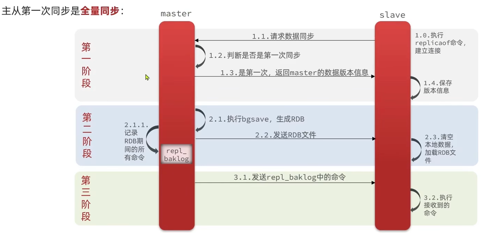

master如何判断slave是不是第一次来同步数据?<font color="red">根据replid是否一致来判断</font>

这里会用到两个很重要的概念:

<font color="red">Replication Id：</font> 简称replid,是数据集的标记，id一致则说明是同一数据集。每一个master都有唯一的replid,salve则会继master节点的replid

<font color="red">offset：</font> 偏移量，随着记录在repl_baklog中的数据增多而逐渐增大。slave完成同步时也会记录当前同步的offset。如果slave的offset小于master的offset,说明slave数据落后于master,需要更新。

因此slave做数据同步，必须向master声明自己的replication id和offset,master才可以判断到底需要同步哪些数据

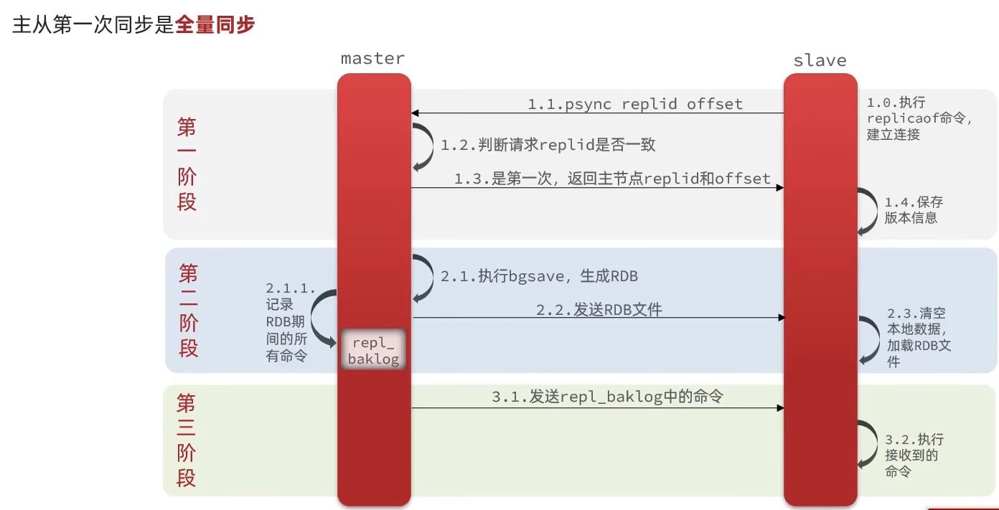

全量同步的流程:

- slave节点请求增量同步

- master节点判断replid,发现不一致，拒绝增量同步

- master将完整内存数据生成RDB,发送RDB到slave

- slave清空本地数据，加载master的RDB

- master将RDB期间的命令记录在repl_baklog,并持续将log中的命令发送给slave

- slave执行接收到的命令，保持与master之间的同步

### 2.增量同步

主从第一次同步是全量同步，但如果slave重启后同步，则执行增量同步。

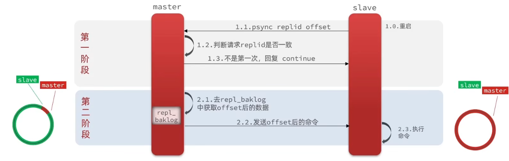

<font color="red">repl_baklog(环形数组)大小有上限，写满后会覆盖最早的数据。如果slave断开时间过久，导致数据被覆盖，则无法实现增量同步，只能再次全量同步</font>

可以从以下几个方面来优化Redis主从就集群:

- 1.在master中配置repl-diskless-sync yes启用无磁盘复制，避免全量同步时的磁盘IO

- 2.Redis单节点上的内存占用不要太大，减少RDB导致的过多磁盘IO

- 3.适当提高repl_baklog的大小，发现slave宕机时尽快实现故障恢复，尽可能避免全量同步

- 4.限制一个master上的slave节点数量，如果实在是太多slave,则可以采用主-从-从链式结构，减少master压力

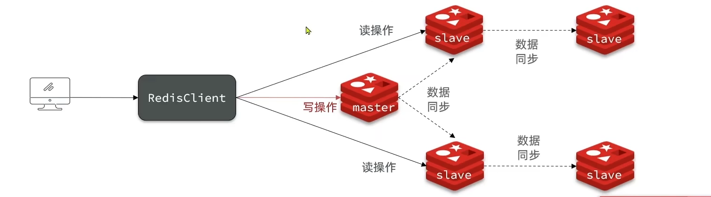

**简述全量同步和增量同步区别?**

- 全量同步:master将完整的内存数据生成RDB，发送RDB到slave。后续命令则记录在repl_baklog,逐个发送给slave。

- 增量同步:slave提交自己的offset到master,master获取repl_baklog从offset之后的命令给slave

**什么时候执行全量同步?**

- slave节点第一次连接master节点时

- slave节点断开太久，repl_baklog中的offset已经覆盖时

**什么时候执行增量同步?**

- slave节点断开又恢复，并且在repl_baklog中能找到offset时

## 4.Redis哨兵

### 1.哨兵的作用

Redis提供了哨兵(Sentinel)机制来实现主从集群的自动故障恢复。哨兵的结构和作用如下:

- **监控:** sentinel会不断检查您的master和slave是否按预期工作

- **自动故障恢复:** 如果master故障，sentinel会将一个slave提升为master。当故障实例恢复后也以新的master为主

- **通知:** sentinel充当Redis客户端的服务来发现来源，当集群发生故障转移时，会将最新的消息推送给Redis的客户端

<font color="red">服务状态监控:</font>

Sentinel基于心跳机制检测服务状态，每隔1s向集群的每个实例发送ping命令:

- 主观下线:如果某sentinel节点发现某实例未在规定时间响应，则认为该实例**主观下线**

- 客观下线:若超过指定数量(quorum)的sentinel都认为该实例主观下线，则该实例客观下线。quorum值最好超过Sentinel实例数量的一半。

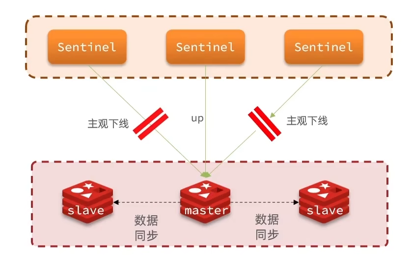

<font color="red">选举新的master</font>

一旦发现master故障，sentinel需要在salve中选择一个作为新的master，选择依据是这样的:

- 首先会判断slave节点与master节点断开时间长短，如果超过指定值(down-after-milliseconds * 10)则会排除该slave节点

- 然后判断slave节点的slave-priority值，越小优先级越高，如果是0则永不参与选举

- 如果slave-prority一样，则判断slave节点的offset值，越大说明数据越新，优先级越高

- 最后是判断slave节点的运行id大小，越小优先级越高

<font color="red">如何实现故障转移</font>

当选中了其中一个slave为新的master后(例如slave1),故障的转移步骤如下:

- sentinel给备选的slave1节点发送slaveof on one命令，让该节点称为master

- sentinel给所有其他slave发送slaveof ip port命令，让这些slave称为新master的从节点，开始从新的master上同步数据。

- 最后,sentinel将故障节点标记为slave，当故障恢复后会自动成为新的master的slave节点

### 2.Redis哨兵集群

搭建步骤请参考<<`Redis集群`>>

### 3.RedisTemplate的哨兵模式

1.在pom文件中引入redis的starter依赖:

```xml
<dependency>
    <groupId>org.springframework.boot</groupId>
    <artifactId>spring-boot-starter-data-redis</artifactId>
</dependency>
```

2.然后在配置文件application.yml中指定sentinel相关信息

```yml
spring:
  redis:
    sentinel:
      master: mymaster # 指定master名称
      nodes: # 指定redis-sentinel集群信息
        - 192.168.150.101:27001
        - 192.168.150.101:27002
        - 192.168.150.101:27003
```

3.配置主从读写分离

```java
@Bean
public LettuceClientConfigurationBuilderCustomizer configurationBuilderCustomizer() {
    return configBuilder -> configBuilder.readFrom(ReadFrom.REPLICA_PREFERRED);
}
```

这里的 `ReadFrom` 是配置 Redis 的读取策略，是一个枚举，包括以下选择：

- **MASTER**  
  → 从主节点读取

- **MASTER_PREFERRED**  
  → 优先从 master 节点读取，master 不可用才读取 replica

- **REPLICA**  
  → 从 slave（replica）节点读取

- **REPLICA_PREFERRED** ✅（图中使用）  
  → 优先从 slave（replica）节点读取，所有的 slave 都不可用时才读取 master

## 5.Redis分片集群

主从和哨兵可以解决高可用、高并发读的问题。但是依然有两个问题没有解决:

- 海量数据存储问题

- 高并发写的问题

使用分片集群可以解决上述问题，分片集群特征:

- 集群中有多个master,每个master保存不同数据

- 每个master都可以有多个slave节点

- master之间通过ping检测彼此健康状态

- 客户端请求可以访问集群任意节点，最终都会转发到正确节点

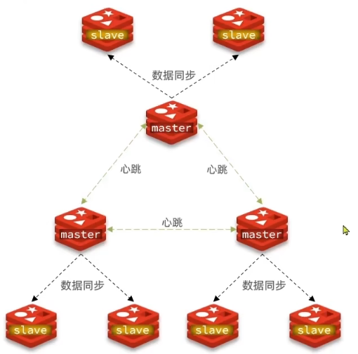

### 1.搭建分片集群

搭建分片集群步骤请参考<<`Redis集群`>>

### 2.散列插槽

Redis会把每一个master节点映射到0~16383共16384个插槽(hash slot)上，查看集群信息时就可以看到:


数据key不是与节点绑定，而是与插槽绑定。redis会根据key的有效部分计算插槽值，分两种清空:

- key中包含"{}",且"{}"中至少包含1个字符，"{}"中的部分就是有效部分

- key中不包含"{}",整个key都是有效部分

例如:key是num,那么就根据num计算，如果是{itcast}num,则根据itcast计算。计算方式是利用CRC16算法得到一个hash值，然后对16384取余，得到的结果就是slot值。

<font color="red">然后启动redis的时候一定要注意:`redis-cli -c -p 7001` -c表示集群模式</font>

**如何将同一类数据固定的保存在同一个Redis实例?**

- 这一类数据使用相同的有效部分，例如key都以{typeId}为前缀

### 3.集群伸缩

redis-cli --cluster提供了很多操作集群的命令，可以通过下面方式查看:

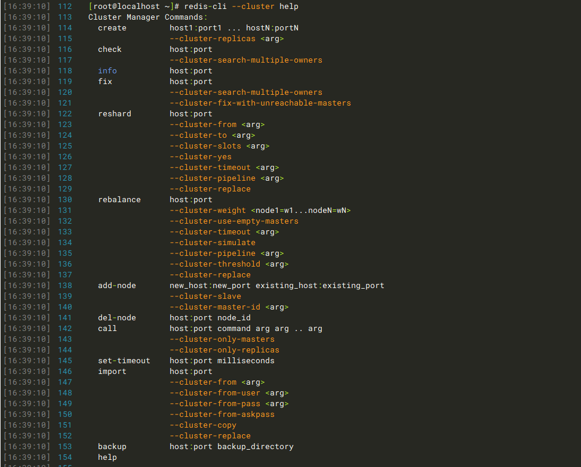

<font color="red">在增加和删除节点的时候，要先reshard插槽，增加的时候要先分配插槽，删除的时候也要先转移插槽</font>

### 4.故障转移

当集群中有一个master宕机会发生什么呢?

1.首先是该实例与其他实例失去连接

2.然后是疑似宕机

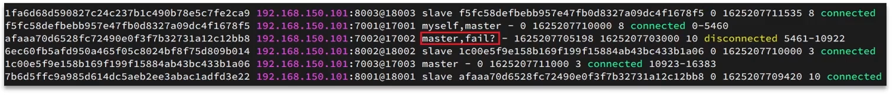

3.最后是确定下线，自动提升一个slave为新的master

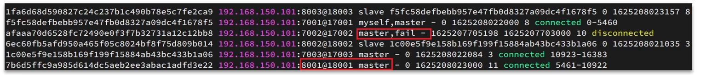

<font color="red">手动选择从节点替换主节点:</font>

利用cluster failover命令可以手动让集群中的某个master宕机，切换到执行cluster failover命令的这个slave节点，实现无感知的数据迁移。其流程如下:

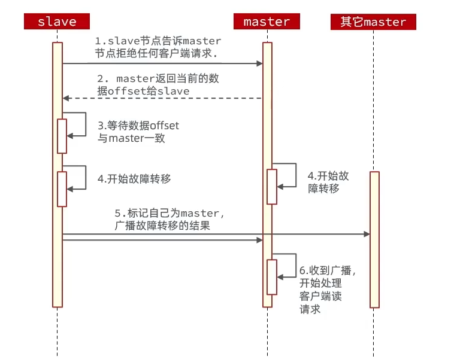

**手动的 Failover 支持三种不同模式：**

- **缺省**：默认的流程，如图1~6步
- **force**：省略了对 offset 的一致性校验
- **takeover**：直接执行第5步，忽略数据一致性、忽略 master 状态和其它 master 的意见

### 5.RedisTemplate访问分片集群

RedisTemplate底层同样基于lettuce实现了分片集群的支持，而使用步骤与哨兵模式基本一致:

1.引入redis的starter依赖

2.配置分片集群地址

3.配置读写分离

与哨兵模式相比，其中只有分片集群的配置方式略有差异，如下:

```yml
spring:
  redis:
    cluster:
      nodes:
        - 192.168.150.101:7001
        - 192.168.150.101:7002
        - 192.168.150.101:7003
        - 192.168.150.101:8001
        - 192.168.150.101:8002
        - 192.168.150.101:8003
```

## 6.多级缓存

传统的缓存策略一般是请求到达Tomcat后，先查询Redis,如果未命中则查询数据库，存在下面的问题:

- 请求要经过Tomcat处理,Tomcat的性能成为整个系统的瓶颈

- Redis缓存失效时，会对数据库产生冲击

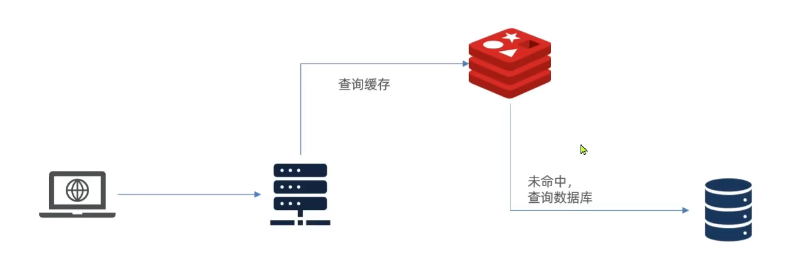

多级缓存就是充分利用请求处理的每个环节，分别加缓存，减轻Tomcat压力，提升服务性能

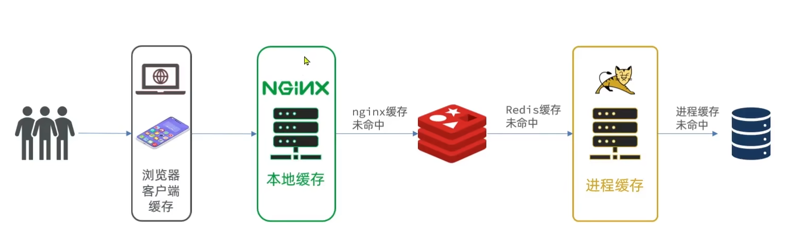

用作缓存的Nginx是业务Nginx,需要部署为集群，再有专门的Nginx用来做反向代理:

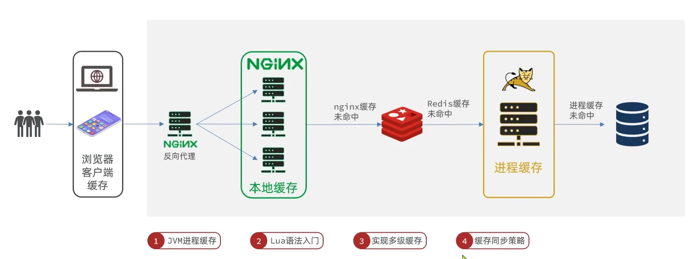

### 1.JVM进程缓存

缓存在日常开发中起到至关重要的作用，由于是存储在内存中，数据的读取速度是非常快的，能大量减少对数据库的访问，减少数据库的压力。我们把缓存分为两类:

**1.分布式缓存，例如Redis:**

- 优点:存储容量更大，可靠性更好，可以在集群间共享

- 缺点:访问缓存有网络开销

- 场景:缓存数据量较大，可靠性要求较高，需要在集群间共享

**2.进程本地缓存，例如HashMap、GuavaCache：**

- 优点:读取本地内存，没有网络开销，速度更快

- 缺点:存储容量有限，可靠性较低，无法共享

- 场景:性能要求较高，缓存数据量较小

Caffeine是一个基于Java8开发的，提供了近乎最佳命中率的高性能的本次缓存库。目前Spring内部的缓存使用的就是Caffeine。GitHub地址:[Home zh CN · ben-manes/caffeine Wiki · GitHub](https://github.com/ben-manes/caffeine/wiki/Home-zh-CN)

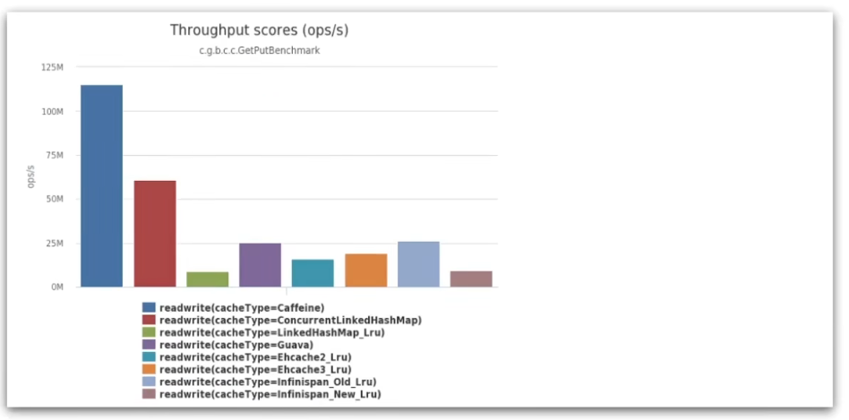

初始Caffeine

```java
    @Test
    void testBasicOps() {
        //构建缓存对象
        Cache<String, String> cache = Caffeine.newBuilder().build();
        //存数据
        cache.put("ns","刘德华");
        //取数据
        String ns = cache.getIfPresent("ns");
        System.out.println(ns);
        //取数据，如果未命中则查询数据库
        String defaultNs = cache.get("defaultNs", key -> {
            //查询数据库业务
            return "黎明";
        });
        System.out.println(defaultNs);
    }
```

Caffeine提供了三种缓存驱逐策略:

- **基于容量** :设置缓存的数量上限

```java

```

- **基于时间** :设置缓存的有效时间

- **基于引用** :设置缓存为软引用或弱引用，利用GC来回收缓存数据。性能较差，不建议使用

在默认情况下，当一个缓存元素过期的时候，Caffeine不会自动立即将其清理和驱逐。而是在一次读或写操作后,或者在空闲时间完成对失效数据的驱逐。

在业务中使用Caffeine

1.注册为一个bean

```java
@Configuration
public class CaffeineConfig {
    @Bean
    public Cache<Long, Item> itemCache(){
        return Caffeine.newBuilder()
                .initialCapacity(100)
                .maximumSize(10_000)
                .build();
    }
    @Bean
    public Cache<Long, ItemStock> stockCache(){
        return Caffeine.newBuilder()
                .initialCapacity(100)
                .maximumSize(10_000)
                .build();
    }
}
```

2.修改查询业务

```java
@RestController
@RequestMapping("item")
public class ItemController {

    @Autowired
    private IItemService itemService;
    @Autowired
    private IItemStockService stockService;
    @Autowired
    private Cache<Long,Item> itemCache;
    @Autowired
    private Cache<Long,ItemStock> stockCache;

    @GetMapping("/{id}")
    public Item findById(@PathVariable("id") Long id){
        return itemCache.get(id,key->{
             return itemService.query()
                    .ne("status", 3).eq("id", key)
                    .one();
        });

    }

    @GetMapping("/stock/{id}")
    public ItemStock findStockById(@PathVariable("id") Long id){
        return stockCache.get(id,key->{
            return stockService.getById(key);
        });
    }
}
```

### 2.Lua语法

Lua是一种轻量小巧的脚本语言，用标准C语言编写并以源代码形式开放，其设计目的就是为了嵌入应用程序中，从而为应用程序提供灵活的扩展和定制功能。官网:https://lua.org/

**数据类型**

| 数据类型       | 描述                                                                                                                       |
| ---------- | ------------------------------------------------------------------------------------------------------------------------ |
| `nil`      | 这个最简单，只有值 `nil` 属于该类，表示一个无效值（在条件表达式中相当于 `false`）。                                                                        |
| `boolean`  | 包含两个值：`false` 和 `true`                                                                                                   |
| `number`   | 表示双精度类型的实浮点数                                                                                                             |
| `string`   | 字符串由一对双引号或单引号来表示                                                                                                         |
| `function` | 由 C 或 Lua 编写的函数                                                                                                          |
| `table`    | Lua 中的表（table）其实是一个"关联数组"（associative arrays），数组的索引可以是数字、字符串或表类型。在 Lua 里，table 的创建是通过"构造表达式"来完成，最简单构造表达式是 `{}`，用来创建一个空表。 |

可以利用type函数测试给定变量或者值得类型:

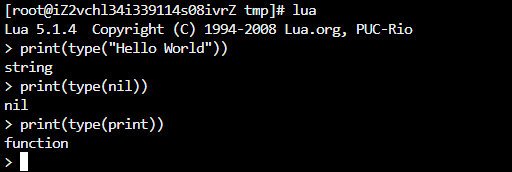

**变量**

Lua声明变量的时候，并不需要指定数据类型

```lua
-- 声明字符串
local str = 'hello'
-- 声明数字
local num = 21
-- 声明布尔类型
local flag = true
-- 声明数组 key为索引的 table
local arr = {'java', 'python', 'lua'}
-- 声明table, 类似java的map
local map = {name='Jack', age=21}
```

访问table

```lua
-- 访问数组，lua数组的角标从1开始
print(arr[1])

-- 访问table
print(map['name'])
print(map.name)
```

<font color="red">在Lua中字符串拼接的语法是"..",并不是Java中的"+"</font>  `local str = 'hello' .. 'World'`

**循环**

数组、table都可以利用for循环来遍历:

> 遍历数组:
> 
> ```lua
> -- 声明数组 key为索引的 table
> local arr = {'java', 'python', 'lua'}
> 
> -- 遍历数组
> for index, value in ipairs(arr) do
>     print(index, value)
> end
> ```
> 
> 遍历table:
> 
> ```lua
> -- 声明map, 也就是table
> local map = {name='Jack', age=21}
> 
> -- 遍历table
> for key, value in pairs(map) do
>     print(key, value)
> end
> ```

**函数**

> 定义函数的语法:
> 
> ```lua
> function 函数名(argument1, argument2..., argumentn)
>     -- 函数体
>     return 返回值
> end
> ```
> 
> 例如，定义一个函数，用来打印数组
> 
> ```lua
> function printArr(arr)
>     for index, value in ipairs(arr) do
>         print(value)
>     end
> end
> ```

**条件控制**

> 类似Java的条件控制，例如if、else的语法
> 
> ```lua
> if(布尔表达式)
> then
>     --[ 布尔表达式为 true 时执行该语句块 --]
> else
>     --[ 布尔表达式为 false 时执行该语句块 --]
> end
> ```
> 
> 与java不同，布尔表达式中的逻辑运算是基于英文单词
> 
> | 操作符   | 描述                                          | 实例                       |
> | ----- | ------------------------------------------- | ------------------------ |
> | `and` | 逻辑与操作符。若 A 为 `false`，则返回 A，否则返回 B。          | `(A and B)` 为 `false`。   |
> | `or`  | 逻辑或操作符。若 A 为 `true`，则返回 A，否则返回 B。           | `(A or B)` 为 `true`。     |
> | `not` | 逻辑非操作符。与逻辑运算结果相反，如果条件为 `true`，逻辑非为 `false`。 | `not(A and B)` 为 `true`。 |
