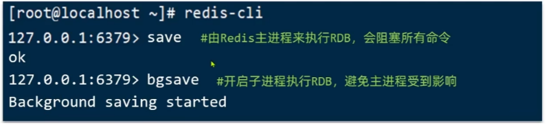
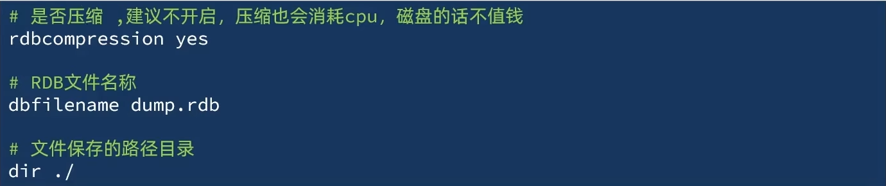
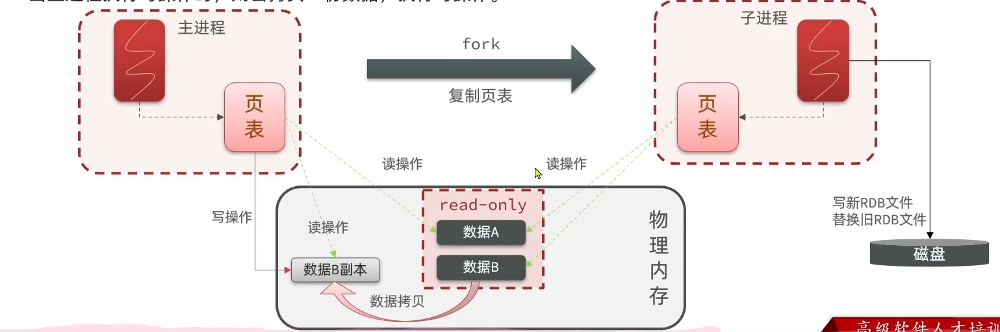
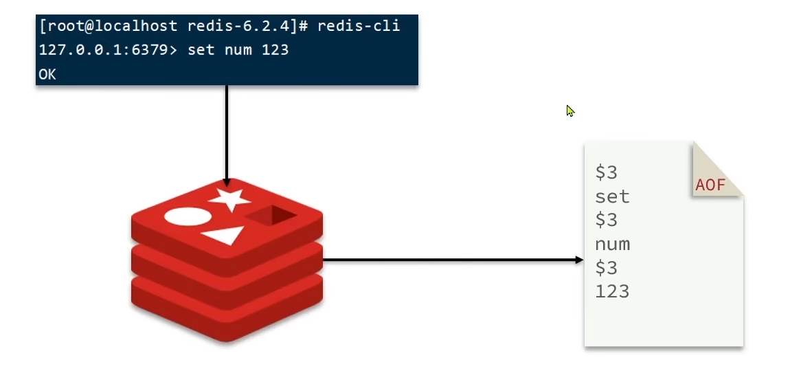
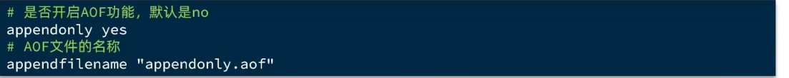
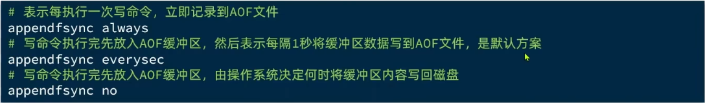
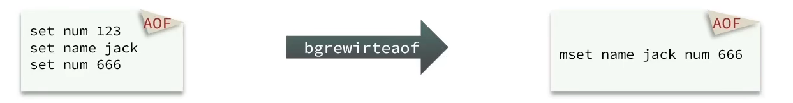
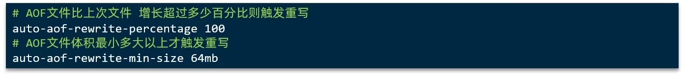
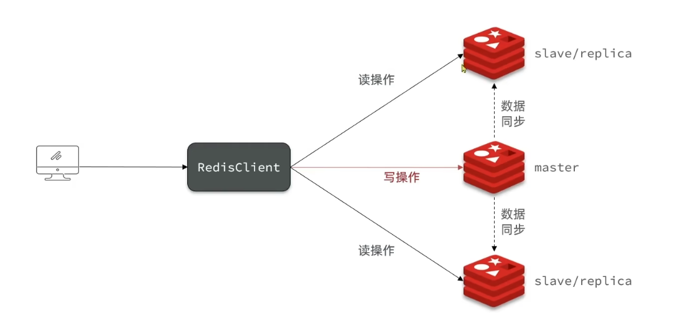

# Redis高级篇

## 1.单点Redis的问题

**1.数据丢失问题**  -> **实现Redis数据持久化**

2.**并发能力问题**  ->**搭建主从集群，实现读写分离**

3.**故障修复问题** ->**利用Redis哨兵，实现健康检测和自动修复**

4.**存储能力问题** -> **搭建分片集群，利用插槽机制动态扩容**

## 2.Redis持久化

### 1.RDB

RDB全称Redis DataBase Backup file(Redis数据备份文件)，也被叫做Redis数据快照。简单来说就是把内存中的所有数据都记录到磁盘中。当Redis实例故障重启后，从磁盘读取快照文件，恢复数据。

快照文件称为RDB文件，默认是保存在当前运行目录

**Redis停机时会执行一次RDB**

Redis内部有触发RDB机制，可以在redis.conf文件中找到，格式如下:

RDB的其他配置也可以在redis.conf文件中设置

**RDB实现原理:**

bgsave开始时会fork主进程得到子进程，子进程共享主进程的内存数据。完成fork后读取内存数据并写入RDB文件。

fork采用的是copy-on-write技术:

1. 当主进程执行读操作时，访问共享内存;

2. 当主进程执行写操作时，则会拷贝一份数据，执行写操作。

### 2.AOF

AOF全称为Append Only File(追加文件)。Redis处理的每一个写命令都会记录在AOF文件中，可以看做是命令日志文件。

AOF默认是关闭的，需要修改Redis.conf配置文件来开启AOF：

AOF的命令记录的频率也可以通过redis.conf文件来配:

| 配置项      | 刷盘时机   | 优点          | 缺点             |
| -------- | ------ | ----------- | -------------- |
| Always   | 同步刷盘   | 可靠性高，几乎不丢数据 | 性能影响大          |
| everysec | 每秒刷盘   | 性能适中        | 最多丢失1秒数据       |
| no       | 操作系统控制 | 性能最好        | 可靠性较差，可能丢失大量数据 |

因为是记录命令，AOF文件会比RDB文件大的多。而且AOF会记录对同一个key的多次写操作，但只有最后一次写操作才有意义。通过执行`bgrewriteaof`命令，可以让AOF文件执行重写操作，用最少的命令达到相同的效果。

Redis也会在触发阈值时自动去重写AOF文件。阈值也可以在redis.conf中配置:

### 3.RDB和AOF总结

RDB和AOF各有自己的优缺点，如果对数据安全性要求较高，在实际开发中往往会结合 两者来实用。

|         | RDB                    | AOF                                 |
| ------- | ---------------------- | ----------------------------------- |
| 持久化方式   | 定时对整个内存做快照             | 记录每一次执行的命令                          |
| 数据完整性   | 不完整，两次备份之间会丢失          | 相对完整，取决于刷盘策略                        |
| 文件大小    | 会有压缩，文件体积小             | 记录命令，文件体积很大                         |
| 启机恢复速度  | 很快                     | 慢                                   |
| 数据恢复优先级 | 低，因为数据完整性不如AOF         | 高，因为数据完整性更高                         |
| 系统资源占用  | 高，大量CPU和内存消耗           | 低，主要是磁盘IO资源 但AOF重写时会占用大量CPU和内存资源 |
| 使用场景    | 可以容忍数分钟的数据丢失，追求更快的启动速度 | 对数据安全性要求较高常见                        |

## 3.Redis主从

单节点Redis的并发能力是有上限的，要进一步提高Redis的并发能力，就需要搭建主从集群，实现读写分离。

搭建Redis主从，参考<<Redis集群>>

假设有A、B两个实例，如何让B作为A的slave节点?

在B节点执行命令: slaveof A的IP A的port

**slave和replica的命令一样，在从节点执行slave/replica A的IP A的port**

