# Redis高级篇

## 1.单点Redis的问题

**1.数据丢失问题**  -> **实现Redis数据持久化**

2.**并发能力问题**  ->**搭建主从集群，实现读写分离**

3.**故障修复问题** ->**利用Redis哨兵，实现健康检测和自动修复**

4.**存储能力问题** -> **搭建分片集群，利用插槽机制动态扩容**

## 2.Redis持久化

### 1.RDB

RDB全称Redis DataBase Backup file(Redis数据备份文件)，也被叫做Redis数据快照。简单来说就是把内存中的所有数据都记录到磁盘中。当Redis实例故障重启后，从磁盘读取快照文件，恢复数据。

快照文件称为RDB文件，默认是保存在当前运行目录

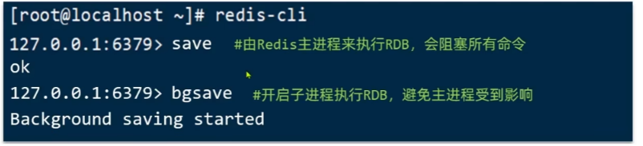

**Redis停机时会执行一次RDB**

Redis内部有触发RDB机制，可以在redis.conf文件中找到，格式如下:


RDB的其他配置也可以在redis.conf文件中设置

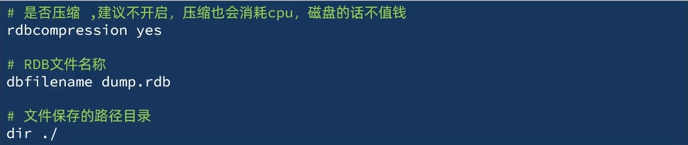

**RDB实现原理:**

bgsave开始时会fork主进程得到子进程，子进程共享主进程的内存数据。完成fork后读取内存数据并写入RDB文件。

fork采用的是copy-on-write技术:

1. 当主进程执行读操作时，访问共享内存;

2. 当主进程执行写操作时，则会拷贝一份数据，执行写操作。

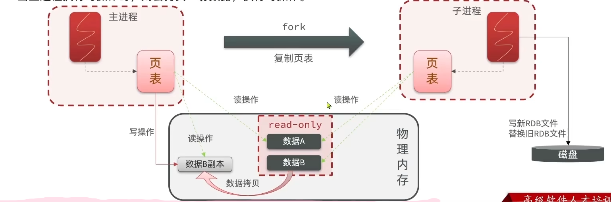

### 2.AOF

AOF全称为Append Only File(追加文件)。Redis处理的每一个写命令都会记录在AOF文件中，可以看做是命令日志文件。

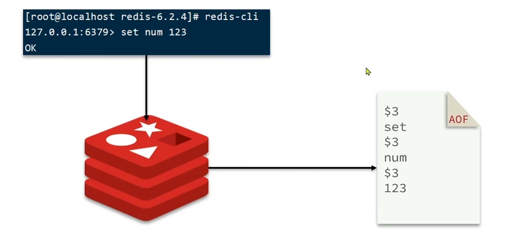

AOF默认是关闭的，需要修改Redis.conf配置文件来开启AOF：

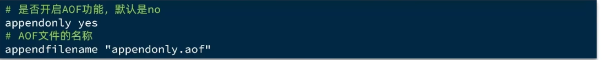

AOF的命令记录的频率也可以通过redis.conf文件来配:

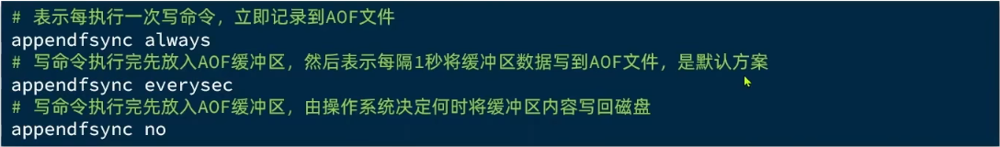

| 配置项      | 刷盘时机   | 优点          | 缺点             |
| -------- | ------ | ----------- | -------------- |
| Always   | 同步刷盘   | 可靠性高，几乎不丢数据 | 性能影响大          |
| everysec | 每秒刷盘   | 性能适中        | 最多丢失1秒数据       |
| no       | 操作系统控制 | 性能最好        | 可靠性较差，可能丢失大量数据 |

因为是记录命令，AOF文件会比RDB文件大的多。而且AOF会记录对同一个key的多次写操作，但只有最后一次写操作才有意义。通过执行`bgrewriteaof`命令，可以让AOF文件执行重写操作，用最少的命令达到相同的效果。

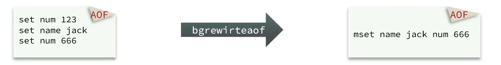

Redis也会在触发阈值时自动去重写AOF文件。阈值也可以在redis.conf中配置:


### 3.RDB和AOF总结

RDB和AOF各有自己的优缺点，如果对数据安全性要求较高，在实际开发中往往会<font color="red">结合</font> 两者来实用。

|         | RDB                    | AOF                                 |
| ------- | ---------------------- | ----------------------------------- |
| 持久化方式   | 定时对整个内存做快照             | 记录每一次执行的命令                          |
| 数据完整性   | 不完整，两次备份之间会丢失          | 相对完整，取决于刷盘策略                        |
| 文件大小    | 会有压缩，文件体积小             | 记录命令，文件体积很大                         |
| 启机恢复速度  | 很快                     | 慢                                   |
| 数据恢复优先级 | 低，因为数据完整性不如AOF         | 高，因为数据完整性更高                         |
| 系统资源占用  | 高，大量CPU和内存消耗           | 低，主要是磁盘IO资源<br>但AOF重写时会占用大量CPU和内存资源 |
| 使用场景    | 可以容忍数分钟的数据丢失，追求更快的启动速度 | 对数据安全性要求较高常见                        |

## 3.Redis主从

单节点Redis的并发能力是有上限的，要进一步提高Redis的并发能力，就需要搭建主从集群，实现读写分离。

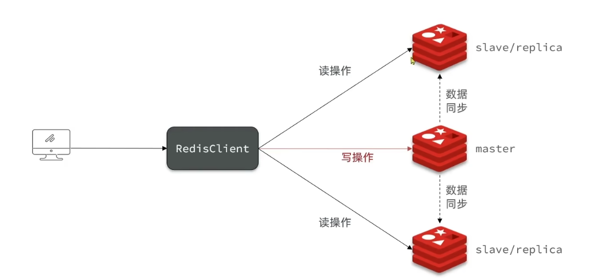

搭建Redis主从，参考<<Redis集群>>

假设有A、B两个实例，如何让B作为A的slave节点?

在B节点执行命令: slaveof A的IP A的port

**slave和replica的命令一样，在从节点执行slave/replica A的IP A的port**

**主节点用来写，从节点只能用来读**

### 1.主从数据同步原理

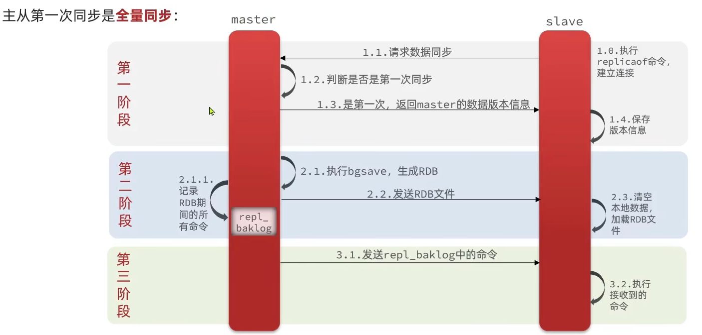

master如何判断slave是不是第一次来同步数据?<font color="red">根据replid是否一致来判断</font>

这里会用到两个很重要的概念:

<font color="red">Replication Id：</font> 简称replid,是数据集的标记，id一致则说明是同一数据集。每一个master都有唯一的replid,salve则会继master节点的replid

<font color="red">offset：</font> 偏移量，随着记录在repl_baklog中的数据增多而逐渐增大。slave完成同步时也会记录当前同步的offset。如果slave的offset小于master的offset,说明slave数据落后于master,需要更新。

因此slave做数据同步，必须向master声明自己的replication id和offset,master才可以判断到底需要同步哪些数据

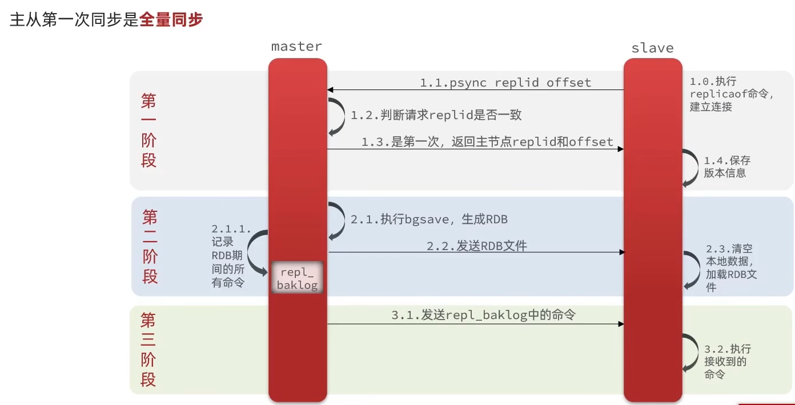

全量同步的流程:

- slave节点请求增量同步

- master节点判断replid,发现不一致，拒绝增量同步

- master将完整内存数据生成RDB,发送RDB到slave

- slave清空本地数据，加载master的RDB

- master将RDB期间的命令记录在repl_baklog,并持续将log中的命令发送给slave

- slave执行接收到的命令，保持与master之间的同步

### 2.增量同步

主从第一次同步是全量同步，但如果slave重启后同步，则执行增量同步。

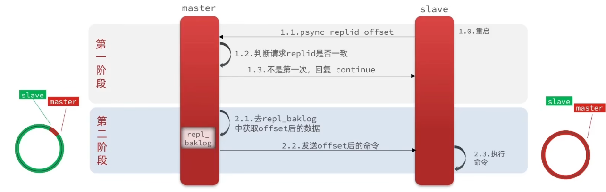

<font color="red">repl_baklog(环形数组)大小有上限，写满后会覆盖最早的数据。如果slave断开时间过久，导致数据被覆盖，则无法实现增量同步，只能再次全量同步</font>

可以从以下几个方面来优化Redis主从就集群:

- 1.在master中配置repl-diskless-sync yes启用无磁盘复制，避免全量同步时的磁盘IO

- 2.Redis单节点上的内存占用不要太大，减少RDB导致的过多磁盘IO

- 3.适当提高repl_baklog的大小，发现slave宕机时尽快实现故障恢复，尽可能避免全量同步

- 4.限制一个master上的slave节点数量，如果实在是太多slave,则可以采用主-从-从链式结构，减少master压力

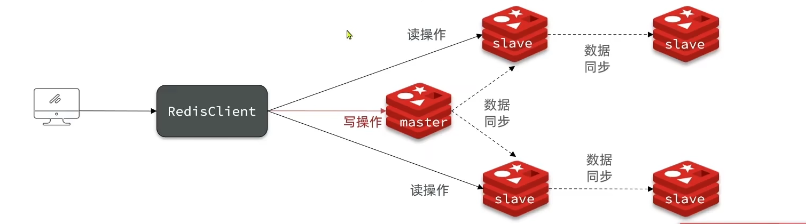

**简述全量同步和增量同步区别?**

- 全量同步:master将完整的内存数据生成RDB，发送RDB到slave。后续命令则记录在repl_baklog,逐个发送给slave。

- 增量同步:slave提交自己的offset到master,master获取repl_baklog从offset之后的命令给slave

**什么时候执行全量同步?**

- slave节点第一次连接master节点时

- slave节点断开太久，repl_baklog中的offset已经覆盖时

**什么时候执行增量同步?**

- slave节点断开又恢复，并且在repl_baklog中能找到offset时

## 4.Redis哨兵

### 1.哨兵的作用

Redis提供了哨兵(Sentinel)机制来实现主从集群的自动故障恢复。哨兵的结构和作用如下:

- **监控:** sentinel会不断检查您的master和slave是否按预期工作

- **自动故障恢复:** 如果master故障，sentinel会将一个slave提升为master。当故障实例恢复后也以新的master为主

- **通知:** sentinel充当Redis客户端的服务来发现来源，当集群发生故障转移时，会将最新的消息推送给Redis的客户端

<font color="red">服务状态监控:</font>

Sentinel基于心跳机制检测服务状态，每隔1s向集群的每个实例发送ping命令:

- 主观下线:如果某sentinel节点发现某实例未在规定时间响应，则认为该实例**主观下线**

- 客观下线:若超过指定数量(quorum)的sentinel都认为该实例主观下线，则该实例客观下线。quorum值最好超过Sentinel实例数量的一半。

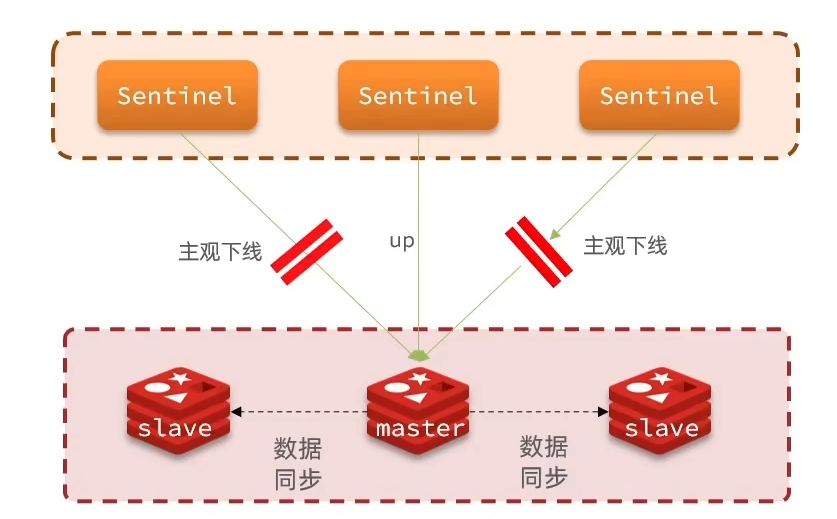

<font color="red">选举新的master</font>

一旦发现master故障，sentinel需要在salve中选择一个作为新的master，选择依据是这样的:

- 首先会判断slave节点与master节点断开时间长短，如果超过指定值(down-after-milliseconds * 10)则会排除该slave节点

- 然后判断slave节点的slave-priority值，越小优先级越高，如果是0则永不参与选举

- 如果slave-prority一样，则判断slave节点的offset值，越大说明数据越新，优先级越高

- 最后是判断slave节点的运行id大小，越小优先级越高

<font color="red">如何实现故障转移</font>

当选中了其中一个slave为新的master后(例如slave1),故障的转移步骤如下:

- sentinel给备选的slave1节点发送slaveof on one命令，让该节点称为master

- sentinel给所有其他slave发送slaveof ip port命令，让这些slave称为新master的从节点，开始从新的master上同步数据。

- 最后,sentinel将故障节点标记为slave，当故障恢复后会自动成为新的master的slave节点

### 2.Redis哨兵集群

搭建步骤请参考<<`Redis集群`>>

### 3.RedisTemplate的哨兵模式

1.在pom文件中引入redis的starter依赖:

```xml
<dependency>
    <groupId>org.springframework.boot</groupId>
    <artifactId>spring-boot-starter-data-redis</artifactId>
</dependency>
```

2.然后在配置文件application.yml中指定sentinel相关信息

```yml
spring:
  redis:
    sentinel:
      master: mymaster # 指定master名称
      nodes: # 指定redis-sentinel集群信息
        - 192.168.150.101:27001
        - 192.168.150.101:27002
        - 192.168.150.101:27003
```

3.配置主从读写分离

```java
@Bean
public LettuceClientConfigurationBuilderCustomizer configurationBuilderCustomizer() {
    return configBuilder -> configBuilder.readFrom(ReadFrom.REPLICA_PREFERRED);
}
```

这里的 `ReadFrom` 是配置 Redis 的读取策略，是一个枚举，包括以下选择：

- **MASTER**  
  → 从主节点读取

- **MASTER_PREFERRED**  
  → 优先从 master 节点读取，master 不可用才读取 replica

- **REPLICA**  
  → 从 slave（replica）节点读取

- **REPLICA_PREFERRED** ✅（图中使用）  
  → 优先从 slave（replica）节点读取，所有的 slave 都不可用时才读取 master

## 5.Redis分片集群

主从和哨兵可以解决高可用、高并发读的问题。但是依然有两个问题没有解决:

- 海量数据存储问题

- 高并发写的问题

使用分片集群可以解决上述问题，分片集群特征:

- 集群中有多个master,每个master保存不同数据

- 每个master都可以有多个slave节点

- master之间通过ping检测彼此健康状态

- 客户端请求可以访问集群任意节点，最终都会转发到正确节点

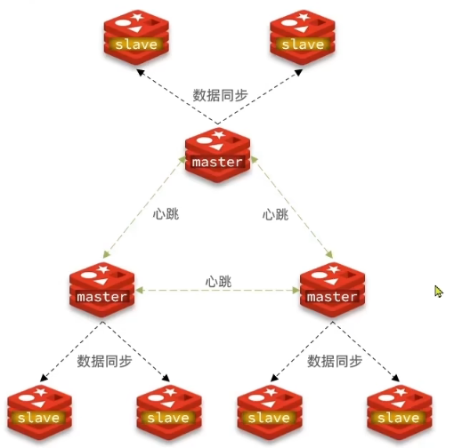

### 1.搭建分片集群

搭建分片集群步骤请参考<<`Redis集群`>>

### 2.散列插槽

Redis会把每一个master节点映射到0~16383共16384个插槽(hash slot)上，查看集群信息时就可以看到:

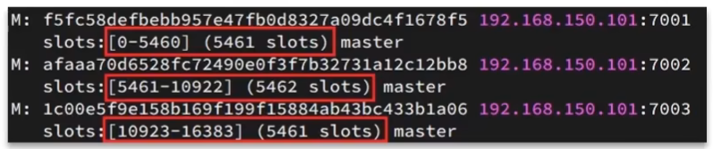

数据key不是与节点绑定，而是与插槽绑定。redis会根据key的有效部分计算插槽值，分两种清空:

- key中包含"{}",且"{}"中至少包含1个字符，"{}"中的部分就是有效部分

- key中不包含"{}",整个key都是有效部分

例如:key是num,那么就根据num计算，如果是{itcast}num,则根据itcast计算。计算方式是利用CRC16算法得到一个hash值，然后对16384取余，得到的结果就是slot值。

<font color="red">然后启动redis的时候一定要注意:`redis-cli -c -p 7001` -c表示集群模式</font>

**如何将同一类数据固定的保存在同一个Redis实例?**

- 这一类数据使用相同的有效部分，例如key都以{typeId}为前缀

### 3.集群伸缩

redis-cli --cluster提供了很多操作集群的命令，可以通过下面方式查看:

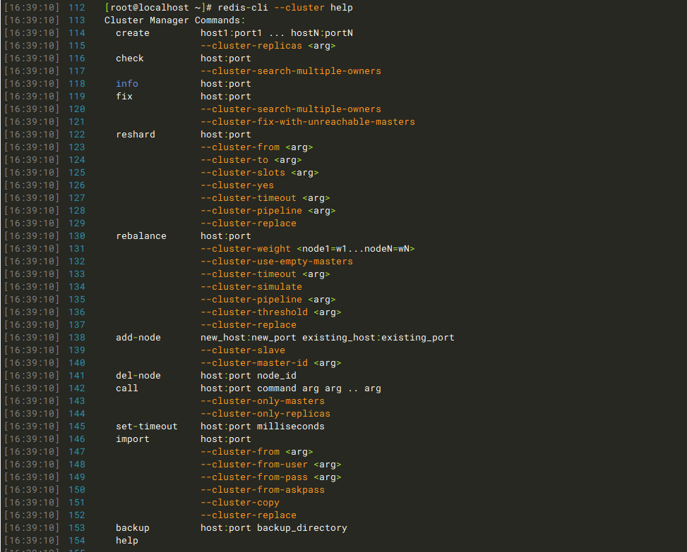

<font color="red">在增加和删除节点的时候，要先reshard插槽，增加的时候要先分配插槽，删除的时候也要先转移插槽</font>

### 4.故障转移

当集群中有一个master宕机会发生什么呢?

1.首先是该实例与其他实例失去连接

2.然后是疑似宕机

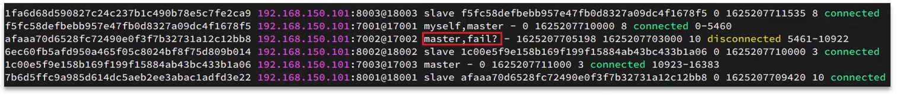

3.最后是确定下线，自动提升一个slave为新的master

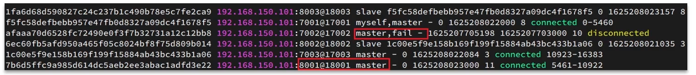

<font color="red">手动选择从节点替换主节点:</font>

利用cluster failover命令可以手动让集群中的某个master宕机，切换到执行cluster failover命令的这个slave节点，实现无感知的数据迁移。其流程如下:

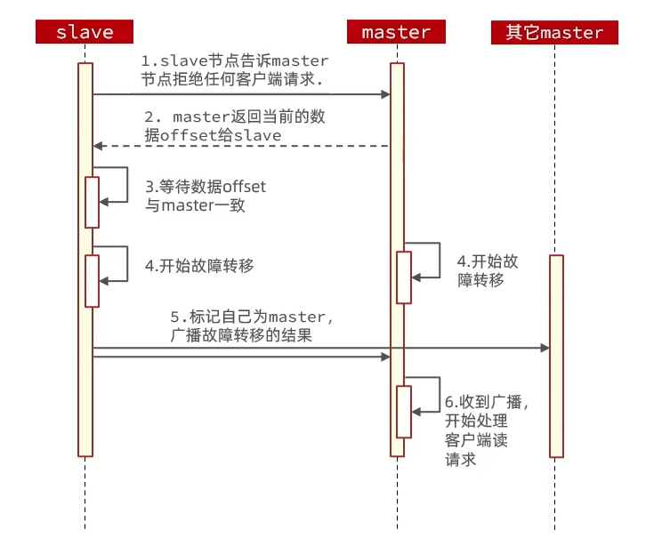

**手动的 Failover 支持三种不同模式：**

- **缺省**：默认的流程，如图1~6步
- **force**：省略了对 offset 的一致性校验
- **takeover**：直接执行第5步，忽略数据一致性、忽略 master 状态和其它 master 的意见

### 5.RedisTemplate访问分片集群

RedisTemplate底层同样基于lettuce实现了分片集群的支持，而使用步骤与哨兵模式基本一致:

1.引入redis的starter依赖

2.配置分片集群地址

3.配置读写分离

与哨兵模式相比，其中只有分片集群的配置方式略有差异，如下:

```yml
spring:
  redis:
    cluster:
      nodes:
        - 192.168.150.101:7001
        - 192.168.150.101:7002
        - 192.168.150.101:7003
        - 192.168.150.101:8001
        - 192.168.150.101:8002
        - 192.168.150.101:8003
```

## 6.多级缓存

传统的缓存策略一般是请求到达Tomcat后，先查询Redis,如果未命中则查询数据库，存在下面的问题:

- 请求要经过Tomcat处理,Tomcat的性能成为整个系统的瓶颈

- Redis缓存失效时，会对数据库产生冲击

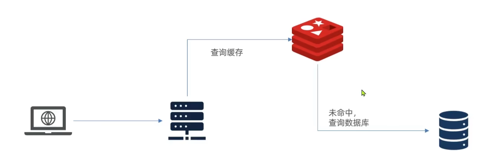

多级缓存就是充分利用请求处理的每个环节，分别加缓存，减轻Tomcat压力，提升服务性能

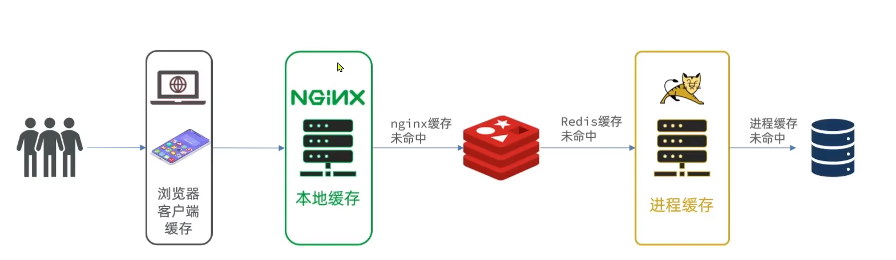

用作缓存的Nginx是业务Nginx,需要部署为集群，再有专门的Nginx用来做反向代理:

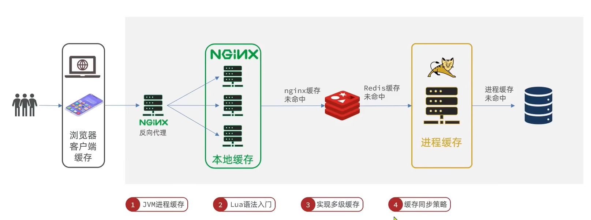

### 1.JVM进程缓存

缓存在日常开发中起到至关重要的作用，由于是存储在内存中，数据的读取速度是非常快的，能大量减少对数据库的访问，减少数据库的压力。我们把缓存分为两类:

**1.分布式缓存，例如Redis:**

- 优点:存储容量更大，可靠性更好，可以在集群间共享

- 缺点:访问缓存有网络开销

- 场景:缓存数据量较大，可靠性要求较高，需要在集群间共享

**2.进程本地缓存，例如HashMap、GuavaCache：**

- 优点:读取本地内存，没有网络开销，速度更快

- 缺点:存储容量有限，可靠性较低，无法共享

- 场景:性能要求较高，缓存数据量较小

Caffeine是一个基于Java8开发的，提供了近乎最佳命中率的高性能的本次缓存库。目前Spring内部的缓存使用的就是Caffeine。GitHub地址:[Home zh CN · ben-manes/caffeine Wiki · GitHub](https://github.com/ben-manes/caffeine/wiki/Home-zh-CN)

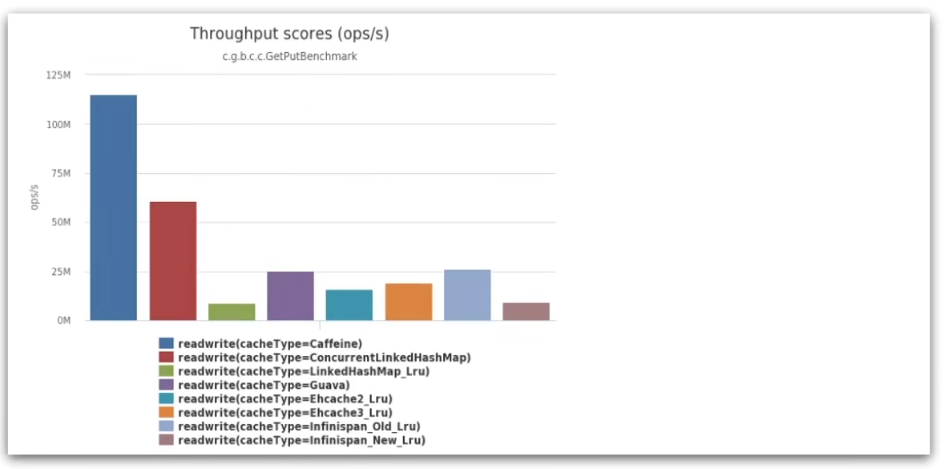

初始Caffeine

```java
    @Test
    void testBasicOps() {
        //构建缓存对象
        Cache<String, String> cache = Caffeine.newBuilder().build();
        //存数据
        cache.put("ns","刘德华");
        //取数据
        String ns = cache.getIfPresent("ns");
        System.out.println(ns);
        //取数据，如果未命中则查询数据库
        String defaultNs = cache.get("defaultNs", key -> {
            //查询数据库业务
            return "黎明";
        });
        System.out.println(defaultNs);
    }
```

Caffeine提供了三种缓存驱逐策略:

- **基于容量** :设置缓存的数量上限

```java

```

- **基于时间** :设置缓存的有效时间

- **基于引用** :设置缓存为软引用或弱引用，利用GC来回收缓存数据。性能较差，不建议使用

在默认情况下，当一个缓存元素过期的时候，Caffeine不会自动立即将其清理和驱逐。而是在一次读或写操作后,或者在空闲时间完成对失效数据的驱逐。

在业务中使用Caffeine

1.注册为一个bean

```java
@Configuration
public class CaffeineConfig {
    @Bean
    public Cache<Long, Item> itemCache(){
        return Caffeine.newBuilder()
                .initialCapacity(100)
                .maximumSize(10_000)
                .build();
    }
    @Bean
    public Cache<Long, ItemStock> stockCache(){
        return Caffeine.newBuilder()
                .initialCapacity(100)
                .maximumSize(10_000)
                .build();
    }
}
```

2.修改查询业务

```java
@RestController
@RequestMapping("item")
public class ItemController {

    @Autowired
    private IItemService itemService;
    @Autowired
    private IItemStockService stockService;
    @Autowired
    private Cache<Long,Item> itemCache;
    @Autowired
    private Cache<Long,ItemStock> stockCache;

    @GetMapping("/{id}")
    public Item findById(@PathVariable("id") Long id){
        return itemCache.get(id,key->{
             return itemService.query()
                    .ne("status", 3).eq("id", key)
                    .one();
        });

    }

    @GetMapping("/stock/{id}")
    public ItemStock findStockById(@PathVariable("id") Long id){
        return stockCache.get(id,key->{
            return stockService.getById(key);
        });
    }
}
```

### 2.Lua语法

Lua是一种轻量小巧的脚本语言，用标准C语言编写并以源代码形式开放，其设计目的就是为了嵌入应用程序中，从而为应用程序提供灵活的扩展和定制功能。官网:https://lua.org/

**数据类型**

| 数据类型       | 描述                                                                                                                       |
| ---------- | ------------------------------------------------------------------------------------------------------------------------ |
| `nil`      | 这个最简单，只有值 `nil` 属于该类，表示一个无效值（在条件表达式中相当于 `false`）。                                                                        |
| `boolean`  | 包含两个值：`false` 和 `true`                                                                                                   |
| `number`   | 表示双精度类型的实浮点数                                                                                                             |
| `string`   | 字符串由一对双引号或单引号来表示                                                                                                         |
| `function` | 由 C 或 Lua 编写的函数                                                                                                          |
| `table`    | Lua 中的表（table）其实是一个"关联数组"（associative arrays），数组的索引可以是数字、字符串或表类型。在 Lua 里，table 的创建是通过"构造表达式"来完成，最简单构造表达式是 `{}`，用来创建一个空表。 |

可以利用type函数测试给定变量或者值得类型:

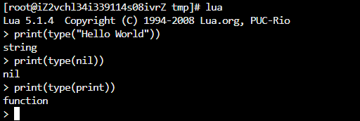

**变量**

Lua声明变量的时候，并不需要指定数据类型

```lua
-- 声明字符串
local str = 'hello'
-- 声明数字
local num = 21
-- 声明布尔类型
local flag = true
-- 声明数组 key为索引的 table
local arr = {'java', 'python', 'lua'}
-- 声明table, 类似java的map
local map = {name='Jack', age=21}
```

访问table

```lua
-- 访问数组，lua数组的角标从1开始
print(arr[1])

-- 访问table
print(map['name'])
print(map.name)
```

<font color="red">在Lua中字符串拼接的语法是"..",并不是Java中的"+"</font>  `local str = 'hello' .. 'World'`

**循环**

数组、table都可以利用for循环来遍历:

> 遍历数组:
> 
> ```lua
> -- 声明数组 key为索引的 table
> local arr = {'java', 'python', 'lua'}
> 
> -- 遍历数组
> for index, value in ipairs(arr) do
>     print(index, value)
> end
> ```
> 
> 遍历table:
> 
> ```lua
> -- 声明map, 也就是table
> local map = {name='Jack', age=21}
> 
> -- 遍历table
> for key, value in pairs(map) do
>     print(key, value)
> end
> ```

**函数**

> 定义函数的语法:
> 
> ```lua
> function 函数名(argument1, argument2..., argumentn)
>     -- 函数体
>     return 返回值
> end
> ```
> 
> 例如，定义一个函数，用来打印数组
> 
> ```lua
> function printArr(arr)
>     for index, value in ipairs(arr) do
>         print(value)
>     end
> end
> ```

**条件控制**

> 类似Java的条件控制，例如if、else的语法
> 
> ```lua
> if(布尔表达式)
> then
>     --[ 布尔表达式为 true 时执行该语句块 --]
> else
>     --[ 布尔表达式为 false 时执行该语句块 --]
> end
> ```
> 
> 与java不同，布尔表达式中的逻辑运算是基于英文单词
> 
> | 操作符   | 描述                                          | 实例                       |
> | ----- | ------------------------------------------- | ------------------------ |
> | `and` | 逻辑与操作符。若 A 为 `false`，则返回 A，否则返回 B。          | `(A and B)` 为 `false`。   |
> | `or`  | 逻辑或操作符。若 A 为 `true`，则返回 A，否则返回 B。           | `(A or B)` 为 `true`。     |
> | `not` | 逻辑非操作符。与逻辑运算结果相反，如果条件为 `true`，逻辑非为 `false`。 | `not(A and B)` 为 `true`。 |

### 3.OpenResty

OpenResty是一个基于Nginx的高性能Web平台，用于方便地搭建能够处理超高并发、扩张性极高地动态Web应用、Web服务和动态网关。具备下列特点:

- 具备Nginx的完整功能

- 基于Lua语言进行扩展，集成了大量精良的Lua库、第三方模块

- 允许使用Lua自定义业务逻辑、自定义库

官方网站:[OpenResty - Presentations](https://openresty.org/cn/presentations.html)

<font color="red">openResty学到这里，其实就是nginx+lua,里面主要还是Nginx</font>

### 4.利用OpenResty写nginx的业务

**步骤一:修改nginx.conf文件**

1.在nginx.conf的http下面，添加对OpenResty的Lua模块的加载:

```lua
# 加载lua 模块
lua_package_path "/usr/local/openresty/lualib/?.lua;";
# 加载c模块
lua_package_cpath "/usr/local/openresty/lualib/?.so;";
```

2.在nginx.conf的server下面，添加对/api/item这个路径的监听

```textile
location /api/item {
    # 响应类型,这里返回json
    default_type application/json;
    # 响应数据由 lua/item.lua这个文件来决定
    content_by_lua_file lua/item.lua;
}
```

**步骤二:编写item.lua文件**

1.内容如下:

```lua
-- 原业务逻辑
ngx.say([[{
    "id": 10001,
    "name": "SALSA AIR",
    "title": "RIMOWA 26寸托运箱拉杆箱 SALSA AIR系列果绿色 820.70.36.4",
    "price": 19900,
    "image": "https://m.360buyimg.com/mobilecms/s720x720_jfs/t6934/364/1195375010/84676/e9f2c55f/597ece38N0ddcbc77.jpg !q70.jpg.webp",
    "category": "拉杆箱",
    "brand": "RIMOWA",
    "spec": "",
    "status": 1,
    "createTime": "2019-04-30T16:00:00.000+00:00",
    "updateTime": "2019-04-30T16:00:00.000+00:00",
    "stock": 2999,
    "sold": 31290
}]])
```

2.重新加载配置

`nginx -s reload`

**<font color="red">OpenResty获取请求参数</font>**

OpenResty提供了各种API用来获取不同类型的请求参数

| 参数格式     | 参数示例           | 参数解析代码示例                                                                                                                                                                 |
| -------- | -------------- | ------------------------------------------------------------------------------------------------------------------------------------------------------------------------ |
| 路径占位符    | `/item/1001`   | lua<br># 1. 正则表达式匹配：<br>location ~ /item/(\d+) {<br> content_by_lua_file lua/item.lua;<br>}<br><br>-- 2. 匹配到的参数会存入ngx.var数组中，<br>-- 可以用角标获取<br>local id = ngx.var[1]<br> |
| 请求头      | `id: 1001`     | lua<br>-- 获取请求头，返回值是table类型<br>local headers = ngx.req.get_headers()<br>                                                                                                 |
| Get请求参数  | `?id=1001`     | lua<br>-- 获取GET请求参数，返回值是table类型<br>local getParams = ngx.req.get_uri_args()<br>                                                                                          |
| Post表单参数 | `id=1001`      | lua<br>-- 读取请求体<br>ngx.req.read_body()<br>-- 获取POST表单参数，返回值是table类型<br>local postParams = ngx.req.get_post_args()<br>                                                    |
| JSON参数   | `{"id": 1001}` | lua<br>-- 读取请求体<br>ngx.req.read_body()<br>-- 获取body中的json参数，返回值是string类型<br>local jsonBody = ngx.req.get_body_data()<br>                                                 |

eg:

```lua
-- 原业务逻辑
-- 获取id
local id = ngx.var[1]
ngx.say([[{
    "id": ]]..id..[[,
    "name": "SALSA AIR",
    "title": "RIMOWA 26寸托运箱拉杆箱 SALSA AIR系列果绿色 820.70.36.4",
    "price": 19900,
    "image": "https://m.360buyimg.com/mobilecms/s720x720_jfs/t6934/364/1195375010/84676/e9f2c55f/597ece38N0ddcbc77.jpg !q70.jpg.webp",
    "category": "拉杆箱",
    "brand": "RIMOWA",
    "spec": "",
    "status": 1,
    "createTime": "2019-04-30T16:00:00.000+00:00",
    "updateTime": "2019-04-30T16:00:00.000+00:00",
    "stock": 2999,
    "sold": 31290
}]])
```

**<font color="red">nginx内部发送Http请求</font>**

nginx提供了内部API用以发送http请求:

```lua
local resp = ngx.location.capture("/path", {
    method = ngx.HTTP_GET,   -- 请求方式
    args = {a=1, b=2},       -- get方式传参数
    body = "c=3&d=4"         -- post方式传参数
})
```

返回的响应内容包括:

- resp.status: 响应状态码

- resp.header:响应头，是一个table

- resp.body:响应体，就是响应数据

<font color="red">注意:</font> 这里的path是路径，并不包含ip和端口。这个请求会被nginx内部的server监听并处理。

但是我们希望这个请求发送到Tomcat服务器，所以还需要编写一个server来对这个路径做反向代理:

```textile
location /path {
    # 这里是windows电脑的ip和Java服务端口，需要确保windows防火墙处于关闭状态
    proxy_pass http://192.168.150.1:8081;
}
```

**封装http查询的函数**

我们可以把http查询的请求封装为一个函数，放到OpenResty函数库中，方便后期使用。

1.在/usr/local/openresty/lualib目录下创建common.lua文件

`vi /usr/local/openresty/lualib/common.lua `

2.在common.lua中封装http查询的函数

```lua
-- 封装函数，发送http请求，并解析响应
local function read_http(path, params)
    local resp = ngx.location.capture(path, {
        method = ngx.HTTP_GET,
        args = params,
    })
    if not resp then
        -- 记录错误信息，返回404
        ngx.log(ngx.ERR, "http not found, path: ", path, ", args: ", args)
        ngx.exit(404)
    end
    return resp.body
end

-- 将方法导出
local _M = {
    read_http = read_http
}
return _M
```

**JSON结果处理**

OpenResty提供了一个cjson的模块用来处理JSON的序列化和反序列化

官方地址：https://github.com/openresty/lua-cjson/

- 引入cjson模块:

```lua
local cjson = require "cjson"
```

- 序列化:

```lua
local obj = {
    name = 'jack',
    age = 21
}
local json = cjson.encode(obj)
```

- 反序列化

```lua
local json = '{"name": "jack", "age": 21}'
-- 反序列化
local obj = cjson.decode(json)
print(obj.name)  -- 输出: jack
```

**OpenResty的业务代码**

```lua
-- 导入common函数库
local common = require('common')
local read_http = common.read_http
-- 导入cjson库
local cjson = require('cjson')

-- 获取路径参数
local id = ngx.var[1]

-- 查询商品信息
local itemJSON = read_http("/item/" .. id, nil)
-- 查询库存信息
local stockJSON = read_http("/item/stock/" .. id, nil)

-- JSON转化为lua的table
local item = cjson.decode(itemJSON)
local stock = cjson.decode(stockJSON)
-- 组合数据
item.stock = stock.stock
item.sold = stock.sold

-- 把item序列化为json 返回结果
ngx.say(cjson.encode(item))
```

### 5.Tomcat集群的负载均衡

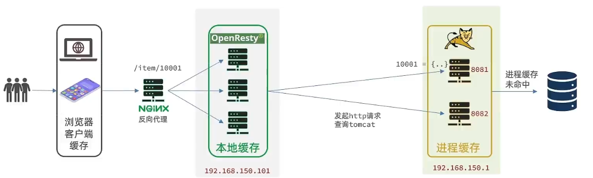

```nginx
# tomcat集群配置
upstream tomcat-cluster {
    hash $request_uri; # 确保相同的url总是访问的同一台服务器
    server 192.168.150.1:8081;
    server 192.168.150.1:8082;
}
```

```nginx
# 反向代理配置，将/item路径的请求代理到tomcat集群
location /item {
    proxy_pass http://tomcat-cluster;
}
```

### 6.Redis缓存预热

**<font color="red">冷启动与缓存预热</font>**

**冷启动:** 服务刚刚启动时，Redis中并没有缓存，如果所有商品数据都在第一次查询时添加缓存，可能会给数据库带来较大压力

**缓存预热:** 在实际开发中，我们可以利用大数据统计用户访问的热点数据，在项目启动时将这些热点数据提前查询并保存到Redis中

数据量较少的时候，可以在启动时将所有数据都放入缓存中。

**缓存预热步骤:**

1.利用Docker安装Redis

` docker run --name redis -p 6379:6379 -d redis redis-server --appendonly yes`

2.在item-service服务中引入Redis依赖

```xml
<dependency>
    <groupId>org.springframework.boot</groupId>
    <artifactId>spring-boot-starter-data-redis</artifactId>
</dependency>
```

3.配置Redis地址

```yml
spring:
  redis:
    host: 192.168.150.101
```

4.编写初始化类

```java
@Component
public class RedisHandler implements InitializingBean {

    @Autowired
    private StringRedisTemplate redisTemplate;

    @Override
    public void afterPropertiesSet() throws Exception {
        // 初始化缓存 ...
    }
}
```

<font color="red">两个知识点:</font>

1.让一个类implements InitializingBean,然后注册为bean,在项目启动的时候，当类的成员变量全部注入完成后，会执行重写的afterPropertiesSet方法

2.ObjectMapper是Spring提供的一个json处理的类

### 7.OpenResty的Redis模块

OpenResty提供了操作Redis的模块，我们只要引入该模块就能直接使用:

- 引入Redis模块，并初始化Redis对象

```lua
-- 引入redis模块
local redis = require("resty.redis")
-- 初始化Redis对象
local red = redis:new()
-- 设置Redis超时时间
red:set_timeouts(1000, 1000, 1000)
```

- 封装函数，用来释放Redis连接，其实是放入连接池

```lua
-- 关闭redis连接的工具方法，其实是放入连接池
local function close_redis(red)
    local pool_max_idle_time = 10000  -- 连接的空闲时间，单位是毫秒
    local pool_size = 100             -- 连接池大小
    local ok, err = red:set_keepalive(pool_max_idle_time, pool_size)
    if not ok then
        ngx.log(ngx.ERR, "放入Redis连接池失败：", err)
    end
end
```

- 封装函数，从Redis读数据并返回

```lua
-- 查询redis的方法 ip和port是redis地址, key是查询的key
local function read_redis(ip, port, key)
    -- 获取一个连接
    local ok, err = red:connect(ip, port)
    if not ok then
        ngx.log(ngx.ERR, "连接redis失败 : ", err)
        return nil
    end

    -- 查询redis
    local resp, err = red:get(key)

    -- 查询失败处理
    if not resp then
        ngx.log(ngx.ERR, "查询Redis失败: ", err, ", key = ", key)
    end

    -- 得到的数据为空处理
    if resp == ngx.null then
        resp = nil
        ngx.log(ngx.ERR, "查询Redis数据为空, key = ", key)
    end

    close_redis(red)
    return resp
end
```

- 封装函数，先查询redis，再查询http

```lua
-- 封装函数，先查询redis，再查询http
local function read_data(key, path, params)
    -- 查询redis
    local resp = read_redis("127.0.0.1", 6379, key)

    -- 判断redis是否命中
    if not resp then
        -- Redis查询失败，查询http
        resp = read_http(path, params)
    end

    return resp
end
```

### 8.Nginx本地缓存

OpenResty为Nginx提供了shard dict的功能，可以在nginx的多个worker之间共享数据，实现缓存功能

- 开启共享字典，在nginx.conf的http下添加配置

```lua
# 共享字典，也就是本地缓存，名称叫做：item_cache，大小150m
lua_shared_dict item_cache 150m;
```

- 操作共享字典

```lua
-- 获取本地缓存对象
local item_cache = ngx.shared.item_cache

-- 存储，指定key、value、过期时间，单位s，默认为0代表永不过期
item_cache:set('key', 'value', 1000)

-- 读取
local val = item_cache:get('key')
```

- 修改后的查询逻辑

```lua
-- 封装函数，先查询本地缓存，再查询redis，再查询http
local function read_data(key, expire, path, params)
    -- 读取本地缓存
    local val = item_cache:get(key)

    if not val then
        -- 缓存未命中，记录日志
        ngx.log(ngx.ERR, "本地缓存查询失败，key: ", key, "，尝试redis查询")

        -- 查询redis
        val = read_redis("127.0.0.1", 6379, key)

        -- 判断redis是否命中
        if not val then
            ngx.log(ngx.ERR, "Redis缓存查询失败，key: ", key, "，尝试http查询")
            -- Redis查询失败，查询http
            val = read_http(path, params)
        end

        -- 写入本地缓存（无论来自Redis还是HTTP）
        item_cache:set(key, val, expire)
    end

    return val
end

-- 根据id查询商品
local itemJSON = read_data('item:id:' .. id, 1800, "/item/".. id, nil)

-- 根据id查询商品库存
local itemStockJSON = read_data('item:stock:id:' .. id, 60, "/item/stock/".. id, nil)
```

### 9.缓存同步

<font color="red">缓存同步策略</font>

缓存数据同步的常见方式由三种:

- **设置有效期:** 给缓存设置有效期，到期后自动删除。再次查询时更新
  
  优势:简单，方便
  
  缺点:时效性差，缓存过期之前可能不一致
  
  场景:更新频率较低。时效性要求低的业务

- **同步双写:** 在修改数据库的同时，直接修改缓存
  
  优势:时效性强，缓存与数据库强一致
  
  缺点:由代码侵入，耦合度高
  
  场景:对一致性、时效性要求较高的缓存数据

- **异步通知:** 修改数据库时发送事件通知，相关服务监听到通知后修改缓存数据
  
  优势:低耦合，可以同时通知多个缓存服务
  
  缺点:时效性一般，可能存在中间不一致状态
  
  场景:时效性要求一般，有多个服务需要同步

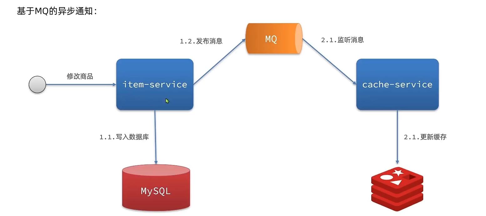

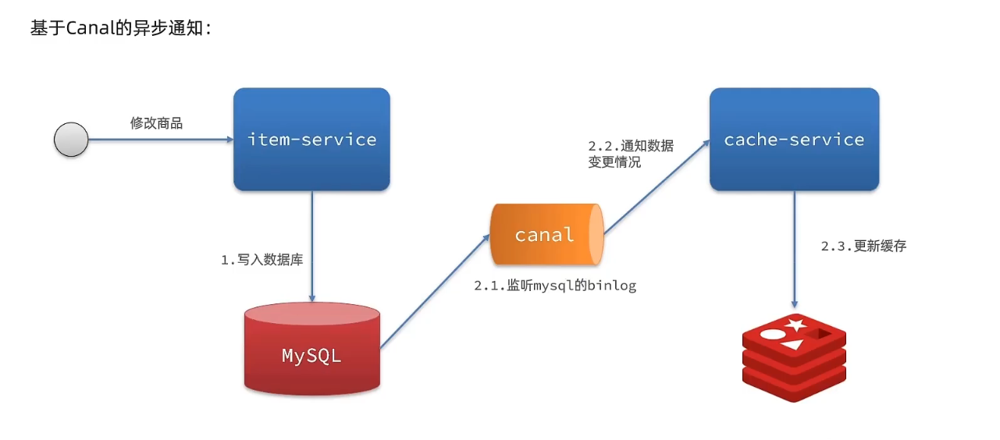

### 10.Canal

**Canal [kəˈnæl]**，译意为水道/管道/沟渠，canal是阿里巴巴旗下的一款开源项目，基于Java开发。基于数据库增量日志解析，提供增量数据订阅&消费。GitHub的地址：https://github.com/alibaba/canal

Canal是基于mysql的主从同步来实现的，MySQL主从同步的原理如下：

- MySQL master 将数据变更写入二进制日志( binary log )，其中记录的数据叫做binary log events
- MySQL slave 将 master 的 binary log events拷贝到它的中继日志(relay log)
- MySQL slave 重放 relay log 中事件，将数据变更反映它自己的数据

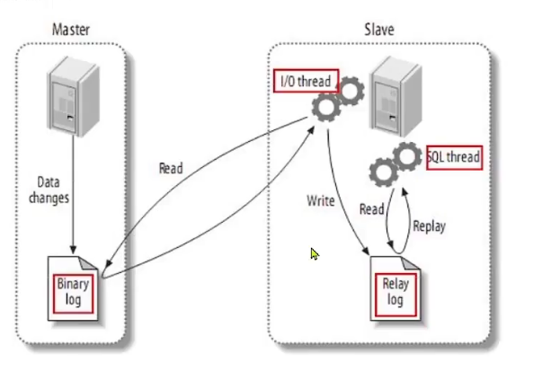

Canal就是把自己伪装为Mysql的一个slave节点，从而监听master的binary log变化。再把得到的变化信息通知给Cannal的客户端，进而完成对其他数据库的同步。

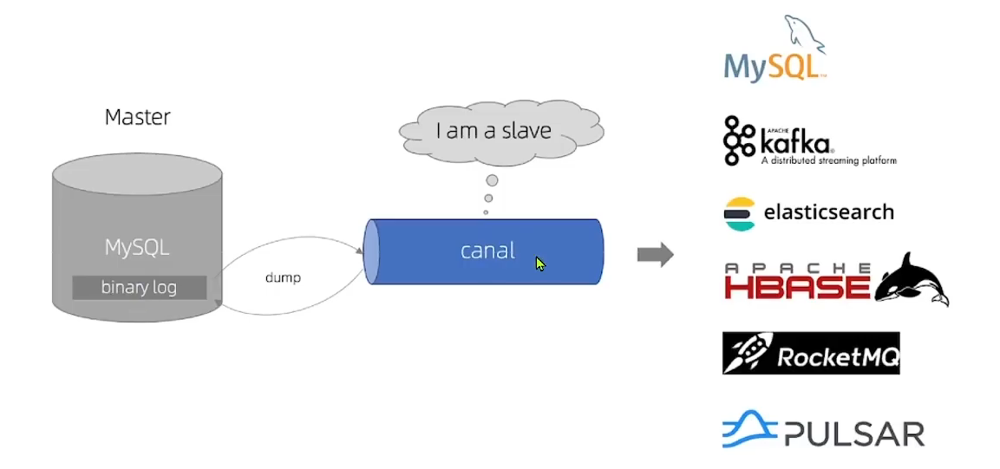

**安装Canal参考<<`Canal安装文档`>>**

**<font color="red">Canal提供了各种语言的客户端，当Canal监听到binlog变化时，会通知Canal的客户端</font>**

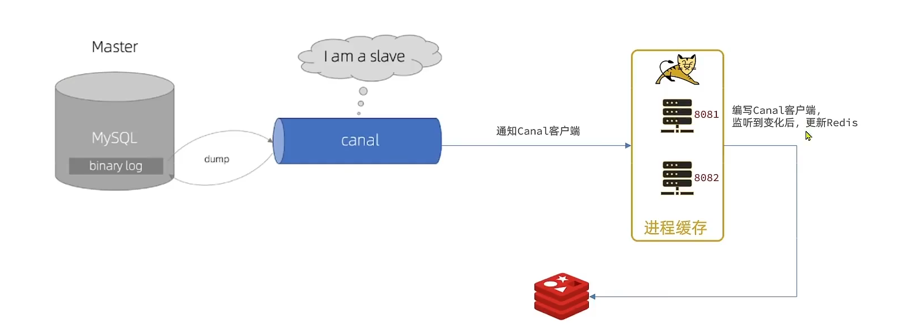

我们使用Github上的第三方开源的canal-starter,地址:[GitHub - NormanGyllenhaal/canal-client: spring boot canal starter 易用的canal 客户端 canal client](https://github.com/NormanGyllenhaal/canal-client)

引入依赖:

```xml
  <dependency>
      <groupId>top.javatool</groupId>
      <artifactId>canal-spring-boot-starter</artifactId>
      <version>1.2.6-RELEASE</version>
  </dependency>
```

编写配置:

```yml
canal:
  destination: heima # canal实例名称，要跟canal-server运行时设置的destination一致
  server: 192.168.150.101:11111 # canal地址
```

编写监听器，监听Canal消息:

```java
package com.heima.item.canal;

@CanalTable("tb_item") // 指定要监听的表
@Component
public class ItemHandler implements EntryHandler<Item> { // 指定表关联的实体类

    @Override
    public void insert(Item item) {
        // 新增数据到redis
    }

    @Override
    public void update(Item before, Item after) {
        // 更新redis数据
        // 更新本地缓存
    }

    @Override
    public void delete(Item item) {
        // 删除redis数据
        // 清理本地缓存
    }
}
```

Canal推送给canal-client的是被修改的这一行数据(row),而我们引入的canal-client则会帮我们把这行数据封装到item实体类中。这个过程中需要知道数据库与实体的映射关系，要用到的几个注解:

```java
@Data
@TableName("tb_item")
public class Item {
    @TableId(type = IdType.AUTO)
    @Id // 标记表中的id字段
    private Long id;

    @Column(name = "name") // 标记表中与属性名不一致的字段
    private String name;

    // ... 其它字段略
    private Date updateTime;

    @TableField(exist = false)
    @Transient // 标记不属于表中的字段
    private Integer stock;

    @TableField(exist = false)
    @Transient // 标记不属于表中的字段
    private Integer sold;
}
```

### 11.多级缓存总结

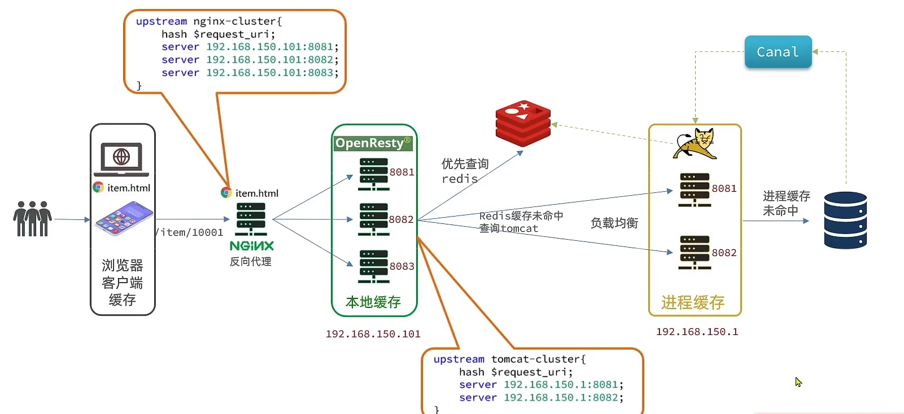

## 7.Redis最佳实践

### 1.优雅的key结构

Redis的key虽然可以自定义，但最好遵循下面的几个最佳实践约定:

- 遵循基本格式:[业务名称]:[数据名]:[id]

- 长度不超过44字节

- 不包含特殊字符

例如:我们的登录业务，保存用户信息，其key是这样的:`login:user:10`

优点:

- 1.可读性强 

- 2.避免key冲突 

- 3.方便管理 

- 更节省内存:key是string类型，底层编码包含int、embstr和raw三种。embstr在小于44字节使用，采用连续内存空间，内存占用更小。`object encoding key 查看key的底层编码`

### 2.BigKey

BigKey通常以key的大小和key中成员的数量来综合判定,例如:

- key本身的数据量过大:一个String类型的key,它的值为5MB

- key中的成员数过多:一个ZSET类型的key.它的成员数量为10,000个

- key中的成员的数据量过大:一个Hash类型的key,它的成员数量虽然只有1000个但这些成员的Value(值)总大小为100MB

推荐值:

- 单个key的value小于10kb

- 对于集合类型的key,建议元素数量小于1000

可以通过`memory usage key`来查看内存大小，但是虎哥说对cpu资源消耗较多，一般就可以通过strlen和llen来简单判断下

**BigKey的危害**

> **1.网络阻塞**
> 
> 对Bigkey执行读请求时，少量的QPS就可能导致带宽使用率被占满，导致Redis实例，乃至所在物理机变慢
> 
> **2.数据倾斜**
> 
> bigKey所在的Redis实例内存使用率远超其他实例，无法使数据分片的内存资源达到均衡
> 
> **3.Redis阻塞**
> 
> 对元素较多的hash、list、zset等做运算会耗时较久，使主线程被阻塞
> 
> **4.CPU压力**
> 
> 对bigKey的数据序列化和反序列化会导致CPU的使用率飙升，影响Redis实例和本机其他应用

**如何发现BigKey**

> **1.redis-cli --bigkeys**
> 
> 利用redis-cli提供的--bigkeys参数，可以遍历分析所有key,并返回key的整体统计信息与每个数据的top1的big key
> 
> **2.scan扫描**
> 
> 自己编程，利用scan扫描Redis中的所有key,利用strlen、hlen等命令判断key的长度(此处不建议使用MEMORY USAGE)
> 
> **3.第三方工具**
> 
> 利用第三方工具，如`Redis-Rdb-Tools`分析RDB快照文件，全面分析内存使用情况
> 
> **4.网络监控**
> 
> 自定义工具，监控进出Redis的网络数据，超出预警值时主动告警

**如何删除BigKey**

BigKey内存占用较多，即便删除这样的key也需要耗费很多时间，导致Redis主线程阻塞，引发一系列问题。

- redis 3.0及以下版本

如果是集合类型，则遍历BigKey的元素，先逐个删除子元素，最后删除BigKey

- redis 4.0以后

Redis在4.0后提供了异步删除的命令:unlink

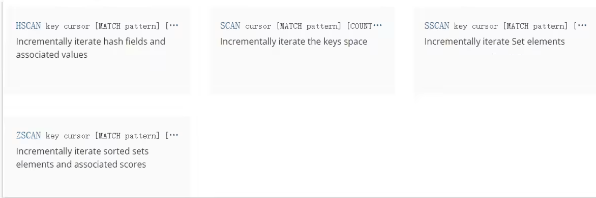

### 3.选择适当的数据结构

例1:比如存储一个User对象，我们有三种存储方式:

方式一:json字符串

| Key      | Value                         |
| -------- | ----------------------------- |
| `user:1` | `{"name": "Jack", "age": 21}` |

优点:实现简单粗暴

缺点:数据耦合，不够灵活

方式二:字段打散

| Key           | Value |
| ------------- | ----- |
| `user:1:name` | Jack  |
| `user:1:age`  | 21    |

优点:可以灵活访问对象任意字段

缺点:占用空间大，没办法做统一控制

方式三:hash

| Key      | Field | Value |
| -------- | ----- | ----- |
| `user:1` | name  | Jack  |
| `user:1` | age   | 21    |

优点:底层采用ziplist,空间占用小，可以灵活访问对象的任意字段

缺点:代码相对复杂

例2：假如有hash类型的key,其中有100万对field和value,field是自增id,这个key存在什么问题？如何优化?

| KEY       | field       | value         |
| --------- | ----------- | ------------- |
| `someKey` | `id:0`      | `value0`      |
|           | `......`    | `......`      |
|           | `id:999999` | `value999999` |

存在的问题:

1.hash的entry数量超过500时，会使用哈希表而不是ZipList,内存占用较多

2.可以通过hash-max-ziplist-entries配置entry上限。但是如果entry过多就会导致BigKey问题

如果拆分为string类型:

| key         | value         |
| ----------- | ------------- |
| `id:0`      | `value0`      |
| `......`    | `......`      |
| `id:999999` | `value999999` |

存在的问题:

1.string结构底层没有太多内存优化，内存占用较多

2.想要批量获取这些数据比较麻烦

**方案:** 拆分为小的hash,将id/100作为key,将id%100作为field,这样每100个元素为一个hash

| KEY        | field    | value         |
| ---------- | -------- | ------------- |
| `key:0`    | `id:00`  | `value0`      |
|            | `......` | `......`      |
|            | `id:99`  | `value99`     |
| `key:1`    | `id:00`  | `value100`    |
|            | `......` | `......`      |
|            | `id:99`  | `value199`    |
| `...`      | `...`    | `...`         |
| `key:9999` | `id:00`  | `value999900` |
|            | `......` | `......`      |
|            | `id:99`  | `value999999` |
