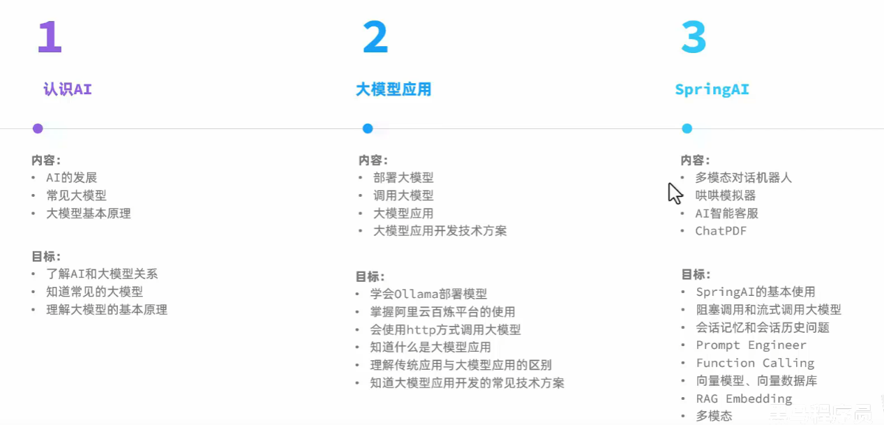
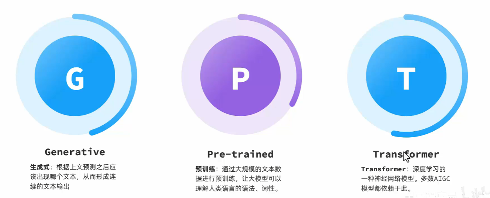
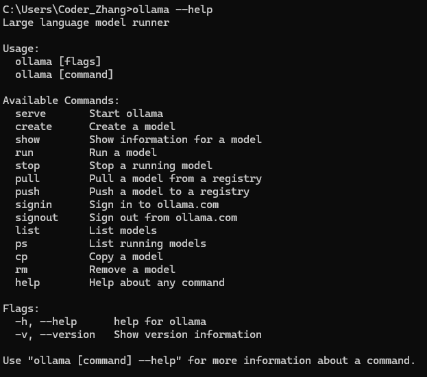

# SpringAI

## 课程大纲

## 1.AI的发展

AI，人工智能(Artificial Intelligence),使机器能够像人类一样思考、学习和解决问题的技术。

发展历史:

在自然语言处理（Natural Language Processing，NLP）中，有一项关键技术叫**Transformer**，这是一种先进的神经网络模型，是现如今AI高速发展的最主要原因。

我们所熟知的大模型（Large Language Models，LLM），例如GPT、DeepSeek底层都是采用Transformer神经网络模型。

由此可见AI高速发展的原因:1.Transformer的神经网络模型  2.计算机算力的提升

## 2.大模型应用

### 模型部署

**云部署**:

优点:前期成本低，部署维护简单，弹性扩展，全球访问

缺点:数据隐私，网络依赖，长期成本高

**开放API**

优点:前期成本极低，无需部署，无需维护，全球访问

缺点:数据隐私，网络依赖，长期成本高，定制限制

**本地部署:**

优点:数据安全，不依赖外部网络，长期成本低，高度定制

缺点:初始成本高，维护复杂，部署周期长

### 本地部署

本地部署最简单的一种方案就是使用ollama,官网地址: https://ollama.com/

ollama是一个模型管理工具和平台，它提供了很多国内外常见的模型，功能类似于docker

安装之后，会默认启动一个服务，可以在控制台中输入命令

