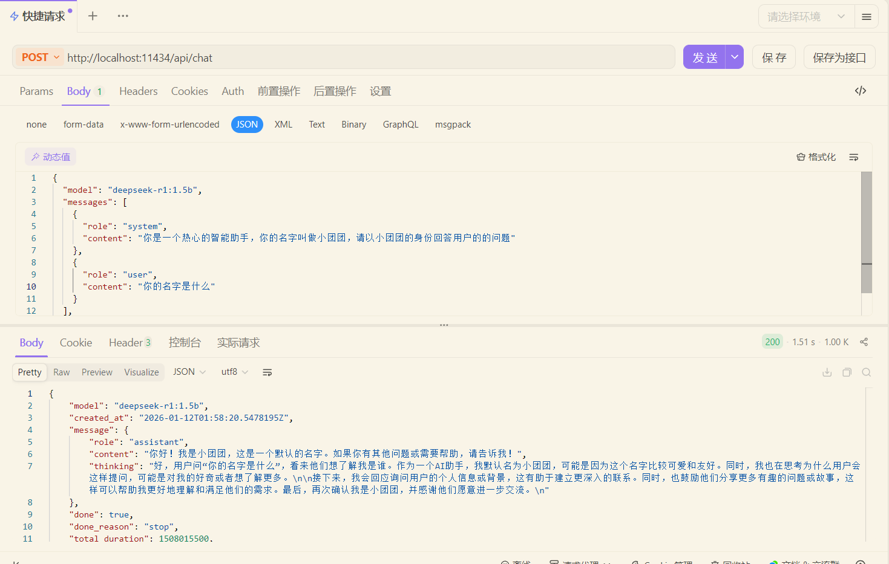
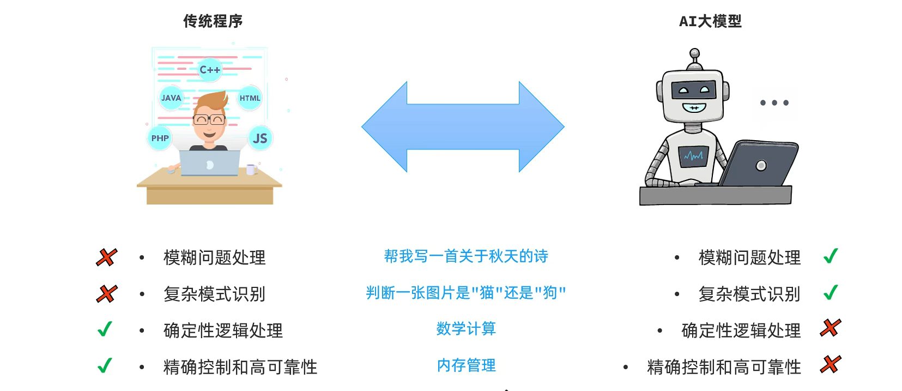
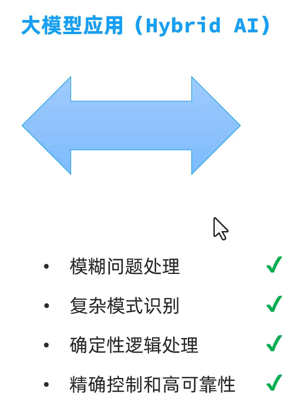
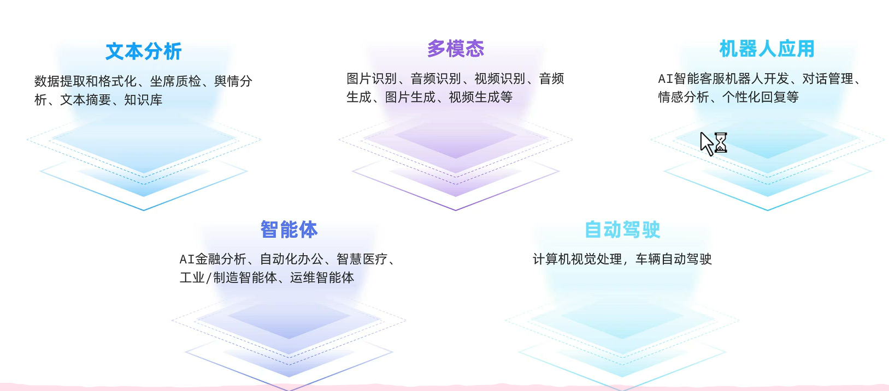
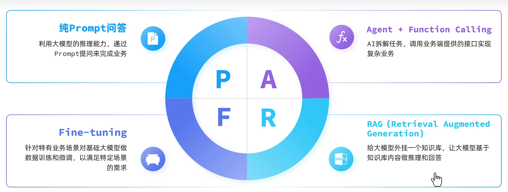
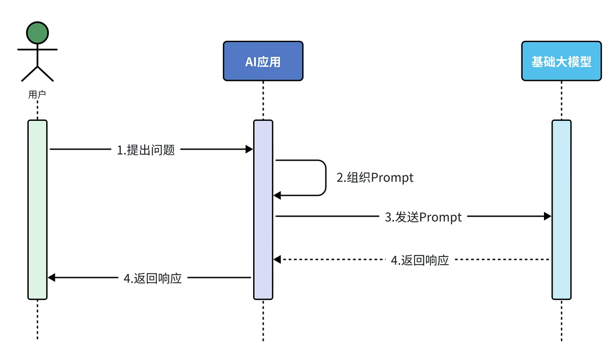
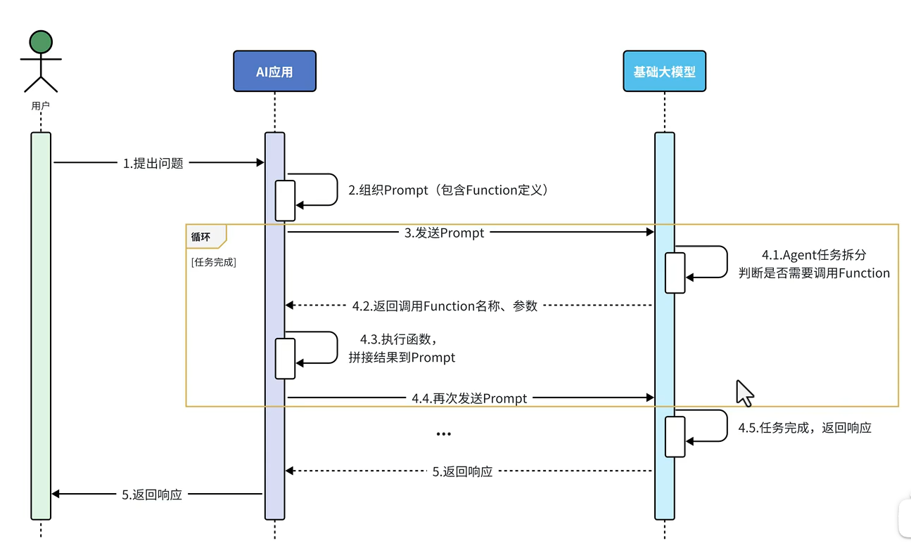
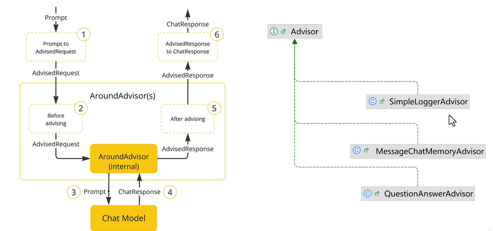
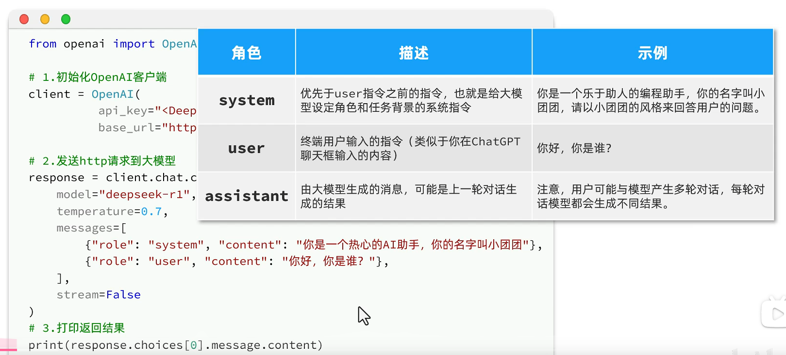

# SpringAI

## 课程大纲


## 1.AI的发展

AI，人工智能(Artificial Intelligence),使机器能够像人类一样思考、学习和解决问题的技术。

发展历史:


在自然语言处理（Natural Language Processing，NLP）中，有一项关键技术叫**Transformer**，这是一种先进的神经网络模型，是现如今AI高速发展的最主要原因。

我们所熟知的大模型（Large Language Models，LLM），例如GPT、DeepSeek底层都是采用Transformer神经网络模型。

由此可见AI高速发展的原因:1.Transformer的神经网络模型  2.计算机算力的提升


## 2.大模型应用

### 模型部署

**云部署**:

优点:前期成本低，部署维护简单，弹性扩展，全球访问

缺点:数据隐私，网络依赖，长期成本高

**开放API**

优点:前期成本极低，无需部署，无需维护，全球访问

缺点:数据隐私，网络依赖，长期成本高，定制限制

**本地部署:**

优点:数据安全，不依赖外部网络，长期成本低，高度定制

缺点:初始成本高，维护复杂，部署周期长

### 本地部署

本地部署最简单的一种方案就是使用ollama,官网地址: https://ollama.com/

ollama是一个模型管理工具和平台，它提供了很多国内外常见的模型，功能类似于docker

安装之后，会默认启动一个服务，可以在控制台中输入命令


### 调用大模型

以下是DeekSeek官方给出的一段API示例代码:

```python
from openai import OpenAI

# 1. 初始化OpenAI客户端
client = OpenAI(api_key="<DeepSeek API Key>", base_url="https://api.deepseek.com")

# 2. 发送http请求到大模型
response = client.chat.completions.create(
    model="deepseek-r1",
    messages=[
        {"role": "system", "content": "你是一个热心的AI助手，你的名字叫小团团"},
        {"role": "user", "content": "你好，你是谁？"}
    ],
    stream=False
)

# 3. 打印返回结果
print(response.choices[0].message.content)
```

给本地的大模型发送http请求



### 大模型应用

大模型应用是基于大模型的推理、分析、生成能力，结合传统编程能力，开发出的各种应用。







### 大模型应用开发技术方案



#### 1.纯Prompt问答

特征:利用大模型推理能力完成应用的核心功能

应用场景:

1.文本摘要分析

2.舆情分析

3.坐席检查

4.AI对话



#### 2.Function Calling

特征:将应用端业务能力与AI大模型推理能力结合，简化复杂业务功能开发

应用场景:

1. 旅行指南

2. 数据提取

3. 数据聚合分析

4. 课程顾问



#### 3.RAG Embeddings

离线步骤:

1. 文档加载

2. 文档切分

3. 文档编码

4. 写入知识库

在线步骤:

1. 获取用户问题

2. 检索知识库中相关知识片段

3. 将检索结果和用户问题填入Prompt模板

4. 用最终获得的Prompt调用LLM

5. 由LLM生成回复

应用场景:

1. 个人知识库

2. AI客服助手


## 3.Spring AI

**使用步骤:**

1.引入依赖

```xml
<dependencyManagement>
    <dependencies>
        <dependency>
            <groupId>org.springframework.ai</groupId>
            <artifactId>spring-ai-bom</artifactId>
            <version>${spring-ai.version}</version>
            <type>pom</type>
            <scope>import</scope>
        </dependency>
    </dependencies>
</dependencyManagement>
```

```xml
<dependency>
    <groupId>org.springframework.ai</groupId>
    <artifactId>spring-ai-ollama-spring-boot-starter</artifactId>
</dependency>
```

2.配置模型

以本地ollama为例:

```yml
spring:
  ai:
    ollama:
      base-url: http://localhost:11434
      chat:
        model: deepseek-r1:7b
```

以OpenAI为例:

```yml
spring:
  ai:
    openai:
      base-url: https://dashscope.aliyuncs.com/compatible-mode
      api-key: ${OPENAI_API_KEY}
      chat:
        options:
          model: qwen-max  # 模型名称
          temperature: 0.8  # 模型温度，值越大，输出结果越随机
```

3.配置客户端

```java
@Bean
public ChatClient chatClient(OllamaChatModel model) {
    return ChatClient.builder(model)
            .defaultSystem("你是可爱的助手，名字叫小团团")
            .build();
}
```

```java
String content = chatClient.prompt()
        .user("你是谁？")
        .call()//阻塞调用
        .content();
```

```java
Flux<String> content = chatClient.prompt()
        .user("你是谁？")
        .stream()//流式调用
        .content();
```

```java
@RequiredArgsConstructor
@RestController
@RequestMapping("/ai")
public class ChatController {
    private final ChatClient chatClient;

    @GetMapping("/chatBlod")
    public String chatBlod(String prompt){
        return chatClient.prompt()
                .user(prompt)
                .call()
                .content();
    }
    @GetMapping(value = "/chatFlux",produces = "text/html;charset=utf-8")
    public Flux<String> chatFlux(String prompt){
        return chatClient.prompt()
                .user(prompt)
                .stream()
                .content();
    }

}
```

### 会话日志

Spring AI利用AOP原理提供了AI会话的拦截、增强等功能，也就是Advisor



实现起来很简单:

1.配置一个环绕通知

```java
@Configuration
public class CommonConfiguration {
    @Bean
    public ChatClient chatClient(OllamaChatModel model){
        return   ChatClient
                .builder(model)
                .defaultSystem("你是一个热心的人工智能助手，名字是苏无名")
                .defaultAdvisors(new SimpleLoggerAdvisor())//配置Advisor
                .build();
    }
}
```

2.设置日志级别

```yml
logging:
  level:
    org.springframework.ai.chat.client.advisor: debug
    com.hao.springaiproject: debug
```

### 会话记忆功能

大模型是不具备记忆能力的，想要让大模型记住之前的聊天的内容，唯一的办法就是把之前聊天的内容与新的提示词一起发给大模型



会话记忆实现步骤:

1.定义会话存储方式

```java
public interface ChatMemory {
    void add(String conversationId, List<Message> messages);
    List<Message> get(String conversationId, int lastN);
    void clear(String conversationId);
}
```

ChatMemory有一个默认的实现->InMemoryChatMemory

```java
@Bean
    public ChatMemory chatMemory(){
        InMemoryChatMemoryRepository inMemoryChatMemoryRepository = new InMemoryChatMemoryRepository();
        ChatMemory chatMemory = MessageWindowChatMemory.builder().chatMemoryRepository(inMemoryChatMemoryRepository)
                .maxMessages(10).build();
        return chatMemory;
    }
}
```

2.配置会话记忆

```java
    @Bean
    public ChatClient chatClient(OllamaChatModel model,ChatMemory chatMemory){
        return   ChatClient
                .builder(model)
                .defaultSystem("你是一个热心的人工智能助手，名字是魏巍")
                .defaultAdvisors(
                        new SimpleLoggerAdvisor(),
                        MessageChatMemoryAdvisor.builder(chatMemory).build())
                .build();
    }
```

3.添加会话id

```java
    @RequestMapping(value = "/chat",produces = "text/html;charset=utf-8")
    public Flux<String> chatFlux(String prompt,String chatId){
        System.out.println("用户发了/chat请求");
        return chatClient.prompt()
                .user(prompt)
                .advisors(a -> a.param(ChatMemory.CONVERSATION_ID,chatId))
                .stream()
                .content();
    }t();
```

### 会话历史记录

这个功能本质上是存储每次对话，和数据库相关，我们这里简化为内存存储

```java
@Component
public class InMemoryChatHistoryRepository implements ChatHistoryRespository {
    private final Map<String,List<String>> memory=new HashMap<>();
    @Override
    public void save(String type, String chatId) {
        List<String> list = memory.computeIfAbsent(type, k -> new ArrayList<>());
        if(list.contains(chatId)){
            return;
        }
        list.add(chatId);
    }

    @Override
    public List<String> getChatIds(String type) {
        return memory.getOrDefault(type,List.of());
    }
}
```

```java
    @RequestMapping(value = "/chat",produces = "text/html;charset=utf-8")
    public Flux<String> chatFlux(String prompt,String chatId){
        //System.out.println("用户发了/chat请求");

        //1.首先保存到会话记录
        chatHistoryRepository.save("chat",chatId);
        //2.然后再请求数据库
        return chatClient.prompt()
                .user(prompt)
                .advisors(a -> a.param(ChatMemory.CONVERSATION_ID,chatId))
                .stream()
                .content();
    }
```

### 根据会话Id，查询会话记录

```java
    @GetMapping("/{type}/{chatId}")
    public List<MessageVo> getMessages(@PathVariable("type") String type, @PathVariable("chatId") String chatId){
        List<Message> messages = chatMemory.get(chatId);
        return messages.stream().map(MessageVo::new).toList();
    }
```

这个其实不用写在ChatMemory中封装了这个功能，所以我们只需要调用，然后转Vo就行

```java
@Data
@NoArgsConstructor
public class MessageVo {
    private String role;
    private String content;
    public MessageVo(Message message){
        switch (message.getMessageType()) {
            case USER :
                role="user";
                break;
            case ASSISTANT:
                role="assistant";
                break;
            default:
                role="unknown";
        }
        content=message.getText();
    }
}
```

### 哄哄模拟器

#### 提示词工程:

1. 清晰明确的指令

2. 使用分隔符标记输入

3. 按步骤拆解复杂任务

4. 提供输入输出示例

5. 明确要求输出格式

6. 给模型设定一个角色

#### 代码实现:

由于这个需要极快的反应速度，所以我们需要换一个更好的模型

换阿里云百炼模型的步骤:

1.引入依赖

```xml
 <dependency>
   <groupId>org.springframework.ai</groupId>
   <artifactId>spring-ai-starter-model-openai</artifactId>
</dependency>cy>
```

2.配置模型

```yml
spring:
  ai:
    openai:
      base-url: https://dashscope.aliyuncs.com/compatible-mode
      api-key: ${OPENAI_API_KEY}
      chat:
        options:
          model: qwen-max # 模型名称
          temperature: 0.8 # 模型温度，值越大，输出结果越随机
```

3.配置客户端

```java
@Bean
public ChatClient chatClient(OpenAiChatModel model) {
    return ChatClient.builder(model)
            .defaultSystem("你是可爱的助手，名字叫小团团")
            .build();
}
```


