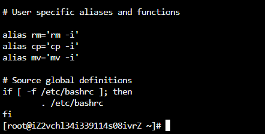
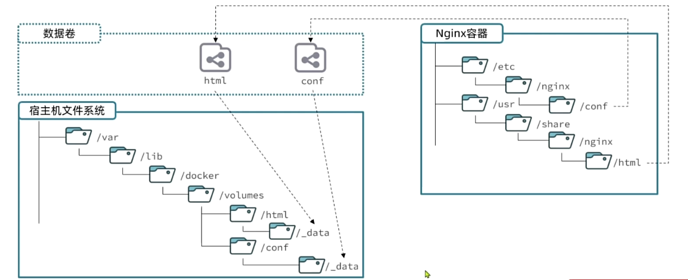

# Docker

## 1.认识Docker

**Docker: 快速构建、运行、管理应用的工具**

当我们利用Docker安装应用时，Docker会自动搜索并下载应用**镜像(image)** 。镜像不仅包含应用本身，还包含应用运行所需要的环境、配置、系统函数库。Docker会在运行镜像时创建一个隔离环境，称为**容器(container)**。

**镜像仓库:** 存储和管理镜像的平台，Docker官方维护了一个公共仓库: https://hub.docker.com/


## 2.快速入门

解读一段安装mysql的命令:

```docker
docker run -d \
  --name mysql \
  -p 3306:3306 \
  -e TZ=Asia/Shanghai \
  -e MYSQL_ROOT_PASSWORD=123 \
  mysql
```

- docker run : 创建并运行一个容器，-d是让容器在后台运行

- --name mysql：给容器起个名字，必须唯一

- -p 3306:3306：设置端口映射

- -e KEY=VALUE：设置环境变量

- mysql：指定运行的镜像的名字

<font color="red">镜像命名规范:</font>

- 镜像名称一般分两部分组成:[repository]:[tag]
  
  其中repository就是镜像名
  
  tag是镜像的版本

- 在没有指定tag时，默认是lastest,代表最新版本的镜像


## 3.Docker基础

Docker最常见的命令就是操作镜像、容器的命令，详见官方文档: https://docs.docker.com/


## 4.命名别名

`linux中 ~/.bashrc`目录中藏着各种命名别名，方便我们使用



我们修改完之后输入`source ~/.bashrc`就可以输入命名别名了

## 5.数据卷

**数据卷(volume)** 是一个虚拟目录，是**容器内目录**与**宿主机目录**之间映射的桥梁



| 命令                      | 说明         | 文档地址                                                                        |
| ----------------------- | ---------- | --------------------------------------------------------------------------- |
| `docker volume create`  | 创建数据卷      | [docker volume create](https://www.qianwen.com/chat/docker_volume_create)   |
| `docker volume ls`      | 查看所有数据卷    | [docker volume ls](https://www.qianwen.com/chat/docker_volume_ls)           |
| `docker volume rm`      | 删除指定数据卷    | [docker volume rm](https://www.qianwen.com/chat/docker_volume_rm)           |
| `docker volume inspect` | 查看某个数据卷的详情 | [docker volume inspect](https://www.qianwen.com/chat/docker_volume_inspect) |
| `docker volume prune`   | 清除未使用的数据卷  | [docker volume prune](https://www.qianwen.com/chat/docker_volume_prune)     |

<font color="red"> 在执行docker run命令时，使用 `-v 数据卷:容器内目录` 可以完成数据卷挂载</font>

<font color="red">在创建容器时，如果挂载了数据卷且数据卷不存在，会自动创建数据卷 </font>

## 6.本地目录挂载

> 1) 在执行docker run命令时，使用`-v 本地目录:容器内目录`可以完成本地目录挂载
> 2) 本地目录必须以"/","./"开头，如果直接以名称开头，会被识别为数据卷，而非本地目录
>    - -v mysql:/var/lib/mysql会被识别为一个数据卷叫mysql
>    - -v ./mysql:/var/lib/mysql会被识别为当前目录下的mysql目录


## 7.自定义镜像

镜像就是包含了应用程序、程序运行的系统函数库，运行配置等文件的文件包。构建镜像的过程其实就是把上述文件打包的过程。

下图是Docker的镜像结构，是分层的。


自定义镜像需要用到**DockerFile**。

**DcokerFile** 就是一个文本文件，其中包含一个个的**指令(instruction)**,用指令来说明要执行什么操作来构建镜像。将来Docker可以根据DockerFile帮我们构建镜像。常见指令如下:

|    指令    |                     说明                     |            示例             |
| :--------: | :------------------------------------------: | :-------------------------: |
|    FROM    |                 指定基础镜像                 |        FROM centos:7        |
|    ENV     |        设置环境变量，可在后面指令使用        |        ENV key value        |
|    COPY    |         拷贝本地文件到镜像的指定目录         |   COPY 本地目录 镜像目录    |
|    RUN     |  执行Linux的shell命令，一般是安装过程的命令  |    RUN tar -zxvf xxx.gz     |
|   EXPOSE   | 指定容器运行时监听的端口，是给镜像使用者看的 |         EXPOSE 8080         |
| ENTRYPOINT |     镜像中应用的启动命令，容器运行时调用     | ENTRYPOINT java -jar xx.jar |

更多指令，请参考官方文档:https://docs.docker.com/reference/dockerfile


>  【示例】:构建一个java的运行环境
>
> 方式一:基于Ubuntu基础镜像，利用Dockerfile描述镜像结构
>
> ```dockerfile
> # 指定基础镜像
> FROM ubuntu:16.04
> 
> # 配置环境变量，JDK的安装目录、容器内时区
> ENV JAVA_DIR=/usr/local
> 
> # 拷贝jdk和java项目的包
> COPY ./jdk8.tar.gz $JAVA_DIR/
> COPY ./docker-demo.jar /tmp/app.jar
> 
> # 安装JDK
> RUN cd $JAVA_DIR \ && tar -xf ./jdk8.tar.gz \
> && mv ./jdk1.8.0_144 ./java8
> 
> # 配置环境变量
> ENV JAVA_HOME=$JAVA_DIR/java8
> ENV PATH=$PATH:$JAVA_HOME/bin
> 
> # 入口，java项目的启动命令
> ENTRYPOINT ["java", "-jar", "/app.jar"]
> ```
>
> 方式二:基于JDK为基础镜像
>
> ```dockerfile
> # 基础镜像
> FROM openjdk:11.0-jre-buster
> 
> # 拷贝jar包
> COPY docker-demo.jar /app.jar
> 
> # 入口
> ENTRYPOINT ["java", "-jar", "/app.jar"]
> ```
>
> 


用dockerfile来构建镜像的命令:

`docker build -t myImage:1.0 .`

1) `-t`:是给镜像起名，格式依然是`repository:tag`的格式，不指定tag时，默认为latest
2) `.`:是指定Dockerfile所在目录，如果就在当前目录，则指定为'.'

## 8.网络

默认情况下，所有容器都是以bridge方式连接到Docker的一个虚拟网桥上:


同一个网关下，可以通过ip互相ping通，但是存在问题，如果ip变更了，比如我们删除了一个容器，后面又重新加载运行了这个容器，ip就会变化，所有我们需要用到`自定义网络`。


加入自定义网络的容器才可以通过容器名互相访问，Docker的网络操作命令如下:

| 命令                      | 说明                     |
| ------------------------- | ------------------------ |
| docker network create     | 创建一个网络             |
| docker network ls         | 查看所有的网络           |
| docker network rm         | 删除指定网络             |
| docker network prune      | 清除未使用的网络         |
| docker network connect    | 使指定容器连接加入某网络 |
| docker network disconnect | 使指定容器连接离开某网络 |
| docker network inspect    | 查看网络详细信息         |


## 9.DockerCompose

Docker Compose通过一个单独的**docker-compose.yml**模板文件(yaml格式)来定义一组相关联的应用容器，帮助我们实现**多个互相关联的Docker容器的快速部署**。


**docker compose**的命令格式如下:

`docker compose [options] [command]`

| 类型     | 参数或指令 | 说明                        |
| -------- | ---------- | --------------------------- |
| Options  | -f         | 指定compose文件的路径和名称 |
|          | -p         | 指定project名称             |
| Commands | up         | 创建并启动所有service容器   |
|          | down       | 停止并移除所有的容器、网络  |
|          | ps         | 列出所有启动的容器          |
|          | logs       | 查看指定容器的日志          |
|          | stop       | 停止容器                    |
|          | start      | 启动容器                    |
|          | restart    | 重启容器                    |
|          | top        | 查看运行的进程              |
|          | exec       | 在指定的运行容器中执行命令  |

