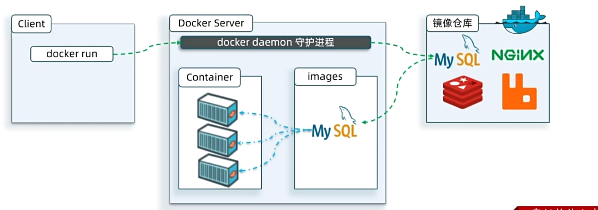
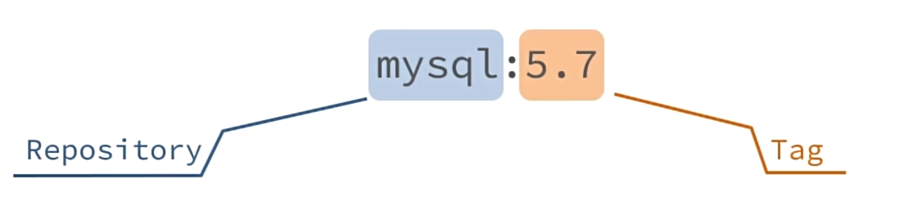
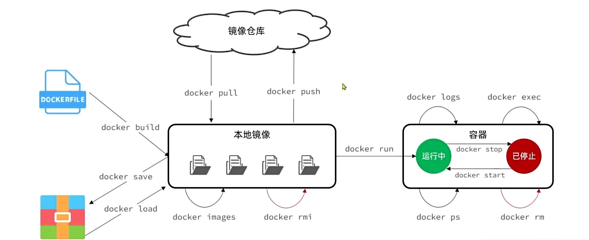

# Docker

## 1.认识Docker

**Docker: 快速构建、运行、管理应用的工具**


当我们利用Docker安装应用时，Docker会自动搜索并下载应用**镜像(image)** 。镜像不仅包含应用本身，还包含应用运行所需要的环境、配置、系统函数库。Docker会在运行镜像时创建一个隔离环境，称为**容器(container)**。

**镜像仓库:** 存储和管理镜像的平台，Docker官方维护了一个公共仓库: https://hub.docker.com/



## 2.快速入门

解读一段安装mysql的命令:

```docker
docker run -d \
  --name mysql \
  -p 3306:3306 \
  -e TZ=Asia/Shanghai \
  -e MYSQL_ROOT_PASSWORD=123 \
  mysql
```

- docker run : 创建并运行一个容器，-d是让容器在后台运行

- --name mysql：给容器起个名字，必须唯一

- -p 3306:3306：设置端口映射

- -e KEY=VALUE：设置环境变量

- mysql：指定运行的镜像的名字


<font color="red">镜像命名规范:</font>

- 镜像名称一般分两部分组成:[repository]:[tag]
  
  其中repository就是镜像名
  
  tag是镜像的版本

- 在没有指定tag时，默认是lastest,代表最新版本的镜像



## 3.Docker基础

Docker最常见的命令就是操作镜像、容器的命令，详见官方文档: https://docs.docker.com/




