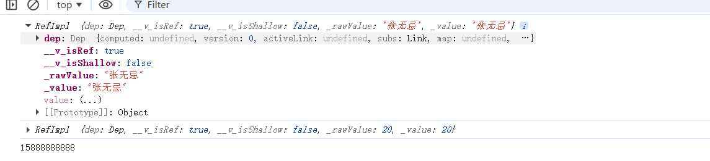
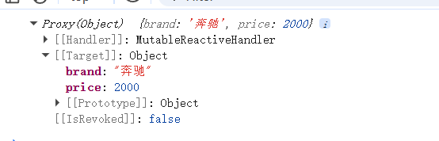
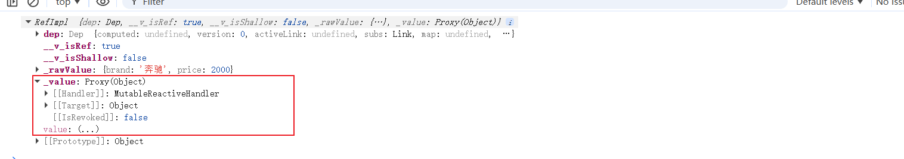

# Vue3

## 1.setup

**setup里面的this是undefined**

```v
<script lang="ts">
export default {
  name: 'Person',
  setup(){
    //console.log('@@',this) undefined
    let name = '张无忌' //此时的数据并不是响应式的数据
    let age = 20
    let phone = '15888888888'
    function changeName(){
      name = '小龙女'
    }
    function changeAge(){
      age = 18
    }
    function changePhone(){
      phone = '15888888888'
    }
    return {name,age,changeName,changeAge,changePhone}
  }

}
</script>
```

**setup的返回值也可以是一个渲染函数**

```v
<script lang="ts">
export default {
  name: 'Person',
  setup(){
    //console.log('@@',this) undefined
    let name = '张无忌' //此时的数据并不是响应式的数据
    let age = 20
    let phone = '15888888888'
    function changeName(){
      name = '小龙女'
    }
    function changeAge(){
      age = 18
    }
    function changePhone(){
      phone = '15888888888'
    }
    //return {name,age,changeName,changeAge,changePhone}
    return () => '哈哈'
  }

}
</script>
```

## 2.setup与data和methods

结论:

1. setup可以与data和methods共存

2. setup读不到data和methods里面的东西，data和methods可以读到setup里面的东西

```v
<script lang="ts">
export default {
  name: 'Person',
  data(){
    return {
      a:this.name //可以读到张无忌
    }
  },
  setup(){
    //console.log('@@',this) undefined
    let name = '张无忌' //此时的数据并不是响应式的数据
    let age = 20
    let phone = '15888888888'
    function changeName(){
      name = '小龙女'
    }
    function changeAge(){
      age = 18
    }
    function changePhone(){
      phone = '15888888888'
    }
    return {name,age,changeName,changeAge,changePhone}
    //return () => '哈哈'
  }
}
</script>
```

## 3.setup语法糖

```v
<script lang="ts">
export default {
  name: 'Person'
}
</script>
<script setup lang="ts"> //这里面和写setup函数是一样的效果
  let name = '张无忌' //此时的数据并不是响应式的数据
  let age = 20
  let phone = '15888888888'
  function changeName(){
  name = '小龙女'
  }
  function changeAge(){
  age = 18
  }
  function changePhone(){
  phone = '15888888888'
  }
</script>
```

但是这样引发了一些问题，就是要写两个script标签

我们可以下载一个插件:

`npm i vite-plugin-vue-setup-extend -D`

同时需要在vite.config.ts中配置

```v
import { fileURLToPath, URL } from 'node:url'

import { defineConfig } from 'vite'
import vue from '@vitejs/plugin-vue'
import VueSetupExtend from 'vite-plugin-vue-setup-extend'
import vueDevTools from 'vite-plugin-vue-devtools'

// https://vite.dev/config/
export default defineConfig({
  plugins: [
    vue(),
    vueDevTools(),
    VueSetupExtend(),
  ],
  resolve: {
    alias: {
      '@': fileURLToPath(new URL('./src', import.meta.url))
    },
  },
})
```

然后就可以在script标签中写name属性就是组件的名字:

## 4.ref创建基本数据类型的响应式

语法:

```v
<script setup lang="ts">
  import { ref } from 'vue'
  let name = ref('张无忌') //此时的数据并不是响应式的数据
  let age = ref(20)
  let phone = '15888888888'
  console.log(name)
  console.log(age)
  console.log(phone)
  function changeName(){
    name.value = '小龙女'
  }
  function changeAge(){
    age.value = 18
  }
  function changePhone(){
  phone = '15888888888'
  }
</script>
```

此时的name和age不再单纯了


用ref声明的数据变为了RefImpl的对象，如果我们想在js中修改这个数据的话,要x.value去修改，在template模板中可以直接写x,vue会帮我们自动.value

## 5.reactive创建对象类型的响应式

语法:

```v
<script setup lang="ts" name="Person">
  import { reactive } from 'vue';
  const car= reactive({brand:'奔驰',price:2000})
  console.log(car)
  function changePrice(){
    car.price=car.price+100
  }
</script>
```



**声明:**

1.reactive是深层次的响应式

2.数组和函数本质上也是对象

## 6.ref和reactive详解

**ref可以定义基本类型和对象类型的响应式数据**

**reactive只能定义对象类型的响应式数据**

代码:

```v
<script setup lang="ts" name="Person">
  import { ref } from 'vue';
  const car= ref({brand:'奔驰',price:2000})
  console.log(car)
  const games = ref([{id:'01',name:'王者荣耀'},{id:'02',name:'英雄联盟'},{id:'03',name:'和平精英'}])
  function changePrice(){
    car.value.price=car.value.price+100
  }
  function changeGame(){
    games.value[0].name = '原神'
  }
</script>
```



可以看到ref声明的对象的响应式是Proxy，所以ref可以声明对象的响应式数据。但是底层用的**reactive**


