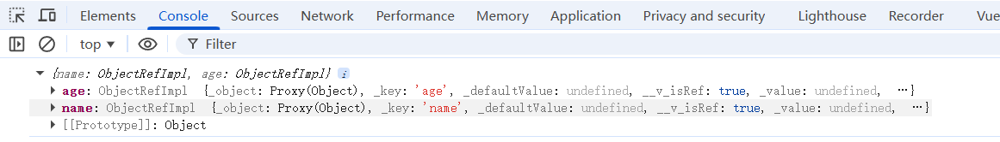
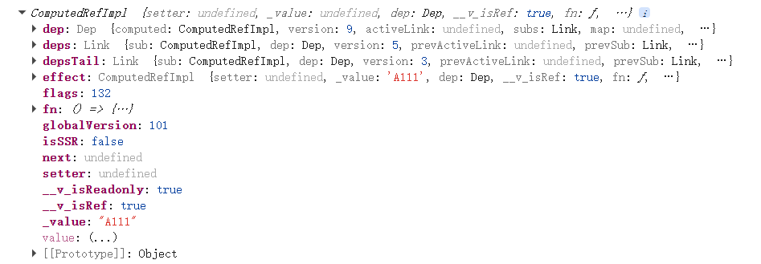

# Vue3

## 1.setup

**setup里面的this是undefined**

```v
<script lang="ts">
export default {
  name: 'Person',
  setup(){
    //console.log('@@',this) undefined
    let name = '张无忌' //此时的数据并不是响应式的数据
    let age = 20
    let phone = '15888888888'
    function changeName(){
      name = '小龙女'
    }
    function changeAge(){
      age = 18
    }
    function changePhone(){
      phone = '15888888888'
    }
    return {name,age,changeName,changeAge,changePhone}
  }

}
</script>
```

**setup的返回值也可以是一个渲染函数**

```v
<script lang="ts">
export default {
  name: 'Person',
  setup(){
    //console.log('@@',this) undefined
    let name = '张无忌' //此时的数据并不是响应式的数据
    let age = 20
    let phone = '15888888888'
    function changeName(){
      name = '小龙女'
    }
    function changeAge(){
      age = 18
    }
    function changePhone(){
      phone = '15888888888'
    }
    //return {name,age,changeName,changeAge,changePhone}
    return () => '哈哈'
  }

}
</script>
```

## 2.setup与data和methods

结论:

1. setup可以与data和methods共存

2. setup读不到data和methods里面的东西，data和methods可以读到setup里面的东西

```v
<script lang="ts">
export default {
  name: 'Person',
  data(){
    return {
      a:this.name //可以读到张无忌
    }
  },
  setup(){
    //console.log('@@',this) undefined
    let name = '张无忌' //此时的数据并不是响应式的数据
    let age = 20
    let phone = '15888888888'
    function changeName(){
      name = '小龙女'
    }
    function changeAge(){
      age = 18
    }
    function changePhone(){
      phone = '15888888888'
    }
    return {name,age,changeName,changeAge,changePhone}
    //return () => '哈哈'
  }
}
</script>
```

## 3.setup语法糖

```v
<script lang="ts">
export default {
  name: 'Person'
}
</script>
<script setup lang="ts"> //这里面和写setup函数是一样的效果
  let name = '张无忌' //此时的数据并不是响应式的数据
  let age = 20
  let phone = '15888888888'
  function changeName(){
  name = '小龙女'
  }
  function changeAge(){
  age = 18
  }
  function changePhone(){
  phone = '15888888888'
  }
</script>
```

但是这样引发了一些问题，就是要写两个script标签

我们可以下载一个插件:

`npm i vite-plugin-vue-setup-extend -D`

同时需要在vite.config.ts中配置

```v
import { fileURLToPath, URL } from 'node:url'

import { defineConfig } from 'vite'
import vue from '@vitejs/plugin-vue'
import VueSetupExtend from 'vite-plugin-vue-setup-extend'
import vueDevTools from 'vite-plugin-vue-devtools'

// https://vite.dev/config/
export default defineConfig({
  plugins: [
    vue(),
    vueDevTools(),
    VueSetupExtend(),
  ],
  resolve: {
    alias: {
      '@': fileURLToPath(new URL('./src', import.meta.url))
    },
  },
})
```

然后就可以在script标签中写name属性就是组件的名字:

## 4.ref创建基本数据类型的响应式

语法:

```v
<script setup lang="ts">
  import { ref } from 'vue'
  let name = ref('张无忌') //此时的数据并不是响应式的数据
  let age = ref(20)
  let phone = '15888888888'
  console.log(name)
  console.log(age)
  console.log(phone)
  function changeName(){
    name.value = '小龙女'
  }
  function changeAge(){
    age.value = 18
  }
  function changePhone(){
  phone = '15888888888'
  }
</script>
```

此时的name和age不再单纯了


用ref声明的数据变为了RefImpl的对象，如果我们想在js中修改这个数据的话,要x.value去修改，在template模板中可以直接写x,vue会帮我们自动.value

## 5.reactive创建对象类型的响应式

语法:

```v
<script setup lang="ts" name="Person">
  import { reactive } from 'vue';
  const car= reactive({brand:'奔驰',price:2000})
  console.log(car)
  function changePrice(){
    car.price=car.price+100
  }
</script>
```


**声明:**

1.reactive是深层次的响应式

2.数组和函数本质上也是对象

## 6.ref和reactive详解

**ref可以定义基本类型和对象类型的响应式数据**

**reactive只能定义对象类型的响应式数据**

代码:

```v
<script setup lang="ts" name="Person">
  import { ref } from 'vue';
  const car= ref({brand:'奔驰',price:2000})
  console.log(car)
  const games = ref([{id:'01',name:'王者荣耀'},{id:'02',name:'英雄联盟'},{id:'03',name:'和平精英'}])
  function changePrice(){
    car.value.price=car.value.price+100
  }
  function changeGame(){
    games.value[0].name = '原神'
  }
</script>
```


可以看到ref声明的对象的响应式是Proxy，所以ref可以声明对象的响应式数据。但是底层用的**reactive**

## 7.ref对比reactive

**宏观角度看:**

1.ref用来定义:基本类型数据，对象类型数据

2.reactive用来定义:对象类型数据

**区别:**

1.ref创建的变量必须使用.value(可以使用volar插件自动添加.value)

2.reactive重新分配一个新对象，会失去响应式(可以用Object.assign()去整体替换)

```v
<script setup name="Person" lang="ts">
import { ref,reactive } from 'vue'
let sum = ref(0)
let car = reactive({brand:'BMW',price:'100000'})
const add= () => {
  sum.value ++
}
const changeCar = () => {
  Object.assign(car,{brand:'BYD',price:'1000'})
}

</script>
```

**使用原则:**

1.若需要一个基本类型的响应式数据，必须使用ref

2.若需要一个响应式对象，层级不深，ref,reactive都可以

3.若需要一个响应式对象，且层级较深，推荐使用reactive

## 8.toRefs和toRef

```v
<template>
  <div class="main">
   <h2>人的姓名:{{ person.name }} 人的年龄:{{ person.age }}</h2>
   <button @click="changeName">修改姓名</button>
   <button @click="changeAge">修改年龄</button>


  </div>
</template>
<script setup name="Person" lang="ts">
  import { reactive } from 'vue';
  const person = reactive({
    name: '张三',
    age: 18,
  })

  let { name, age } = person
  function changeName() {
    name +="~"
    console.log(name,person.name)
  }
  function changeAge() {
    age ++
    console.log(age,person.age)
  }

</script>
```


可以看到这样的解构根本没有修改到真正的person里面的数据，同时解构出来的name和age也不是响应式的。

如果我们想要解构的话，必须用toRefs

```v
<template>
  <div class="main">
   <h2>人的姓名:{{ person.name }} 人的年龄:{{ person.age }}</h2>
   <button @click="changeName">修改姓名</button>
   <button @click="changeAge">修改年龄</button>


  </div>
</template>
<script setup name="Person" lang="ts">
  import { reactive,toRefs } from 'vue';
  const person = reactive({
    name: '张三',
    age: 18,
  })

  let { name, age } = toRefs(person) 
  console.log(toRefs(person))
  function changeName() {
    name.value +="~"
    console.log(name,person.name)
  }
  function changeAge() {
    age.value ++
    console.log(age,person.age)
  }

</script>
```



**<font color="red">一言以蔽之:toRefs接收一个reactive声明的对象，同时将这个对象的属性都变为ref的响应式，并且修改单个ref的属性的时候，reactive声明的对象对应的属性 也会改变</font>**

toRef就是让指定的单个属性变为响应式:`let namesingle = toRef(person,'name')`,和toRefs一样的效果

## 9.计算属性

```v
<script setup name="Person" lang="ts">
  import { ref,computed } from 'vue'
  import { NInput } from 'naive-ui'
  const firstname = ref('')
  const lastName = ref('')
  //这样定义的计算属性，只是可读，不支持修改
  let fullName = computed(()=>{
    return firstname.value.slice(0,1).toUpperCase() + lastName.value
  })
</script>
```

计算属性:**会有缓存，对应的数据变化了，计算属性会自动重新计算**



计算属性本质上也是一个ref

```v
<script setup name="Person" lang="ts">
  import { ref,computed } from 'vue'
  import { NInput, NButton } from 'naive-ui'
  let firstname = ref('')
  let lastName = ref('')
  //这样定义的计算属性，只是可读，不支持修改
  let fullName = computed({
    get(){
       return firstname.value +'-'+ lastName.value
    },
    set(val){
      const [first,last] = val.split('-')
      console.log(first,last)
      firstname.value = first
      lastName.value = last
    }

  })
  function changeName(){
    fullName.value = '王-小王'
  }
  console.log(fullName)
</script>
```

## 10.watch监听

作用:监视数据的变化

特点:Vue3中的watch只能监视以下**四种数据**

1. ref定义的数据

2. reactive定义的数据

3. 函数返回一个值(getter函数)

4. 一个包含上述内容的数组

### 情况一:watch监听ref定义的基本类型的数据

```v

```


