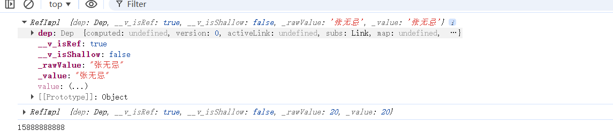
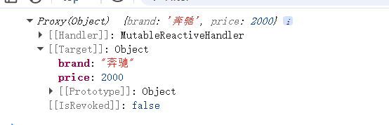
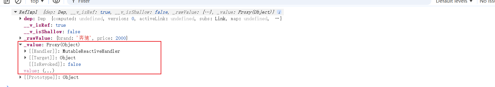
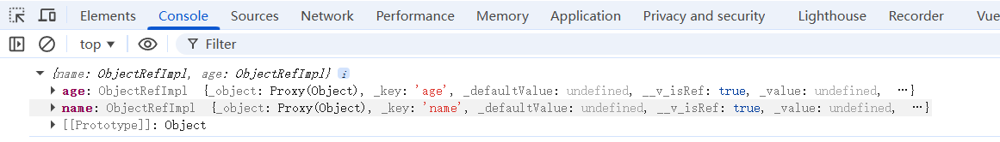
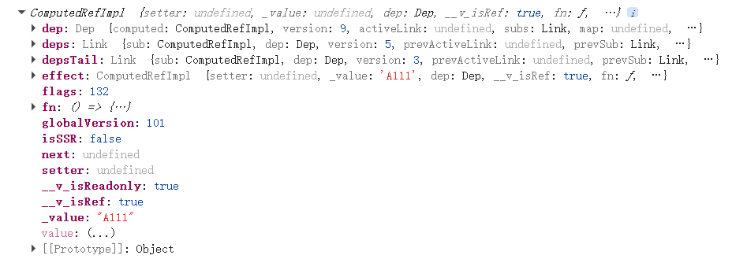
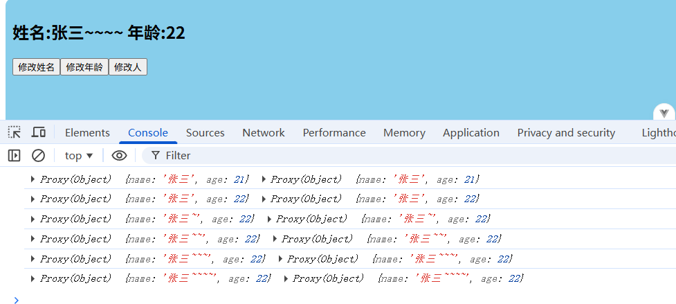
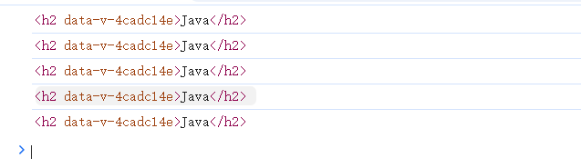
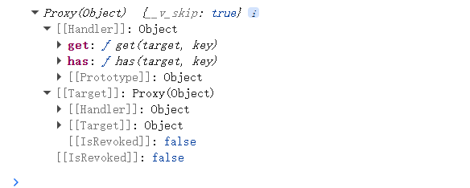
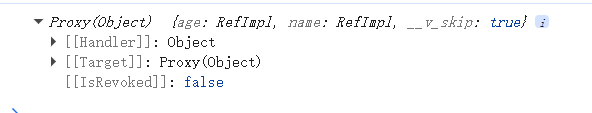
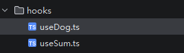

# Vue3

## 1.setup

**setup里面的this是undefined**

```v
<script lang="ts">
export default {
  name: 'Person',
  setup(){
    //console.log('@@',this) undefined
    let name = '张无忌' //此时的数据并不是响应式的数据
    let age = 20
    let phone = '15888888888'
    function changeName(){
      name = '小龙女'
    }
    function changeAge(){
      age = 18
    }
    function changePhone(){
      phone = '15888888888'
    }
    return {name,age,changeName,changeAge,changePhone}
  }

}
</script>
```

**setup的返回值也可以是一个渲染函数**

```v
<script lang="ts">
export default {
  name: 'Person',
  setup(){
    //console.log('@@',this) undefined
    let name = '张无忌' //此时的数据并不是响应式的数据
    let age = 20
    let phone = '15888888888'
    function changeName(){
      name = '小龙女'
    }
    function changeAge(){
      age = 18
    }
    function changePhone(){
      phone = '15888888888'
    }
    //return {name,age,changeName,changeAge,changePhone}
    return () => '哈哈'
  }

}
</script>
```

## 2.setup与data和methods

结论:

1. setup可以与data和methods共存

2. setup读不到data和methods里面的东西，data和methods可以读到setup里面的东西

```v
<script lang="ts">
export default {
  name: 'Person',
  data(){
    return {
      a:this.name //可以读到张无忌
    }
  },
  setup(){
    //console.log('@@',this) undefined
    let name = '张无忌' //此时的数据并不是响应式的数据
    let age = 20
    let phone = '15888888888'
    function changeName(){
      name = '小龙女'
    }
    function changeAge(){
      age = 18
    }
    function changePhone(){
      phone = '15888888888'
    }
    return {name,age,changeName,changeAge,changePhone}
    //return () => '哈哈'
  }
}
</script>
```

## 3.setup语法糖

```v
<script lang="ts">
export default {
  name: 'Person'
}
</script>
<script setup lang="ts"> //这里面和写setup函数是一样的效果
  let name = '张无忌' //此时的数据并不是响应式的数据
  let age = 20
  let phone = '15888888888'
  function changeName(){
  name = '小龙女'
  }
  function changeAge(){
  age = 18
  }
  function changePhone(){
  phone = '15888888888'
  }
</script>
```

但是这样引发了一些问题，就是要写两个script标签

我们可以下载一个插件:

`npm i vite-plugin-vue-setup-extend -D`

同时需要在vite.config.ts中配置

```v
import { fileURLToPath, URL } from 'node:url'

import { defineConfig } from 'vite'
import vue from '@vitejs/plugin-vue'
import VueSetupExtend from 'vite-plugin-vue-setup-extend'
import vueDevTools from 'vite-plugin-vue-devtools'

// https://vite.dev/config/
export default defineConfig({
  plugins: [
    vue(),
    vueDevTools(),
    VueSetupExtend(),
  ],
  resolve: {
    alias: {
      '@': fileURLToPath(new URL('./src', import.meta.url))
    },
  },
})
```

然后就可以在script标签中写name属性就是组件的名字:

## 4.ref创建基本数据类型的响应式

语法:

```v
<script setup lang="ts">
  import { ref } from 'vue'
  let name = ref('张无忌') //此时的数据并不是响应式的数据
  let age = ref(20)
  let phone = '15888888888'
  console.log(name)
  console.log(age)
  console.log(phone)
  function changeName(){
    name.value = '小龙女'
  }
  function changeAge(){
    age.value = 18
  }
  function changePhone(){
  phone = '15888888888'
  }
</script>
```

此时的name和age不再单纯了


用ref声明的数据变为了RefImpl的对象，如果我们想在js中修改这个数据的话,要x.value去修改，在template模板中可以直接写x,vue会帮我们自动.value

## 5.reactive创建对象类型的响应式

语法:

```v
<script setup lang="ts" name="Person">
  import { reactive } from 'vue';
  const car= reactive({brand:'奔驰',price:2000})
  console.log(car)
  function changePrice(){
    car.price=car.price+100
  }
</script>
```



**声明:**

1.reactive是深层次的响应式

2.数组和函数本质上也是对象

## 6.ref和reactive详解

**ref可以定义基本类型和对象类型的响应式数据**

**reactive只能定义对象类型的响应式数据**

代码:

```v
<script setup lang="ts" name="Person">
  import { ref } from 'vue';
  const car= ref({brand:'奔驰',price:2000})
  console.log(car)
  const games = ref([{id:'01',name:'王者荣耀'},{id:'02',name:'英雄联盟'},{id:'03',name:'和平精英'}])
  function changePrice(){
    car.value.price=car.value.price+100
  }
  function changeGame(){
    games.value[0].name = '原神'
  }
</script>
```



可以看到ref声明的对象的响应式是Proxy，所以ref可以声明对象的响应式数据。但是底层用的**reactive**

## 7.ref对比reactive

**宏观角度看:**

1.ref用来定义:基本类型数据，对象类型数据

2.reactive用来定义:对象类型数据

**区别:**

1.ref创建的变量必须使用.value(可以使用volar插件自动添加.value)

2.reactive重新分配一个新对象，会失去响应式(可以用Object.assign()去整体替换)

```v
<script setup name="Person" lang="ts">
import { ref,reactive } from 'vue'
let sum = ref(0)
let car = reactive({brand:'BMW',price:'100000'})
const add= () => {
  sum.value ++
}
const changeCar = () => {
  Object.assign(car,{brand:'BYD',price:'1000'})
}

</script>
```

**使用原则:**

1.若需要一个基本类型的响应式数据，必须使用ref

2.若需要一个响应式对象，层级不深，ref,reactive都可以

3.若需要一个响应式对象，且层级较深，推荐使用reactive

## 8.toRefs和toRef

```v
<template>
  <div class="main">
   <h2>人的姓名:{{ person.name }} 人的年龄:{{ person.age }}</h2>
   <button @click="changeName">修改姓名</button>
   <button @click="changeAge">修改年龄</button>


  </div>
</template>
<script setup name="Person" lang="ts">
  import { reactive } from 'vue';
  const person = reactive({
    name: '张三',
    age: 18,
  })

  let { name, age } = person
  function changeName() {
    name +="~"
    console.log(name,person.name)
  }
  function changeAge() {
    age ++
    console.log(age,person.age)
  }

</script>
```


可以看到这样的解构根本没有修改到真正的person里面的数据，同时解构出来的name和age也不是响应式的。

如果我们想要解构的话，必须用toRefs

```v
<template>
  <div class="main">
   <h2>人的姓名:{{ person.name }} 人的年龄:{{ person.age }}</h2>
   <button @click="changeName">修改姓名</button>
   <button @click="changeAge">修改年龄</button>


  </div>
</template>
<script setup name="Person" lang="ts">
  import { reactive,toRefs } from 'vue';
  const person = reactive({
    name: '张三',
    age: 18,
  })

  let { name, age } = toRefs(person) 
  console.log(toRefs(person))
  function changeName() {
    name.value +="~"
    console.log(name,person.name)
  }
  function changeAge() {
    age.value ++
    console.log(age,person.age)
  }

</script>
```



**<font color="red">一言以蔽之:toRefs接收一个reactive声明的对象，同时将这个对象的属性都变为ref的响应式，并且修改单个ref的属性的时候，reactive声明的对象对应的属性 也会改变</font>**

toRef就是让指定的单个属性变为响应式:`let namesingle = toRef(person,'name')`,和toRefs一样的效果

## 9.计算属性

```v
<script setup name="Person" lang="ts">
  import { ref,computed } from 'vue'
  import { NInput } from 'naive-ui'
  const firstname = ref('')
  const lastName = ref('')
  //这样定义的计算属性，只是可读，不支持修改
  let fullName = computed(()=>{
    return firstname.value.slice(0,1).toUpperCase() + lastName.value
  })
</script>
```

计算属性:**会有缓存，对应的数据变化了，计算属性会自动重新计算**



计算属性本质上也是一个ref

```v
<script setup name="Person" lang="ts">
  import { ref,computed } from 'vue'
  import { NInput, NButton } from 'naive-ui'
  let firstname = ref('')
  let lastName = ref('')
  //这样定义的计算属性，只是可读，不支持修改
  let fullName = computed({
    get(){
       return firstname.value +'-'+ lastName.value
    },
    set(val){
      const [first,last] = val.split('-')
      console.log(first,last)
      firstname.value = first
      lastName.value = last
    }

  })
  function changeName(){
    fullName.value = '王-小王'
  }
  console.log(fullName)
</script>
```

## 10.watch监听

作用:监视数据的变化

特点:Vue3中的watch只能监视以下**四种数据**

1. ref定义的数据

2. reactive定义的数据

3. 函数返回一个值(getter函数)

4. 一个包含上述内容的数组

### 情况一:watch监听ref定义的基本类型的数据

```v
<template>
  <div class="main">
    <h2>sum的值: {{ sum }}</h2>
    <button @click="add">sum++</button>   
  </div>
</template>
<script setup name="Person" lang="ts">
import { ref,watch } from 'vue'
let sum = ref(0)
function add(){
  sum.value++
}
const stopWatch = watch(sum, (newValue, oldValue) => {
  console.log(`sum: ${oldValue} -> ${newValue}`)
  if(newValue > 10){
    stopWatch()//停止watch
  }
})
</script>
```

<font color="red">注意两点:1.watch里面第一个参数直接写ref声明的对象 2.如何停止监视</font>

### 情况二:watch监听ref定义的对象类型的数据

**如果不配置watch监听配置项，只能监听对象的地址发生变化的时候**

```v
<template>
  <div class="main">
      <h2>姓名:{{ person.name }} 年龄:{{ person.age }}</h2>
      <button @click="changName">修改姓名</button>
      <button @click="changAge">修改年龄</button>
      <button @click="changPerson">修改人</button>
  </div>
</template>
<script setup name="Person" lang="ts">
import { ref,watch } from 'vue'
let person = ref({
  name:'张三',
  age:20
})
function changName(){
  person.value.name +='~'
}
function changAge(){
  person.value.age +=1
}
function changPerson(){
  person.value = {
    name:'李四',
    age:22
  }
}
watch(person,(newValue,oldValue)=>{
  console.log(newValue,oldValue)//只有点击修改人的时候才会触发这个打印
})

</script>
```

**配置watch的深度监听**

```v
watch(person,(newValue,oldValue)=>{

  console.log(newValue,oldValue)

},{deep:true})
```

但是会出现一个现象，就是newValue和oldValue在点击修改姓名和修改年龄的时候，是一个值



**newValue和oldValue指向的是同一个地址**

### 情况三:watch监听reactive定义的对象类型的数据

**<font color="red">默认开启深度监视，且关不掉</font>**

```v
<template>
  <div class="main">
      <h2>姓名:{{ person.name }} 年龄:{{ person.age }}</h2>
      <button @click="changName">修改姓名</button>
      <button @click="changAge">修改年龄</button>
      <button @click="changPerson">修改人</button>
  </div>
</template>
<script setup name="Person" lang="ts">
import { reactive,watch } from 'vue'
let person = reactive({
  name:'张三',
  age:20
})
function changName(){
  person.name +='~'
}
function changAge(){
  person.age +=1
}
function changPerson(){
  Object.assign(person,{name:'李四',age:80})
}
watch(person,(newValue,oldValue)=>{
  console.log(newValue,oldValue)//三个按钮都会触发这个打印
},{deep:true})

</script>
```

### 情况四:监视ref或reactive定义的【对象类型】数据中的<font color="red">某个属性</font>,注意点如下:

1.若该属性不是【对象类型】，需要写成函数形式

```v
<template>
  <div class="main">
      <h2>姓名:{{ person.name }} 年龄:{{ person.age }}</h2>
      <button @click="changName">修改姓名</button>
      <button @click="changAge">修改年龄</button>
      <button @click="changPerson">修改人</button>
  </div>
</template>
<script setup name="Person" lang="ts">
import { reactive,watch } from 'vue'
let person = reactive({
  name:'张三',
  age:20
})
function changName(){
  person.name +='~'
}
function changAge(){
  person.age +=1
}
function changPerson(){
  Object.assign(person,{name:'李四',age:80})
}
watch(()=>person.name,(newValue,oldValue)=>{
  console.log('name变化了',newValue,oldValue)
})
</script>
```

2.若该属性值依然是【对象类型】，可直接编，也可写成函数，不过建议写成函数

```v
<template>
  <div class="main">
      <h2>姓名:{{ person.name }} 年龄:{{ person.age }}</h2>
      <h2>车:{{ person.car.c1 }},{{ person.car.c2 }}</h2>
      <button @click="changName">修改姓名</button>
      <button @click="changAge">修改年龄</button>
      <button @click="changPerson">修改人</button>
      <button @click="changeC1">修改第一辆车</button>
      <button @click="changeC2">修改第二辆车</button>
      <button @click="changeCar">修改整辆车</button>
  </div>
</template>
<script setup name="Person" lang="ts">
import { reactive,watch } from 'vue'
let person = reactive({
  name:'张三',
  age:20,
  car:{
    c1:'奔驰',
    c2:'宝马'
  }
})
function changName(){
  person.name +='~'
}
function changAge(){
  person.age +=1
}
function changPerson(){
  Object.assign(person,{name:'李四',age:80})
}
function changeC1(){
  person.car.c1 = '奥迪'
}
function changeC2(){
  person.car.c2 = '大众'
}
function changeCar(){
  person.car = {c1:'雅迪',c2:'爱玛'}
}
// watch(()=>person.name,(newValue,oldValue)=>{
//   console.log('name变化了',newValue,oldValue)
// })

//这样监视，changeC1和changeC2会触发，但是changeCar不会触发，彻底改变了那个对象
watch(person.car,(newValue,oldValue)=>{ 
  console.log('car变化了',newValue,oldValue)
})
</script>
```

```v
watch(()=>person.car,(newValue,oldValue)=>{
  console.log('car变化了',newValue,oldValue)
})
```

如果用函数式的写法，监听的是对象的地址，如果要监视具体值，需要配置深度监视

<font color="red">结论:</font> 监视对象里的属性，最好写函数式，注意点:若是监视的是一个对象里面的一个对象，又不仅要监视这个地址值，需要手动开启深度监视

```v
watch(()=>person.car,(newValue,oldValue)=>{
  console.log('car变化了',newValue,oldValue)
},{deep:true})
```

### 情况五:监视上述的多个数据

```v
<template>
  <div class="main">
      <h2>姓名:{{ person.name }} 年龄:{{ person.age }}</h2>
      <h2>车:{{ person.car.c1 }},{{ person.car.c2 }}</h2>
      <button @click="changName">修改姓名</button>
      <button @click="changAge">修改年龄</button>
      <button @click="changPerson">修改人</button>
      <button @click="changeC1">修改第一辆车</button>
      <button @click="changeC2">修改第二辆车</button>
      <button @click="changeCar">修改整辆车</button>
  </div>
</template>
<script setup name="Person" lang="ts">
import { reactive,watch } from 'vue'
let person = reactive({
  name:'张三',
  age:20,
  car:{
    c1:'奔驰',
    c2:'宝马'
  }
})
function changName(){
  person.name +='~'
}
function changAge(){
  person.age +=1
}
function changPerson(){
  Object.assign(person,{name:'李四',age:80})
}
function changeC1(){
  person.car.c1 = '奥迪'
}
function changeC2(){
  person.car.c2 = '大众'
}
function changeCar(){
  person.car = {c1:'雅迪',c2:'爱玛'}
}
watch([()=> person.name,()=>person.car.c1],(newValue,oldValue)=>{
  console.log(newValue,oldValue)
})
</script>
```

## 11.watchEffect

**watchEffect特点:**

> 1.立即运行这个函数
> 
> 2.自动监视回调里面依赖的响应式数据，并在依赖更改时重新执行该函数

代码:

```v
<template>
  <div class="main">
      <h2>当水温到达120摄氏度,水位到达20cm的时候,给服务器发请求</h2>
      <h2>水温:{{ temprature }}</h2>
      <h2>水位:{{ height }}</h2>
      <n-space>
        <n-button type="info" @click="addtemp">
          水温+10
        </n-button>
        <n-button type="info" @click="addHeight">
          水位+10
        </n-button>
      </n-space>

  </div>
</template>
<script setup lang="ts">
import {ref, watch, watchEffect} from 'vue'
import {NButton,NSpace,useMessage} from "naive-ui";
const message = useMessage()
let temprature = ref(20)
let height = ref(0)
const addtemp = ()=>{
  temprature.value += 10
}
const addHeight = ()=>{
  height.value+=10
}
// watch([temprature,height],(newValue) => {
//   let [newTemp, newHeight] = newValue;
//   if(newTemp>=120 || newHeight>=20){
//     message.info('给服务器整点汉堡',{keepAliveOnHover:true})
//   }
// })
watchEffect(()=>{
  if(temprature.value >= 120 || height.value>=20){
    message.info(`给服务器整点汉堡${temprature.value}`,{keepAliveOnHover:true})
  }
})

</script>
```

**watch对比watchEffect**

> 1.都能监听响应式数据的变化，不同的是监听数据变化的方式不同
> 
> 2.watch：要明确指出监视的数据
> 
> 3.watchEffect:不用明确指出监视的数据（函数中用到哪些属性，那就监视哪些属性）

## 12.标签的ref属性

> - 用在普通Dom标签上，获取的是Dom节点
> 
> - 用在组件标签上，获取的是组件实例对象

**用在普通Dom标签上**

```v
<template>
  <div class="main">
    <h2 ref="language">Java</h2>
    <h2>张峻豪</h2>
    <button @click="log">点我打印语言</button>
  </div>
</template>

<script setup lang="ts">
import {ref} from "vue";
let language = ref();
function log(){
  console.log(language.value);
}
</script>

<style scoped>
.main{
  height: 200px;
  padding: 10px;
  border-radius: 10px;
  background-color: skyblue;
}  
</style>
```

标签的ref属性就是为了更加方便地获取这个对象



这个data-v-xxxxxx是因为我们的vue中style标签加了scoped值，是局部样式

**用在组件标签上**

App.vue

```v
<template>
  <n-config-provider>
    <n-message-provider>
      <Person ref="peo"/>
      <n-button type="primary" @click="logPerson">
        点我打印Person组件
      </n-button>
    </n-message-provider>
  </n-config-provider>
</template>


<script lang="ts" setup>
  import {NConfigProvider,NMessageProvider,NButton} from "naive-ui";
  import Person from './components/Person.vue';
  import {ref} from 'vue';
  let peo = ref()
  const logPerson = () => {
    console.log(peo.value)//为啥是undefined
  }
</script>

<style>

</style>
```

Person.vue

```v
<template>
  <div class="main">
    <h2 ref="language">Java</h2>
    <h2>张峻豪</h2>
    <button @click="log">点我打印语言</button>
  </div>
</template>

<script setup lang="ts">
import {ref} from "vue";
let language = ref();
function log(){
  console.log(language.value);
}
let name = ref('donk')
let age = ref(20);
</script>
<style scoped>
.main{
  height: 200px;
  padding: 10px;
  border-radius: 10px;
  background-color: skyblue;
}  
</style>
```

在App.vue中是看不到子组件的ref数据的



<font color="red">子组件需要自己定义想要父组件看到哪些数据</font>

```v
<script setup lang="ts">
import {ref,defineExpose} from "vue";
let language = ref();
function log(){
  console.log(language.value);
}
let name = ref('donk')
let age = ref(20);
defineExpose({age,name});
</script>
```



## 13.回顾TS中的接口，泛型，自定义类型

src/types/index.ts

```typescript
// 定义一个接口,用于限制person对象的具体属性
export interface PersonInter{
    id:string,
    name:string,
    age:number
}
// 自定义类型
// export type Persons = Array<PersonInter>
export type Persons = PersonInter[]
```

src/components/Person.vue

```v
<template>
  <div class="main">

  </div>
</template>

<script setup lang="ts">
import {type PersonInter,type Persons} from '@/types'
let person:PersonInter={
  id:'518456456489789',
  name:'张峻豪',
  age:20
}
let personList:Persons = [
  {id:'123123',name:'123',age:13},
  {id:'123456789',name:'123456789',age:14},
  {id:'123456789',name:'123456789',age:14},
]
</script>
<style scoped>
.main{
  height: 200px;
  padding: 10px;
  border-radius: 10px;
  background-color: skyblue;
}  
</style>
```

## 14.props的使用

ts的小技巧

```v
// 定义一个接口,用于限制person对象的具体属性
export interface PersonInter{
    id:string,
    name:string,
    age:number,
    x?:number,//表示这个参数可有可无
}
// 自定义类型
// export type Persons = Array<PersonInter>
export type Persons = PersonInter[]
```

父组件:App.vue

```v
<template>
  <n-config-provider>
    <n-message-provider>
      <Person a="哈哈哈"/>
    </n-message-provider>
  </n-config-provider>
</template>


<script lang="ts" setup>
  import {NConfigProvider,NMessageProvider,NButton} from "naive-ui";
  import Person from './components/Person.vue';

</script>

<style>

</style>
```

子组件:Person.vue

```v
<template>
  <div class="main">
    <h2>{{a}}</h2>

  </div>
</template>

<script setup lang="ts">
import {defineProps} from 'vue'

//defineProps(['a']) //模板中可以直接接收到,但是在脚本中无法用
let data = defineProps(['a'])//这样才可以在脚本中使用
console.log(data)
</script>
<style scoped>
.main{
  height: 200px;
  padding: 10px;
  border-radius: 10px;
  background-color: skyblue;
}  
</style>
```

接收+限制类型

```v
<template>
  <div class="main">


  </div>
</template>

<script setup lang="ts">
import {defineProps} from 'vue'
import type {Persons} from "@/types";

//接收+限制类型
defineProps<{list:Persons}>()

</script>
<style scoped>
.main{
  height: 200px;
  padding: 10px;
  border-radius: 10px;
  background-color: skyblue;
}  
</style>
```

```v
<script setup lang="ts">
import {defineProps,withDefaults} from 'vue'
import type {Persons} from "@/types";

// //接收+限制类型
// defineProps<{list:Persons}>()

//接收+限制类型+限制必要性+指定默认值
withDefaults(defineProps<{list?:Persons}>(),{list:()=>[{id:'123213112',name:'蔡徐坤',age:20}]})

</script>
```

defineXXX是Vue中的宏函数，可以不用引入

```v
<script setup lang="ts">
import {withDefaults} from 'vue'
import type {Persons} from "@/types";

// //接收+限制类型
// defineProps<{list:Persons}>()

//接收+限制类型+限制必要性+指定默认值
withDefaults(defineProps<{list?:Persons}>(),{list:()=>[{id:'123213112',name:'蔡徐坤',age:20}]})

</script>
```

## 15.组件的声明周期

【时刻】: 创建、挂载、更新、销毁

【调用特定的函数】

对应的时刻会调用对应的函数

## 16.Vue2声明周期

创建前:beforeCreate() 创建后created()

挂载前:beforeMount() 挂载完毕mounted()

更新前:beforeUpdate() 更新完毕updated()

销毁前:beforeDestroy() 销毁完毕destroyed()

<font color="red">销毁:当不用这个组件的时候，就会销毁，比如用v-if去判断</font>

## 17.Vue3声明周期

创建用**setup**函数代替了

挂载前:onBeforeMount( ()=>{} ) 挂载完毕onMounted(()=>{})

更新前:onBeforeUpdate(()=>{}) 更新完毕onUpdated(()=>{})

卸载前:onBeforeUnmount(()=>{}) 卸载完毕onUnmounted(()=>{})

## 18.自定义Hooks

来看看没有自定义hooks之前

```v
<template>
  <div class="app">
    <h2> {{ sum }}</h2> <el-button type="primary" @click="add">点击sum +1</el-button>
    <br>
    <h2> {{ dogNum }}</h2> <el-button type="primary" @click="addDogNumber">点击dogNum +1</el-button>

  </div>
</template>

<script setup lang="ts">
import {ref} from "vue";

let sum = ref(0)
function add(){
  sum.value++
}

let dogNum = ref(0)
function addDogNumber(){
  dogNum.value++
}
</script>
<style scoped>
.app{
  height: 200px;
  padding: 10px;
  border-radius: 10px;
  background-color: skyblue;
}  
</style>
```

最大的问题就是这些script中的数据依然混合在一起

自定义Hooks之后，让"组合式"这个词发挥了更大的作用

```v
<script setup lang="ts">
import useSum from "@/hooks/useSum.ts";
import useDog from "@/hooks/useDog.ts";
const {sum,add} = useSum()
const {dogNum,addDogNumber} = useDog()
useDog()
</script>
```

```v
import {ref} from "vue";

export default function (){
    let sum = ref(0)
    function add(){
        sum.value++
    }
    return {sum,add}
}
```

```v
import {ref} from "vue";

export default function (){
    let dogNum = ref(0)
    function addDogNumber(){
        dogNum.value++
    }
    return {dogNum,addDogNumber}
}
```

**注意:** hooks一般用useXXX开头去命名这个ts文件，这里面也可以写钩子函数



## 19.路由

1) 路由就是一组key-value的对应关系（像是url和view的对应关系）

2) 多个路由，需要经过路由器的管理

路由中有一个routerLink组件，可以写to属性(去哪个路径)和active-class(被激活时的class)
